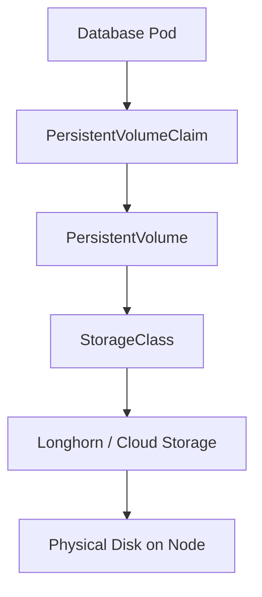

# How to Configure Persistent Storage for Databases in Rancher

Author: [nawazdhandala](https://www.github.com/nawazdhandala)

Tags: Rancher, Persistent Storage, PVC, StorageClass, Longhorn, Kubernetes

Description: A complete guide to configuring persistent storage for database workloads in Rancher using StorageClasses, PersistentVolumeClaims, and Longhorn.

## Introduction

Databases require durable storage that survives pod restarts and rescheduling. Kubernetes provides this through PersistentVolumes (PVs) and PersistentVolumeClaims (PVCs). Rancher includes Longhorn, a cloud-native distributed storage solution that is ideal for database workloads.

## Storage Architecture



## Step 1: Install Longhorn via Rancher

Longhorn can be installed directly through the Rancher Apps catalog.

1. In Rancher UI, navigate to your cluster
2. Go to **Apps > Charts**
3. Search for **Longhorn** and click Install
4. Accept defaults or customize the data path

Or install via Helm:

```bash
helm repo add longhorn https://charts.longhorn.io
helm repo update

helm install longhorn longhorn/longhorn \
  --namespace longhorn-system \
  --create-namespace \
  --set defaultSettings.defaultReplicaCount=3
```

## Step 2: Verify Longhorn StorageClass

After installation, Longhorn registers a StorageClass automatically.

```bash
# List available StorageClasses

kubectl get storageclass

# Set Longhorn as the default StorageClass
kubectl patch storageclass longhorn \
  -p '{"metadata": {"annotations":{"storageclass.kubernetes.io/is-default-class":"true"}}}'
```

## Step 3: Create a PVC for a Database

For databases, always use `ReadWriteOnce` access mode and specify a size appropriate to your data volume.

```yaml
# db-pvc.yaml
apiVersion: v1
kind: PersistentVolumeClaim
metadata:
  name: mysql-data
  namespace: databases
spec:
  accessModes:
    - ReadWriteOnce       # Only one node mounts at a time (required for most databases)
  storageClassName: longhorn
  resources:
    requests:
      storage: 50Gi       # Adjust based on expected data size
```

```bash
kubectl apply -f db-pvc.yaml
kubectl get pvc -n databases   # Should show STATUS: Bound
```

## Step 4: Mount the PVC in a Database Deployment

Reference the PVC in your database StatefulSet or Deployment.

```yaml
# mysql-statefulset.yaml (excerpt)
spec:
  template:
    spec:
      containers:
        - name: mysql
          image: mysql:8.0
          volumeMounts:
            - name: mysql-data
              mountPath: /var/lib/mysql    # Standard MySQL data directory
      volumes:
        - name: mysql-data
          persistentVolumeClaim:
            claimName: mysql-data         # Reference the PVC created above
```

## Step 5: Configure StorageClass for Performance

For databases, use the Longhorn StorageClass with specific performance settings.

```yaml
# fast-storage.yaml
apiVersion: storage.k8s.io/v1
kind: StorageClass
metadata:
  name: fast-db-storage
provisioner: driver.longhorn.io
parameters:
  numberOfReplicas: "2"           # Fewer replicas for higher write performance
  dataLocality: "best-effort"     # Try to place replica on same node as pod
  diskSelector: "ssd"             # Only use SSD-labeled disks
reclaimPolicy: Retain             # Keep volume even after PVC deletion
volumeBindingMode: WaitForFirstConsumer
```

## Step 6: Backup Volumes with Longhorn

Longhorn supports scheduled snapshots and backups to S3-compatible storage.

```bash
# Configure backup target via kubectl
kubectl patch setting backup-target \
  -n longhorn-system \
  --type merge \
  -p '{"value": "s3://my-bucket@us-east-1/"}'
```

## Conclusion

Rancher with Longhorn provides a complete persistent storage solution for databases. Use `Retain` reclaim policies to prevent accidental data deletion, and configure Longhorn snapshot schedules to protect against data loss.
