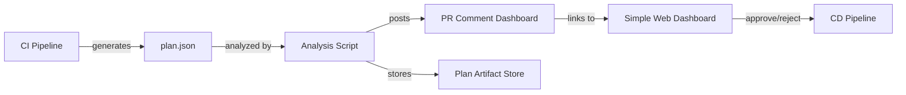

# How to Build Plan Approval Dashboards for OpenTofu

Author: [nawazdhandala](https://www.github.com/nawazdhandala)

Tags: OpenTofu, Plan Approval, Dashboard, CI/CD, Infrastructure as Code

Description: Learn how to build plan approval dashboards for OpenTofu that give operators a clear view of pending infrastructure changes before approving deployments.

A plan approval dashboard presents infrastructure changes in a human-friendly format, groups them by risk level, and provides an approve/reject interface. This guide shows how to build one using plan JSON, GitHub Actions environments, and a simple web UI.

## Architecture Overview



## Step 1: Generate a Rich Plan Summary

```python
#!/usr/bin/env python3
# dashboard-summary.py — generate an HTML plan approval dashboard

import json, sys
from datetime import datetime

with open(sys.argv[1]) as f:
    plan = json.load(f)

changes = plan.get("resource_changes", [])
creates = [c for c in changes if c["change"]["actions"] == ["create"]]
updates = [c for c in changes if c["change"]["actions"] == ["update"]]
deletes = [c for c in changes if "delete" in c["change"]["actions"] and "create" not in c["change"]["actions"]]
replaces = [c for c in changes if "delete" in c["change"]["actions"] and "create" in c["change"]["actions"]]

html = f"""<!DOCTYPE html>
<html>
<head>
  <title>OpenTofu Plan Approval</title>
  <style>
    body {{ font-family: system-ui; max-width: 900px; margin: 40px auto; padding: 0 20px; }}
    .create {{ color: green; }} .update {{ color: orange; }}
    .delete {{ color: red; }} .replace {{ color: darkred; }}
    table {{ width: 100%; border-collapse: collapse; }}
    th, td {{ padding: 8px 12px; border: 1px solid #ddd; text-align: left; }}
    th {{ background: #f5f5f5; }}
    .approve {{ background: green; color: white; padding: 10px 20px; border: none; cursor: pointer; border-radius: 4px; }}
    .reject {{ background: red; color: white; padding: 10px 20px; border: none; cursor: pointer; border-radius: 4px; margin-left: 10px; }}
  </style>
</head>
<body>
  <h1>OpenTofu Plan Approval Dashboard</h1>
  <p>Generated: {datetime.utcnow().strftime('%Y-%m-%d %H:%M UTC')}</p>

  <h2>Summary</h2>
  <table>
    <tr><th>Action</th><th>Count</th></tr>
    <tr><td class="create">Create</td><td>{len(creates)}</td></tr>
    <tr><td class="update">Update</td><td>{len(updates)}</td></tr>
    <tr><td class="replace">Replace</td><td>{len(replaces)}</td></tr>
    <tr><td class="delete">Delete</td><td>{len(deletes)}</td></tr>
  </table>
"""

if deletes or replaces:
    html += "<h2 style='color:red'>⚠️ Destructive Changes</h2><ul>"
    for c in deletes + replaces:
        html += f"<li class='delete'>{'+'.join(c['change']['actions'])} — <strong>{c['address']}</strong></li>"
    html += "</ul>"

html += "<h2>All Changes</h2><table><tr><th>Action</th><th>Resource</th><th>Type</th></tr>"
for c in changes:
    if c["change"]["actions"] == ["no-op"]:
        continue
    action = "+".join(c["change"]["actions"])
    css = "delete" if "delete" in c["change"]["actions"] else action
    html += f"<tr><td class='{css}'>{action}</td><td>{c['address']}</td><td>{c['type']}</td></tr>"
html += "</table>"

html += """
  <br><br>
  <button class="approve" onclick="alert('Approve signal sent!')">✅ Approve</button>
  <button class="reject" onclick="alert('Plan rejected.')">❌ Reject</button>
</body></html>"""

with open("plan-dashboard.html", "w") as f:
    f.write(html)

print("Dashboard written to plan-dashboard.html")
```

## Step 2: Publish the Dashboard in CI

```yaml
# .github/workflows/plan-dashboard.yml
- name: Generate Dashboard
  run: python3 scripts/dashboard-summary.py plan.json

- name: Upload Dashboard
  uses: actions/upload-artifact@v4
  with:
    name: plan-dashboard
    path: plan-dashboard.html

- name: Post Artifact Link to PR
  uses: marocchino/sticky-pull-request-comment@v2
  with:
    message: |
      ## Plan Ready for Review
      Download and open the [Plan Dashboard](https://github.com/${{ github.repository }}/actions/runs/${{ github.run_id }}) to review infrastructure changes.
```

## Step 3: Use GitHub Environments for Approval Gates

Configure a GitHub Environment named `production` with required reviewers:

1. Go to **Settings > Environments > production**.
2. Add required reviewers (e.g., `@infra-team`).
3. The apply job will pause and send a notification until a reviewer approves.

```yaml
  apply:
    needs: plan
    runs-on: ubuntu-latest
    environment: production  # Pauses here until a reviewer approves
    steps:
      - name: Apply Approved Plan
        run: tofu apply -auto-approve tfplan
```

## Conclusion

A plan approval dashboard combines the structured data from `tofu show -json` with a visual interface and CI gating to give your team full confidence before every infrastructure change lands in production. Start with the HTML dashboard and GitHub environment approvals, then extend the dashboard as your team's review needs grow.
