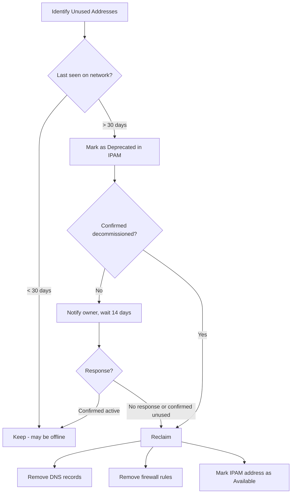

# How to Plan IPv6 Address Reclamation

Author: [nawazdhandala](https://www.github.com/nawazdhandala)

Tags: IPv6, IPAM, Address Reclamation, Network Hygiene, Lifecycle Management

Description: Plan and execute IPv6 address reclamation to recover unused prefixes and addresses, updating IPAM records and firewall rules as devices are decommissioned.

## Introduction

IPv6 address reclamation recovers prefixes and addresses that are assigned in IPAM but no longer in active use. While IPv6's vast space reduces urgency compared to IPv4, reclamation is important for maintaining IPAM accuracy, removing stale firewall rules, and revoking DNS records for decommissioned systems.

## Reclamation Workflow



## Step 1: Identify Reclamation Candidates

```python
#!/usr/bin/env python3
# find_reclamation_candidates.py

import pynetbox
import dns.resolver
import subprocess
import ipaddress
from datetime import datetime

nb = pynetbox.api("http://netbox.internal", token="your-token")

def is_address_reachable(ipv6_addr: str) -> bool:
    """Check if an IPv6 address responds to ping."""
    result = subprocess.run(
        ["ping6", "-c", "2", "-W", "3", ipv6_addr],
        capture_output=True
    )
    return result.returncode == 0

def is_in_ndp(ipv6_addr: str) -> bool:
    """Check if address is in the local NDP table."""
    result = subprocess.run(
        ["ip", "-6", "neigh", "show", ipv6_addr],
        capture_output=True, text=True
    )
    return bool(result.stdout.strip())

# Find active IPAM addresses not seen recently

print("Checking reclamation candidates...")
candidates = []

for ip in nb.ipam.ip_addresses.filter(family=6, status="active"):
    addr = str(ip.address).split('/')[0]

    # Skip important addresses
    try:
        ip_obj = ipaddress.ip_address(addr)
        if ip_obj.is_loopback or ip_obj.is_link_local:
            continue
    except ValueError:
        continue

    # Check if reachable
    reachable = is_address_reachable(addr)
    in_ndp = is_in_ndp(addr)

    if not reachable and not in_ndp:
        candidates.append({
            "address": addr,
            "description": ip.description or "",
            "dns_name": str(ip.dns_name) if ip.dns_name else "",
            "tags": [str(t) for t in (ip.tags or [])],
        })

print(f"\nReclamation candidates: {len(candidates)}")
for c in candidates[:20]:
    print(f"  {c['address']:<40} {c['description'] or c['dns_name']}")
```

## Step 2: Send Reclamation Notifications

```python
def send_reclamation_notice(address: str, description: str, owner_email: str):
    """Send email notice before reclaiming an address."""
    import smtplib
    from email.mime.text import MIMEText

    msg = MIMEText(f"""
IPv6 Address Reclamation Notice

Address: {address}
Description: {description}

This IPv6 address has not been seen active on the network for 30+ days.
It will be reclaimed in 14 days unless you confirm it is still required.

To retain this address, reply to this email or update the IPAM record
at http://netbox.internal/ipam/ip-addresses/?q={address}

Network Operations Team
""")
    msg['Subject'] = f"IPv6 Reclamation Notice: {address}"
    msg['From'] = "noc@example.com"
    msg['To'] = owner_email

    with smtplib.SMTP('mail.internal') as smtp:
        smtp.send_message(msg)
    print(f"Notice sent to {owner_email} for {address}")
```

## Step 3: Execute Reclamation

```python
def reclaim_ipv6_address(address: str, reason: str = "Unused"):
    """
    Reclaim an IPv6 address:
    1. Remove DNS records
    2. Update firewall rule annotations
    3. Mark IPAM as available
    """
    import subprocess

    # Find in IPAM
    ip_obj = nb.ipam.ip_addresses.get(address=f"{address}/128")
    if not ip_obj:
        ip_obj = nb.ipam.ip_addresses.filter(address__startswith=address)
        ip_obj = list(ip_obj)[0] if ip_obj else None

    if not ip_obj:
        print(f"Address {address} not found in IPAM")
        return

    # Get DNS name for cleanup
    dns_name = str(ip_obj.dns_name).rstrip('.') if ip_obj.dns_name else None

    # Remove DNS records (nsupdate)
    if dns_name:
        result = subprocess.run(
            ["nsupdate", "-k", "/etc/named.key", "-v"],
            input=f"zone example.com\ndel {dns_name}. AAAA\nsend\n".encode(),
            capture_output=True
        )
        if result.returncode == 0:
            print(f"Removed DNS: {dns_name} AAAA")

    # Update IPAM: mark as available
    nb.ipam.ip_addresses.update([{
        "id": ip_obj.id,
        "status": "deprecated",
        "description": f"RECLAIMED {datetime.now().date()}: {reason}",
        "dns_name": "",
        "assigned_object_type": None,
        "assigned_object_id": None
    }])

    print(f"Reclaimed: {address} ({reason})")
```

## Step 4: Reclamation Verification

```bash
# After reclamation, verify address is no longer reachable
ping6 -c 3 2001:db8::10
# Should fail

# Verify DNS is removed
dig AAAA server-01.example.com
# Should return NXDOMAIN or no AAAA record

# Verify NDP table no longer contains address
ip -6 neigh show 2001:db8::10
# Should return empty or "FAILED" state
```

## Conclusion

IPv6 address reclamation follows a workflow: identify candidates (not seen on network or in NDP table), notify owners with a 14-day grace period, then reclaim by removing DNS records, clearing IPAM assignments, and marking the address as deprecated. Automation reduces the operational burden - schedule monthly reclamation scans and batch process candidates rather than handling individually. Keep reclaimed addresses in IPAM as "deprecated" rather than deleting them to preserve audit history showing when and why addresses were used.
