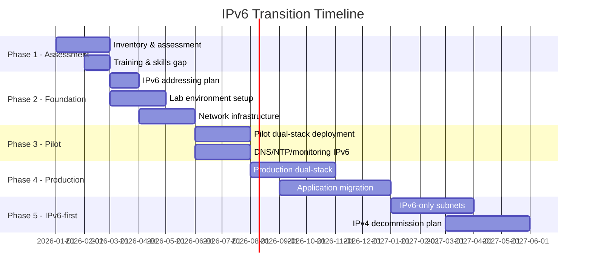

# How to Plan an IPv6 Transition Timeline for Your Organization

Author: [nawazdhandala](https://www.github.com/nawazdhandala)

Tags: IPv6, Network Planning, IPv6 Transition, Enterprise Networking, Project Management

Description: A practical roadmap for planning and executing an IPv6 transition in an enterprise organization, with phases, milestones, and common pitfalls to avoid.

## Why Plan the Timeline Carefully?

IPv6 transitions that lack structured timelines often stall after the initial pilot. Proper planning ensures stakeholder buy-in, prevents disruption to existing services, and sets realistic milestones for full IPv6 deployment.

## Phase Overview



## Phase 1: Assessment (Weeks 1–8)

### Inventory All IPv4 Dependencies

```bash
# Scan your network for IPv4-only devices and services
nmap -sn 192.168.0.0/16 -oX inventory.xml

# Check which services listen only on IPv4
ss -4 -tlnp  # on servers: list IPv4-only listeners
ss -6 -tlnp  # compare: list IPv6 listeners

# Check DNS for missing AAAA records
for domain in $(cat domains.txt); do
    dig AAAA $domain +short | grep -q ':' || echo "No AAAA: $domain"
done
```

### Skill Gap Assessment

Identify team members who need IPv6 training:
- Network engineers: IPv6 addressing, routing, subnetting
- Security engineers: IPv6 firewall rules, ICMPv6 handling
- Application developers: Dual-stack socket programming, IPv6 literals

## Phase 2: Foundation (Months 2–4)

### Create an IPv6 Addressing Plan

Document your IPv6 address allocation before deploying anything:

```
Organization IPv6 Prefix: 2001:db8:acme::/48 (received from ISP or RIR)

Subnets:
  2001:db8:acme:0001::/64  - Data center servers
  2001:db8:acme:0002::/64  - Management network
  2001:db8:acme:0100::/64  - Office network - HQ
  2001:db8:acme:0101::/64  - Office network - Branch 1
  2001:db8:acme:1000::/52  - Reserved for future expansion
```

### Set Up Lab Environment

Test all components with IPv6 before touching production:
- Router/switch firmware upgrades for IPv6 support
- Firewall IPv6 rule testing
- DNS server dual-stack configuration
- Monitoring tool IPv6 support verification

## Phase 3: Pilot Deployment (Months 5–6)

Deploy dual-stack on a small non-critical subnet first:

```bash
# Enable dual-stack on a test subnet router interface
# Example: Cisco IOS
interface GigabitEthernet0/1
  ip address 192.168.1.1 255.255.255.0
  ipv6 address 2001:db8:acme:1::/64 eui-64
  ipv6 nd ra-interval 30

# Verify IPv6 neighbors are reachable
show ipv6 neighbors
```

Key services to enable on IPv6 in pilot:
- DNS (add AAAA records for internal resolvers)
- NTP (add IPv6 NTP server addresses)
- Monitoring (configure OneUptime, Prometheus to scrape IPv6)
- Logging (syslog, Splunk to accept IPv6 source addresses)

## Phase 4: Production Dual-Stack (Months 7–12)

Roll out dual-stack across all production infrastructure:

**Checklist for each subnet:**
- Router interface has IPv6 address and RA enabled
- Firewall has equivalent IPv6 ACLs to IPv4 (critical — don't leave IPv6 open!)
- DHCP/SLAAC configured for client addressing
- DNS has AAAA records for all services in the subnet
- Monitoring checks both IPv4 and IPv6 paths
- Applications tested with IPv6 client connections

## Phase 5: IPv6-First and IPv4 Deprecation (Year 2+)

Once dual-stack is stable, begin transitioning to IPv6-first:

- New subnets: IPv6-only from day one
- New applications: Deployed with IPv6 as primary
- IPv4: Kept only where legacy systems require it
- Set a target date for IPv4 decommission (typically 2–5 years out)

## Common Pitfalls to Avoid

| Pitfall | Prevention |
|---|---|
| Forgetting firewall IPv6 rules | Use firewall rule automation that mirrors IPv4 to IPv6 |
| Missing monitoring for IPv6 paths | Explicitly configure IPv6 targets in monitoring |
| IPv6-only application failures | Test all apps with IPv6-only network before production |
| Ignoring link-local traffic | Include link-local in security policies |
| PMTUD issues | Allow ICMPv6 type 2 (Packet Too Big) through all firewalls |

## Executive Summary for Stakeholders

Frame the transition in business terms:
- IPv6 removes dependency on IPv4 address exhaustion risk
- Reduces NAT complexity in infrastructure
- Required for compliance with many government and carrier contracts
- Future-proofs the network for 10+ years

## Summary

A successful IPv6 transition requires structured phases: assessment, foundation, pilot, production, and IPv6-first. The key is not to rush dual-stack deployment but to build it correctly with full parity in security, monitoring, and DNS before expanding. Create your addressing plan first, test in a lab, and expand methodically. Most organizations complete a functional dual-stack deployment in 12–18 months.
