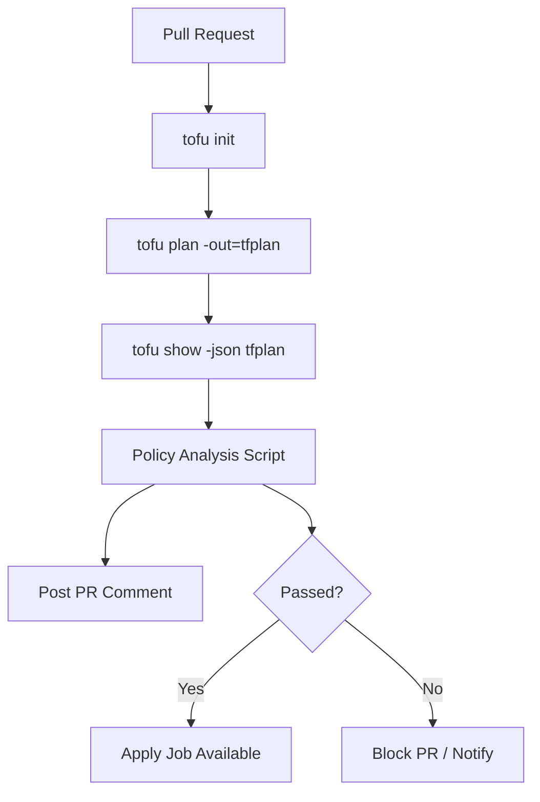

# How to Integrate Plan JSON Analysis in CI/CD for OpenTofu

Author: [nawazdhandala](https://www.github.com/nawazdhandala)

Tags: OpenTofu, CI/CD, Plan JSON, GitHub Actions, Infrastructure as Code

Description: Learn how to integrate OpenTofu plan JSON analysis into CI/CD pipelines to enforce policies, post change summaries, and gate deployments automatically.

Integrating plan analysis in CI/CD transforms infrastructure pipelines from simple apply runners into intelligent gatekeeping systems. This guide shows how to wire plan generation, analysis, reporting, and gating into a complete GitHub Actions workflow.

## Full CI/CD Plan Analysis Workflow



## Step 1: Generate and Save the Plan JSON

```yaml
# .github/workflows/infra-pr.yml

name: Infrastructure PR Check

on:
  pull_request:
    paths: ["infra/**"]

jobs:
  plan:
    runs-on: ubuntu-latest
    permissions:
      pull-requests: write  # Required to post PR comments
      id-token: write       # For OIDC auth

    steps:
      - uses: actions/checkout@v4

      - name: Configure AWS via OIDC
        uses: aws-actions/configure-aws-credentials@v4
        with:
          role-to-assume: arn:aws:iam::123456789012:role/github-actions-plan
          aws-region: us-east-1

      - name: Install OpenTofu
        run: |
          curl -Lo tofu.tar.gz \
            https://github.com/opentofu/opentofu/releases/latest/download/tofu_linux_amd64.tar.gz
          tar -xzf tofu.tar.gz && sudo mv tofu /usr/local/bin/

      - name: Init and Plan
        working-directory: infra
        run: |
          tofu init
          tofu plan -out=tfplan -no-color 2>&1 | tee plan-human.txt
          tofu show -json tfplan > plan.json

      - name: Upload Plan Artifacts
        uses: actions/upload-artifact@v4
        with:
          name: plan-artifacts
          path: |
            infra/tfplan
            infra/plan.json
            infra/plan-human.txt
```

## Step 2: Analyze the Plan and Generate a Summary

```python
#!/usr/bin/env python3
# ci-plan-summary.py - generate a Markdown summary for PR comments

import json, sys

with open(sys.argv[1]) as f:
    plan = json.load(f)

changes = plan.get("resource_changes", [])
counts = {"create": 0, "update": 0, "delete": 0, "replace": 0}
destructive = []

for c in changes:
    actions = c["change"]["actions"]
    addr = c["address"]
    if actions == ["no-op"]: continue
    if actions == ["create"]: counts["create"] += 1
    elif actions == ["update"]: counts["update"] += 1
    elif actions == ["delete"]:
        counts["delete"] += 1
        destructive.append(addr)
    elif set(actions) == {"delete", "create"}:
        counts["replace"] += 1
        destructive.append(addr)

# Write Markdown output
output = f"""## OpenTofu Plan Summary

| Action | Count |
|--------|-------|
| Create | {counts['create']} |
| Update | {counts['update']} |
| Delete | {counts['delete']} |
| Replace | {counts['replace']} |

"""

if destructive:
    output += "### ⚠️ Destructive Changes\n"
    for addr in destructive:
        output += f"- `{addr}`\n"

with open("plan-summary.md", "w") as f:
    f.write(output)

# Exit non-zero if there are destructive changes
sys.exit(1 if destructive else 0)
```

## Step 3: Post Summary as a PR Comment

```yaml
      - name: Analyze Plan
        id: analyze
        working-directory: infra
        run: |
          python3 ../scripts/ci-plan-summary.py plan.json
          echo "has_destructive=$?" >> $GITHUB_OUTPUT

      - name: Post PR Comment
        uses: marocchino/sticky-pull-request-comment@v2
        with:
          path: infra/plan-summary.md
```

## Step 4: Gate the Apply Job

```yaml
  apply:
    needs: plan
    runs-on: ubuntu-latest
    # Only run apply on merge to main, not on PRs
    if: github.event_name == 'push' && github.ref == 'refs/heads/main'
    environment: production

    steps:
      - name: Download Plan
        uses: actions/download-artifact@v4
        with:
          name: plan-artifacts

      - name: Apply
        working-directory: infra
        run: tofu apply -auto-approve tfplan
```

## Conclusion

A complete CI/CD plan analysis pipeline generates a JSON plan, runs policy checks, posts a human-readable summary to the pull request, and gates the apply job behind environment approvals. This workflow gives your team full visibility into infrastructure changes before they land in production.
