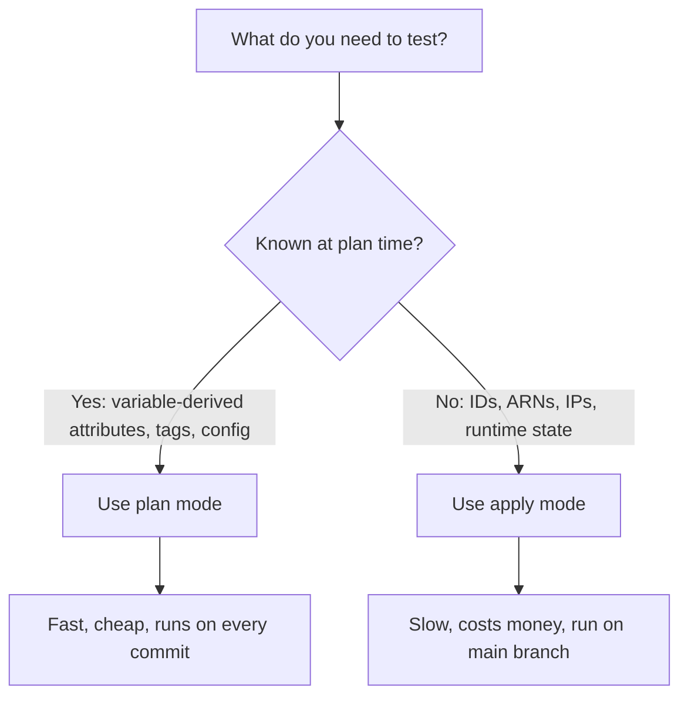

# How to Use Plan Mode vs Apply Mode in Tests in OpenTofu

Author: [nawazdhandala](https://www.github.com/nawazdhandala)

Tags: OpenTofu, Testing, Plan Mode, Apply Mode, Infrastructure as Code

Description: Understand when to use plan mode versus apply mode in OpenTofu tests to balance test thoroughness with execution speed.

## Introduction

OpenTofu tests support two execution modes controlled by the `command` argument in a `run` block: `plan` and `apply`. Choosing the right mode for each test is a key architectural decision that affects speed, cost, and the depth of coverage.

## Plan Mode

In plan mode, OpenTofu generates an execution plan but does not create or modify any real resources.

```hcl
run "check_resource_configuration" {
  # 'plan' is the explicit keyword; no resources are created
  command = plan

  assert {
    # Attributes derived from variables are known at plan time
    condition     = aws_s3_bucket.this.bucket == "my-app-bucket"
    error_message = "Bucket name should match the input variable"
  }
}
```

**Advantages of plan mode:**
- Very fast—no API calls to create resources.
- No cloud credentials required if using mock providers.
- Zero cost.
- Safe to run on every commit.

**Limitations of plan mode:**
- Attributes generated by the cloud provider (like ARNs, IDs, assigned IP addresses) are `(known after apply)` and cannot be asserted on.
- Does not catch runtime errors (e.g., capacity limits, duplicate names).

## Apply Mode

In apply mode (the default), OpenTofu actually creates resources, evaluates assertions, and then destroys everything at the end.

```hcl
run "instance_gets_public_ip" {
  # 'apply' is the default; you can omit this line
  command = apply

  assert {
    # Public IP is only known after apply
    condition     = aws_instance.web.public_ip != ""
    error_message = "Instance should have received a public IP"
  }

  assert {
    # ARN is provider-generated
    condition     = startswith(aws_instance.web.arn, "arn:aws:ec2:")
    error_message = "Instance ARN format is invalid"
  }
}
```

**Advantages of apply mode:**
- Full fidelity—tests real cloud behaviour.
- Can assert on any attribute, including provider-generated ones.
- Catches real-world failure modes.

**Limitations of apply mode:**
- Slower (minutes, not seconds).
- Incurs cloud costs.
- Requires live cloud credentials.

## Combining Both Modes in One File

Use plan mode for cheap structural checks and apply mode for end-to-end verification:

```hcl
# tests/ec2.tftest.hcl

# Fast structural check — runs on every PR
run "instance_uses_correct_type" {
  command = plan

  assert {
    condition     = aws_instance.web.instance_type == "t3.micro"
    error_message = "Instance type must be t3.micro in test environments"
  }
}

# Full apply — runs on merge to main only
run "instance_is_running_after_apply" {
  command = apply

  assert {
    condition     = aws_instance.web.instance_state == "running"
    error_message = "Instance should be in running state after apply"
  }

  assert {
    condition     = aws_instance.web.public_ip != ""
    error_message = "Instance should have a public IP"
  }
}
```

## Decision Framework



## CI/CD Strategy

```yaml
# .github/workflows/test.yml
jobs:
  plan-tests:
    runs-on: ubuntu-latest
    on: [pull_request]
    steps:
      - uses: opentofu/setup-opentofu@v1
      - run: tofu init
      # Only plan-mode tests—fast and free
      - run: tofu test -filter=tests/unit/

  apply-tests:
    runs-on: ubuntu-latest
    on:
      push:
        branches: [main]
    steps:
      - uses: opentofu/setup-opentofu@v1
      - run: tofu init
      # Full apply tests—thorough but slow
      - run: tofu test -filter=tests/integration/
        env:
          AWS_ACCESS_KEY_ID: ${{ secrets.AWS_ACCESS_KEY_ID }}
          AWS_SECRET_ACCESS_KEY: ${{ secrets.AWS_SECRET_ACCESS_KEY }}
```

## Conclusion

Plan mode and apply mode are complementary, not competing. A well-designed test suite runs plan-mode tests on every pull request for fast feedback, and apply-mode tests post-merge to verify real-world behaviour. Together they give you confidence without unnecessary cost or latency.
