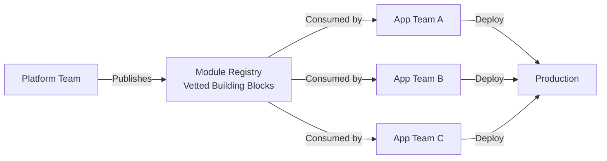

# How to Build a Platform Engineering Foundation with OpenTofu

Author: [nawazdhandala](https://www.github.com/nawazdhandala)

Tags: OpenTofu, Platform Engineering, Internal Developer Platform, Modules, Infrastructure as Code, DevOps

Description: Learn how to build an Internal Developer Platform (IDP) foundation using OpenTofu modules that enable product teams to self-service infrastructure without deep cloud expertise.

---

Platform engineering builds the foundations that application teams use to deploy their services. Rather than every team solving the same infrastructure problems, the platform team provides curated, opinionated modules. OpenTofu is the delivery mechanism for these golden paths.

## The Platform Engineering Model



## Creating Opinionated Service Modules

The platform team creates modules that enforce security, monitoring, and compliance by default.

```hcl
# modules/platform-service/main.tf

# This module represents the "golden path" for deploying a web service
# It enforces: TLS, WAF, monitoring, tagging, and secret management

terraform {
  required_providers {
    aws = {
      source  = "hashicorp/aws"
      version = "~> 5.30"
    }
  }
}

variable "service_name" {
  type        = string
  description = "Name of the service (e.g., orders-api, user-service)"

  validation {
    condition     = can(regex("^[a-z][a-z0-9-]*[a-z0-9]$", var.service_name))
    error_message = "Service name must be lowercase alphanumeric with hyphens"
  }
}

variable "app_image" {
  type        = string
  description = "Docker image for the service (e.g., 123456789012.dkr.ecr.us-east-1.amazonaws.com/app:v1)"
}

variable "team" {
  type        = string
  description = "Team that owns this service"
}

variable "desired_count" {
  type        = number
  description = "Number of service instances"
  default     = 2

  validation {
    condition     = var.desired_count >= 2
    error_message = "Production services must have at least 2 instances for HA"
  }
}

# Platform-enforced locals - not overridable by calling modules
locals {
  common_tags = {
    Service     = var.service_name
    Team        = var.team
    ManagedBy   = "opentofu"
    Platform    = "true"
    Environment = data.aws_ssm_parameter.environment.value
  }
}

data "aws_ssm_parameter" "environment" {
  name = "/platform/environment"
}

# ECS service with platform-enforced settings
resource "aws_ecs_service" "main" {
  name            = var.service_name
  cluster         = data.aws_ecs_cluster.platform.arn
  task_definition = aws_ecs_task_definition.main.arn
  desired_count   = var.desired_count

  # Platform-required: deployment circuit breaker
  deployment_circuit_breaker {
    enable   = true
    rollback = true
  }

  # Platform-required: ELB health check
  health_check_grace_period_seconds = 120

  load_balancer {
    target_group_arn = aws_lb_target_group.main.arn
    container_name   = var.service_name
    container_port   = 8080
  }

  network_configuration {
    subnets         = data.aws_ssm_parameter.private_subnets.value
    security_groups = [aws_security_group.service.id]
  }
}

# Platform-enforced monitoring - auto-created for every service
resource "aws_cloudwatch_metric_alarm" "high_cpu" {
  alarm_name          = "${var.service_name}-high-cpu"
  comparison_operator = "GreaterThanOrEqualToThreshold"
  evaluation_periods  = 2
  metric_name         = "CPUUtilization"
  namespace           = "AWS/ECS"
  period              = 300
  statistic           = "Average"
  threshold           = 80

  dimensions = {
    ClusterName = data.aws_ecs_cluster.platform.name
    ServiceName = var.service_name
  }

  alarm_actions = [data.aws_ssm_parameter.alert_topic.value]
  tags          = local.common_tags
}

data "aws_ecs_cluster" "platform" {
  cluster_name = data.aws_ssm_parameter.cluster_name.value
}
```

## Application Team Usage

```hcl
# teams/orders-team/orders-api/main.tf
# The application team's entire infrastructure - 10 lines
module "orders_api" {
  source  = "git::https://github.com/myorg/platform-modules.git//platform-service?ref=v1.5.0"

  service_name  = "orders-api"
  team          = "orders"
  app_image     = "123456789012.dkr.ecr.us-east-1.amazonaws.com/orders-api:${var.version}"
  desired_count = 3
}
```

## Service Catalog via SSM Parameters

```hcl
# service_catalog.tf
# Platform stores shared configuration in SSM for consuming modules
resource "aws_ssm_parameter" "cluster_name" {
  name  = "/platform/ecs-cluster-name"
  type  = "String"
  value = aws_ecs_cluster.platform.name
}

resource "aws_ssm_parameter" "private_subnets" {
  name  = "/platform/private-subnet-ids"
  type  = "StringList"
  value = join(",", aws_subnet.private[*].id)
}

resource "aws_ssm_parameter" "alert_topic" {
  name  = "/platform/alert-sns-topic-arn"
  type  = "String"
  value = aws_sns_topic.platform_alerts.arn
}
```

## Best Practices

- Design platform modules to be opinionated - they should enforce security and operational standards, not just provide convenience.
- Version your platform modules with semantic versioning so teams can upgrade deliberately and test before adopting new versions.
- Provide migration guides when making breaking changes to platform module APIs.
- Publish module documentation to an internal portal (Backstage, Confluence) so teams can discover what's available.
- Collect feedback from application teams to understand where the golden paths have sharp edges that need improvement.
