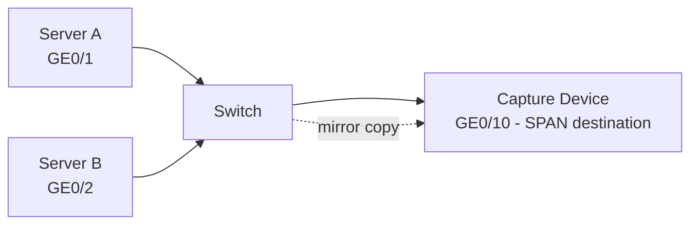

# How to Set Up Port Mirroring (SPAN) on a Switch for Packet Capture

Author: [nawazdhandala](https://www.github.com/nawazdhandala)

Tags: Span, Port Mirroring, Switch, Packet Capture, Network Monitoring

Description: Learn how to configure Switched Port Analyzer (SPAN) port mirroring on Cisco, Arista, and Linux bridge switches to copy traffic from monitored ports to a capture device running Wireshark or tcpdump.

## What Is SPAN/Port Mirroring?

SPAN (Switched Port Analyzer) copies traffic from one or more source ports to a destination port where a packet capture device is connected. The capture device receives a copy of all traffic - not just traffic destined for it.



## Step 1: Configure SPAN on Cisco IOS

```yaml
! Monitor a single port (GigabitEthernet0/1)
! Send copy to GigabitEthernet0/10 (where capture device is connected)

Switch# configure terminal

! Create SPAN session 1
Switch(config)# monitor session 1 source interface GigabitEthernet0/1 both
Switch(config)# monitor session 1 destination interface GigabitEthernet0/10

! Options for source direction:
! both  = capture TX and RX
! tx    = capture only transmitted (leaving the port)
! rx    = capture only received (arriving at the port)

! Verify
Switch# show monitor session 1
!
! Session 1
! ---------
! Type                   : Local Session
! Source Ports           :
!     Both               : Gi0/1
! Destination Ports      : Gi0/10
!     Encapsulation      : Native
!         Ingress        : Disabled
```

## Step 2: Mirror Multiple Source Ports

```text
! Mirror multiple specific ports
Switch(config)# monitor session 1 source interface GigabitEthernet0/1 - 5 both

! Mirror an entire VLAN (all traffic in VLAN 100)
Switch(config)# monitor session 1 source vlan 100

! Mirror multiple VLANs
Switch(config)# monitor session 1 source vlan 100, 200, 300

! Combine ports and VLANs in one session
Switch(config)# monitor session 1 source interface GigabitEthernet0/1 both
Switch(config)# monitor session 1 source vlan 100

! Remove a SPAN session
Switch(config)# no monitor session 1
```

## Step 3: Configure RSPAN (Remote SPAN Across Switches)

```text
! RSPAN sends mirrored traffic across the network to a remote switch

! Source switch configuration
Switch-Source(config)# vlan 999
Switch-Source(config-vlan)# remote-span
Switch-Source(config-vlan)# exit

Switch-Source(config)# monitor session 1 source interface GigabitEthernet0/1 both
Switch-Source(config)# monitor session 1 destination remote vlan 999

! Destination switch (where capture device is)
Switch-Dest(config)# vlan 999
Switch-Dest(config-vlan)# remote-span
Switch-Dest(config-vlan)# exit

Switch-Dest(config)# monitor session 1 source remote vlan 999
Switch-Dest(config)# monitor session 1 destination interface GigabitEthernet0/10
```

## Step 4: Configure Port Mirroring on Linux Bridge

```bash
# Linux bridge with tc (traffic control) mirroring

# Add mirror rule: copy all traffic from eth1 to eth2 (capture device)

sudo tc qdisc add dev eth1 handle ffff: ingress
sudo tc filter add dev eth1 parent ffff: u32 match u8 0 0 \
    action mirred egress mirror dev eth2

# Mirror outgoing traffic too
sudo tc qdisc add dev eth1 root handle 1: prio
sudo tc filter add dev eth1 parent 1: u32 match u8 0 0 \
    action mirred egress mirror dev eth2

# Verify mirrors are active
tc filter show dev eth1 parent ffff:
tc filter show dev eth1 parent 1:

# Remove mirror
sudo tc qdisc del dev eth1 root
sudo tc qdisc del dev eth1 handle ffff: ingress
```

## Step 5: Configure on Arista EOS

```text
! Arista EOS SPAN configuration

Switch# configure
Switch(config)# monitor session 1
Switch(config-monitor-session-1)# source Ethernet1 both
Switch(config-monitor-session-1)# destination Ethernet10
Switch(config-monitor-session-1)# no shutdown

! Verify
Switch# show monitor session 1
Session 1 (active)
  Source interfaces:
    Ethernet1 (tx, rx)
  Destination interfaces:
    Ethernet10
```

## Step 6: Capture and Analyze Mirrored Traffic

```bash
# On the capture device connected to SPAN destination port
# The NIC must be in promiscuous mode to receive all mirrored traffic

# Enable promiscuous mode
sudo ip link set eth0 promisc on

# Verify
ip link show eth0 | grep -o 'PROMISC'

# Capture all mirrored traffic
sudo tcpdump -i eth0 -n -w /tmp/span-capture.pcap

# Capture with filter (even on mirrored traffic)
sudo tcpdump -i eth0 -n 'host 192.168.1.50' -w /tmp/server-traffic.pcap

# Open in Wireshark
wireshark /tmp/span-capture.pcap
```

## Step 7: SPAN Best Practices and Limitations

```text
Limitations:
1. SPAN destination port cannot be used for regular traffic
2. SPAN may drop packets during congestion (hardware limit)
3. Too many source ports can oversubscribe destination
4. Some switches limit SPAN sessions (typically 2-4 per switch)

Best Practices:
1. Use rx-only SPAN when possible (half the traffic)
2. Filter at SPAN level if switch supports it:
   Switch(config)# monitor session 1 filter ip access-group ACL_NAME

3. Monitor SPAN session health:
   Switch# show monitor session all

4. Use a dedicated NIC for capture device (multiple ports = multi-threading)
```

## Conclusion

SPAN/port mirroring copies traffic from source ports to a capture device at the switch hardware level. Configure on Cisco IOS with `monitor session 1 source interface Gi0/1 both` + `monitor session 1 destination interface Gi0/10`. On Linux, use `tc filter` with `action mirred egress mirror`. Set the capture device NIC to promiscuous mode with `ip link set eth0 promisc on`, then run `tcpdump -i eth0` to capture all mirrored traffic. Use RSPAN to extend port mirroring across multiple switches to a centralized capture location.
