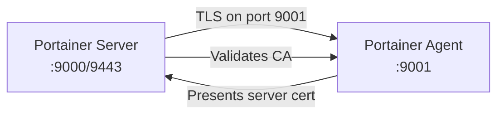

# How to Configure TLS for Portainer Agent Communication

Author: [nawazdhandala](https://www.github.com/nawazdhandala)

Tags: Portainer, Agent, TLS, Security, Certificates, Encryption

Description: Secure the communication channel between the Portainer server and Portainer Agent using mutual TLS (mTLS) with custom certificates.

## Introduction

By default, the Portainer Agent on port 9001 uses TLS with a self-generated certificate. For production environments, you should configure TLS with your own certificates to ensure the authenticity of both the Portainer server and the Agent. This guide covers setting up TLS for the Agent-to-server communication channel.

## Prerequisites

- Portainer server running with accessible port 9000/9443
- Portainer Agent deployed on remote hosts
- OpenSSL installed for certificate generation
- Basic understanding of TLS/PKI concepts

## Understanding Agent TLS Architecture



The Portainer server connects to the Agent on port 9001. The Agent presents a certificate; the server validates it against a trusted CA.

## Step 1: Generate a CA and Certificates

```bash
mkdir -p /opt/portainer-certs
cd /opt/portainer-certs

# Generate CA key and certificate
openssl genrsa -out ca.key 4096
openssl req -new -x509 -days 3650 \
  -key ca.key \
  -out ca.crt \
  -subj "/C=US/O=MyOrg/CN=Portainer CA"

# Generate Agent server key and CSR
openssl genrsa -out agent.key 2048
openssl req -new \
  -key agent.key \
  -out agent.csr \
  -subj "/C=US/O=MyOrg/CN=portainer-agent"

# Sign the Agent certificate with the CA
openssl x509 -req -days 365 \
  -in agent.csr \
  -CA ca.crt \
  -CAkey ca.key \
  -CAcreateserial \
  -out agent.crt

# Generate Portainer server client certificate (for mTLS)
openssl genrsa -out server.key 2048
openssl req -new \
  -key server.key \
  -out server.csr \
  -subj "/C=US/O=MyOrg/CN=portainer-server"

openssl x509 -req -days 365 \
  -in server.csr \
  -CA ca.crt \
  -CAkey ca.key \
  -CAcreateserial \
  -out server.crt

# Verify certificates
openssl verify -CAfile ca.crt agent.crt server.crt
```

## Step 2: Deploy Agent with Custom TLS Certificates

```bash
# Copy certificates to the agent host
scp ca.crt agent.crt agent.key user@agent-host:/opt/portainer-certs/

# On the agent host, deploy the agent with TLS
docker run -d \
  -p 9001:9001 \
  -v /var/run/docker.sock:/var/run/docker.sock \
  -v /var/lib/docker/volumes:/var/lib/docker/volumes \
  -v /opt/portainer-certs:/certs:ro \
  --name portainer_agent \
  --restart always \
  portainer/agent:latest \
  --tlscacert /certs/ca.crt \
  --tlscert /certs/agent.crt \
  --tlskey /certs/agent.key
```

## Step 3: Configure Docker Compose for Agent TLS

```yaml
version: "3.8"

services:
  portainer_agent:
    image: portainer/agent:latest
    container_name: portainer_agent
    restart: always
    ports:
      - "9001:9001"
    volumes:
      - /var/run/docker.sock:/var/run/docker.sock
      - /var/lib/docker/volumes:/var/lib/docker/volumes
      - /opt/portainer-certs:/certs:ro
    command: >
      --tlscacert /certs/ca.crt
      --tlscert /certs/agent.crt
      --tlskey /certs/agent.key
```

## Step 4: Add the TLS-Secured Agent to Portainer

When adding the environment in Portainer:

1. Go to **Environments** → **Add environment** → **Docker Standalone** → **Agent**
2. Enter the Agent URL: `tcp://agent-host:9001`
3. Enable **TLS**
4. Upload:
   - **TLS CA certificate**: `ca.crt`
   - **TLS certificate**: `server.crt` (the client certificate for mTLS)
   - **TLS key**: `server.key`
5. Click **Add environment**

### Via API

```bash
TOKEN=$(curl -s -X POST \
  https://portainer.example.com/api/auth \
  -H "Content-Type: application/json" \
  -d '{"username":"admin","password":"adminpassword"}' \
  | python3 -c "import sys,json; print(json.load(sys.stdin)['jwt'])")

# Add TLS-secured agent
curl -X POST \
  -H "Authorization: Bearer $TOKEN" \
  -F "Name=Production Agent" \
  -F "EndpointCreationType=1" \
  -F "URL=tcp://agent-host:9001" \
  -F "TLS=true" \
  -F "TLSSkipVerify=false" \
  -F "TLSSkipClientVerify=false" \
  -F "TLSCACert=@/opt/portainer-certs/ca.crt" \
  -F "TLSCert=@/opt/portainer-certs/server.crt" \
  -F "TLSKey=@/opt/portainer-certs/server.key" \
  https://portainer.example.com/api/endpoints
```

## Certificate Rotation

When certificates expire, rotate them without downtime:

```bash
# 1. Generate new certificates (keeping the same CA)
openssl genrsa -out agent-new.key 2048
openssl req -new -key agent-new.key -out agent-new.csr \
  -subj "/C=US/O=MyOrg/CN=portainer-agent"
openssl x509 -req -days 365 \
  -in agent-new.csr -CA ca.crt -CAkey ca.key \
  -CAcreateserial -out agent-new.crt

# 2. Copy new certs to agent host
scp agent-new.crt agent-new.key user@agent-host:/opt/portainer-certs/

# 3. Rename and restart agent
ssh user@agent-host "
  mv /opt/portainer-certs/agent-new.crt /opt/portainer-certs/agent.crt
  mv /opt/portainer-certs/agent-new.key /opt/portainer-certs/agent.key
  docker restart portainer_agent
"
```

## Verify TLS Connection

```bash
# Test TLS handshake
openssl s_client \
  -connect agent-host:9001 \
  -CAfile /opt/portainer-certs/ca.crt \
  -cert /opt/portainer-certs/server.crt \
  -key /opt/portainer-certs/server.key

# Expected output includes:
# Verify return code: 0 (ok)
```

## Troubleshooting

**"x509: certificate signed by unknown authority":**
- Ensure the CA certificate is uploaded to Portainer when adding the environment
- Verify the Agent certificate was signed by the same CA

**"remote error: tls: certificate required":**
- mTLS is enforced but the Portainer server hasn't provided its client certificate
- Upload the server client certificate when configuring the environment in Portainer

**Connection timeout on port 9001:**
- Check firewall rules: `nc -zv agent-host 9001`
- Verify the Agent is listening: `ss -tlnp | grep 9001`

## Conclusion

Configuring TLS for Portainer Agent communication provides end-to-end encryption and mutual authentication between the server and agents. This is especially important in production environments where agents may be exposed on network interfaces accessible to multiple systems. Using a dedicated CA for your Portainer infrastructure gives you full control over certificate issuance and revocation.
