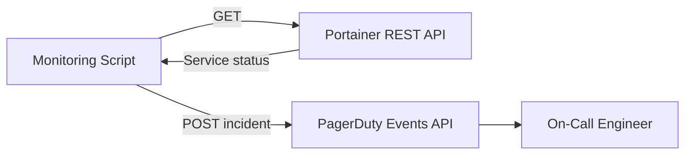

# How to Integrate Portainer API with PagerDuty for Alerts - Alerts

Author: [nawazdhandala](https://www.github.com/nawazdhandala)

Tags: Portainer, PagerDuty, Alerting, API, DevOps, Monitoring

Description: Use the Portainer REST API to monitor container and service health, then trigger PagerDuty incidents when failures are detected across your Docker and Kubernetes environments.

---

Portainer's REST API exposes container status, service health, and environment connectivity - all queryable from external monitoring scripts. By polling the Portainer API and sending events to PagerDuty, you build an alerting pipeline that pages on-call engineers when services degrade.

## Architecture



## Step 1: Generate a Portainer API Token

In Portainer, go to **My Account > Access Tokens > Add Access Token**. Save the token securely.

## Step 2: PagerDuty Integration Key

In PagerDuty, create a new **Events API v2** integration on your service:

1. Go to Services > [Your Service] > Integrations
2. Add **Events API v2**
3. Copy the Integration Key (routing_key)

## Step 3: Health Check Script

```python
#!/usr/bin/env python3
"""
Monitor Portainer service health and alert PagerDuty on degradation.
Run every 60 seconds via cron or a monitoring loop.
"""
import requests
import json
import os

PORTAINER_URL = os.environ["PORTAINER_URL"]
PORTAINER_TOKEN = os.environ["PORTAINER_TOKEN"]
PAGERDUTY_KEY = os.environ["PAGERDUTY_ROUTING_KEY"]
ENDPOINT_ID = 1  # Docker/Swarm environment ID

def get_swarm_services():
    """Fetch all Swarm service statuses from Portainer API."""
    resp = requests.get(
        f"{PORTAINER_URL}/api/endpoints/{ENDPOINT_ID}/docker/services",
        headers={"Authorization": f"Bearer {PORTAINER_TOKEN}"},
        verify=True
    )
    resp.raise_for_status()
    return resp.json()

def send_pagerduty_alert(service_name, running, desired):
    """Trigger a PagerDuty incident for a degraded service."""
    payload = {
        "routing_key": PAGERDUTY_KEY,
        "event_action": "trigger",
        "dedup_key": f"portainer-service-{service_name}",
        "payload": {
            "summary": f"Service {service_name} degraded: {running}/{desired} replicas",
            "severity": "critical",
            "source": "portainer-monitor",
            "custom_details": {
                "service": service_name,
                "running_replicas": running,
                "desired_replicas": desired
            }
        }
    }
    resp = requests.post(
        "https://events.pagerduty.com/v2/enqueue",
        json=payload
    )
    return resp.status_code

def resolve_pagerduty_alert(service_name):
    """Resolve a PagerDuty incident when service recovers."""
    payload = {
        "routing_key": PAGERDUTY_KEY,
        "event_action": "resolve",
        "dedup_key": f"portainer-service-{service_name}"
    }
    requests.post("https://events.pagerduty.com/v2/enqueue", json=payload)

if __name__ == "__main__":
    services = get_swarm_services()
    for svc in services:
        name = svc["Spec"]["Name"]
        running = svc.get("ServiceStatus", {}).get("RunningTasks", 0)
        desired = svc.get("ServiceStatus", {}).get("DesiredTasks", 1)
        if running < desired:
            code = send_pagerduty_alert(name, running, desired)
            print(f"Alerted PagerDuty for {name}: HTTP {code}")
        else:
            resolve_pagerduty_alert(name)
            print(f"Service {name} healthy: {running}/{desired}")
```

## Step 4: Deploy the Monitor as a Docker Container

```yaml
# monitor-stack.yml

version: "3.8"
services:
  portainer-monitor:
    image: python:3.12-slim
    entrypoint: ["/bin/sh", "-c"]
    command: >
      "pip install requests -q &&
       while true; do python /monitor/health_check.py; sleep 60; done"
    environment:
      - PORTAINER_URL=https://portainer:9443
      - PORTAINER_TOKEN=${PORTAINER_TOKEN}
      - PAGERDUTY_ROUTING_KEY=${PAGERDUTY_KEY}
    volumes:
      - ./health_check.py:/monitor/health_check.py:ro
    restart: unless-stopped
```

## Summary

The Portainer REST API provides all the health data needed to build effective alerting integrations. The PagerDuty Events API v2 accepts both trigger and resolve calls, enabling auto-resolution when services recover. This pattern extends to any incident management platform that accepts webhook events.
