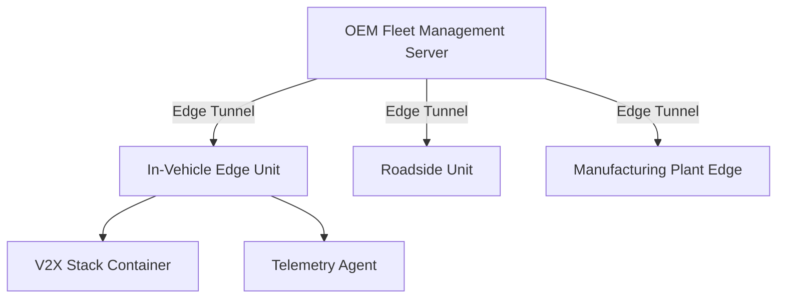

# How to Set Up Portainer for Automotive Edge Deployments

Author: [nawazdhandala](https://www.github.com/nawazdhandala)

Tags: Portainer, Automotive, Edge Computing, Docker, OTA Updates, V2X

Description: Configure Portainer to manage containerized applications on automotive edge computing platforms — from in-vehicle compute modules to roadside units and manufacturing line controllers.

---

The automotive industry deploys containerized software on edge hardware in vehicles, roadside units, and manufacturing facilities. Portainer's Edge Agent model is well-suited for managing these deployments: devices connect outbound, updates are pushed from a central server, and rollbacks are available when issues arise.

## Automotive Edge Use Cases

| Platform | Container Workloads |
|---|---|
| In-Vehicle Compute (AUTOSAR Adaptive) | V2X messaging, OTA update agent, telemetry |
| Roadside Unit (RSU) | DSRC/C-V2X protocol stack, traffic analytics |
| Manufacturing Line | Quality vision, torque control telemetry, MES integration |
| Dealership Diagnostics | OBD connector gateway, service scheduling API |

## Architecture



## Step 1: Deploy Portainer for Fleet Management

Install Portainer Server at the OEM's central cloud or data center:

```bash
docker run -d \
  --name portainer-fleet \
  --restart always \
  -p 9443:9443 \
  -p 8000:8000 \
  -v portainer_data:/data \
  portainer/portainer-ee:latest
```

## Step 2: Create Edge Groups by Vehicle Model or Region

```
Edge Group: model-x-gen3-vehicles
Edge Group: rsus-california
Edge Group: plant-detroit-line1
```

Group vehicles by model year for targeted software updates — a new feature may only apply to Gen 3 hardware, not Gen 2.

## Step 3: Enroll Edge Compute Units

For automotive-grade Linux targets (e.g., running Automotive Grade Linux or GENIVI):

```bash
# Initial enrollment script for edge compute module
docker run -d \
  --name portainer-agent \
  --restart always \
  -e EDGE=1 \
  -e EDGE_ID=${VIN_BASED_ID} \
  -e EDGE_KEY=${FLEET_ENROLLMENT_KEY} \
  -e EDGE_INACTIVITY_TIMEOUT=75 \
  -v /var/run/docker.sock:/var/run/docker.sock \
  internal-registry.oem.com/portainer/agent:latest
```

Use the Vehicle Identification Number (VIN) as the Edge ID for traceability.

## Step 4: Deploy Telemetry Stack via Edge Stack

```yaml
# vehicle-telemetry-stack.yml
version: "3.8"

services:
  telemetry-agent:
    image: internal-registry.oem.com/telemetry-agent:4.1.0
    environment:
      - VEHICLE_ID=${VIN}
      - TELEMETRY_ENDPOINT=https://telemetry.oem.com/ingest
      - SAMPLE_RATE_HZ=10
    volumes:
      - /dev/canbus0:/dev/canbus0   # CAN bus interface
    restart: unless-stopped
    network_mode: host

  ota-agent:
    image: internal-registry.oem.com/ota-client:2.0.3
    environment:
      - OTA_SERVER=https://updates.oem.com
      - HARDWARE_PROFILE=${HW_PROFILE}
    volumes:
      - /opt/ota:/opt/ota
    restart: unless-stopped
```

## Step 5: Staged Rollouts

For safety-critical automotive software, use staged rollouts:

1. Deploy to `edge-group: test-fleet-10-vehicles` first
2. Monitor telemetry for 72 hours
3. Promote to `edge-group: model-x-gen3-vehicles` after validation
4. Keep rollback image available for immediate revert

```bash
# Portainer API — update edge stack to previous version
curl -X PUT https://portainer-fleet:9443/api/edge/stacks/42 \
  -H "Authorization: Bearer $TOKEN" \
  -d '{"StackFileContent": "...previous-version-yaml..."}'
```

## Summary

Portainer's Edge Agent architecture fits the automotive edge deployment model well: outbound-only connectivity from vehicles and roadside units, centralized fleet management from the OEM cloud, and the ability to perform staged OTA software updates with rollback capability. The Edge Group model maps naturally to vehicle model years, hardware generations, and regional deployment scopes.
