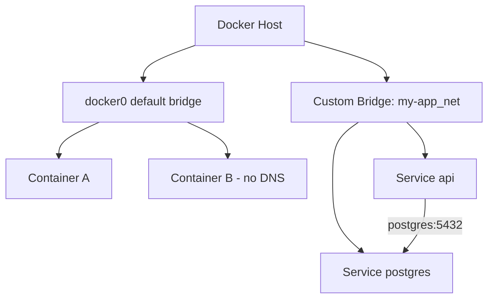

# How to Understand Docker Bridge Networking in Portainer

Author: [nawazdhandala](https://www.github.com/nawazdhandala)

Tags: Portainer, Docker Networking, Bridge Network, Container Communication, Network Management

Description: Learn how Docker bridge networking works in Portainer, how to create and manage custom bridge networks, and how containers communicate within them.

---

Bridge networking is Docker's default network mode. Each bridge network creates a virtual switch on the host, and containers on the same bridge can communicate by name. Portainer provides a visual interface for managing these networks.

## How Bridge Networks Work



The default `docker0` bridge does not support DNS-based container name resolution. Custom bridges created by Docker Compose or manually do support it — containers resolve each other by service name.

## Creating a Network in Portainer

In Portainer, go to **Networks > Add network**:

- **Name**: `my-app-net`
- **Driver**: `bridge`
- **Subnet**: `172.20.0.0/16` (optional — Docker assigns one if left blank)
- **Gateway**: `172.20.0.1` (optional)
- **IP range**: `172.20.0.0/24` (optional, restricts automatic IP assignment)

## Custom Bridge Network in a Stack

Define isolated networks per stack to prevent cross-stack container communication:

```yaml
version: "3.8"

services:
  api:
    image: my-api:latest
    networks:
      - frontend     # Accessible from the ingress
      - backend      # Can reach the database
    ports:
      - "3000:3000"

  postgres:
    image: postgres:15
    networks:
      - backend      # Isolated — only reachable from backend network
    environment:
      POSTGRES_PASSWORD: secret

  nginx:
    image: nginx:alpine
    networks:
      - frontend     # Only needs to reach the API
    ports:
      - "80:80"

networks:
  frontend:
    driver: bridge
  backend:
    driver: bridge
    internal: true   # No external internet access for the database network
```

## Inspecting Networks via Portainer

View network details including connected containers and IPAM config:

```bash
# List all networks
docker network ls

# Inspect a specific network
docker network inspect my-app_backend | jq '.[0] | {Subnet: .IPAM.Config[0].Subnet, Containers: (.Containers | keys)}'
```

In Portainer, click **Networks** then click the network name to see connected containers and IP assignments.

## Connecting a Running Container to a Network

Attach a container to an additional network without restarting it:

```bash
# Connect container to another network
docker network connect my-app_frontend my-container-name

# Disconnect from a network
docker network disconnect my-app_backend my-container-name
```

In Portainer, go to **Containers > [container] > Connected Networks** to connect or disconnect networks.

## Network Isolation Best Practices

| Practice | Benefit |
|----------|---------|
| Use `internal: true` for database networks | Prevents external access to databases |
| Create per-stack networks | Containers can't talk to other stacks by default |
| Avoid the default `docker0` bridge | No DNS support |
| Limit ports exposed to host | Reduces attack surface |
| Use separate frontend and backend networks | Defense in depth |

## Troubleshooting Connectivity

Test connectivity between containers on the same bridge:

```bash
# From inside the api container, test database connectivity
docker exec -it $(docker ps -qf name=api) sh -c "nc -zv postgres 5432 && echo OK"

# Check which networks a container is on
docker inspect $(docker ps -qf name=api) | jq '.[0].NetworkSettings.Networks | keys'
```
