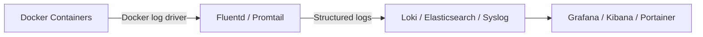

# How to Set Up Centralized Logging for Containers via Portainer (2)

Author: [nawazdhandala](https://www.github.com/nawazdhandala)

Tags: Portainer, Centralized Logging, Docker, Log Management, Monitoring, Fluentd

Description: Learn how to set up centralized logging for all containers managed by Portainer, routing logs to a central store like Loki, Elasticsearch, or a syslog server.

---

Centralized logging aggregates logs from all containers into a single, searchable store. Rather than `docker logs` one container at a time, you can search, filter, and alert across all containers from one interface.

## Logging Architecture Options



## Option 1: Loki + Promtail (Recommended for Simplicity)

Deploy the PLG stack as a Portainer stack:

```yaml
version: "3.8"

services:
  loki:
    image: grafana/loki:2.9.4
    command: -config.file=/etc/loki/loki.yaml
    volumes:
      - ./loki.yaml:/etc/loki/loki.yaml:ro
      - loki_data:/loki
    networks:
      - logging_net
    ports:
      - "3100:3100"

  promtail:
    image: grafana/promtail:2.9.4
    command: -config.file=/etc/promtail/promtail.yaml
    volumes:
      - ./promtail.yaml:/etc/promtail/promtail.yaml:ro
      - /var/run/docker.sock:/var/run/docker.sock:ro
      - /var/lib/docker/containers:/var/lib/docker/containers:ro
    networks:
      - logging_net
    depends_on:
      - loki

  grafana:
    image: grafana/grafana:10.3.1
    environment:
      GF_SECURITY_ADMIN_PASSWORD: grafanapassword
    ports:
      - "3000:3000"
    volumes:
      - grafana_data:/var/lib/grafana
    networks:
      - logging_net

volumes:
  loki_data:
  grafana_data:

networks:
  logging_net:
    driver: bridge
```

## Promtail Docker Discovery Config

Create `promtail.yaml` to discover all containers automatically:

```yaml
server:
  http_listen_port: 9080
  grpc_listen_port: 0

clients:
  - url: http://loki:3100/loki/api/v1/push

scrape_configs:
  - job_name: docker
    docker_sd_configs:
      - host: unix:///var/run/docker.sock
        refresh_interval: 5s
    relabel_configs:
      - source_labels: ['__meta_docker_container_name']
        regex: '/(.*)'
        target_label: container
      - source_labels: ['__meta_docker_container_image']
        target_label: image
      - source_labels: ['__meta_docker_compose_service']
        target_label: service
      - source_labels: ['__meta_docker_compose_project']
        target_label: stack
```

## Option 2: Fluentd with Docker Log Driver

Configure all containers to send logs to Fluentd:

```yaml
# In each application stack, add the log driver

services:
  api:
    image: my-api:latest
    logging:
      driver: fluentd
      options:
        fluentd-address: "localhost:24224"
        tag: "docker.{{.Name}}"
        fluentd-async: "true"    # Don't block container if Fluentd is unavailable
```

Deploy Fluentd as a separate stack:

```yaml
services:
  fluentd:
    image: fluent/fluentd:v1.16-debian-1
    volumes:
      - ./fluent.conf:/fluentd/etc/fluent.conf:ro
      - fluentd_logs:/fluentd/log
    ports:
      - "24224:24224"
      - "24224:24224/udp"
    networks:
      - logging_net
```

## Option 3: Syslog Driver

The syslog driver is the simplest option - it sends logs to any syslog server:

```yaml
services:
  api:
    image: my-api:latest
    logging:
      driver: syslog
      options:
        syslog-address: "tcp://syslog-server:514"
        tag: "my-app/api"
```

## Querying Logs in Grafana + Loki

After deployment, add Loki as a Grafana data source and use LogQL to query:

```logql
# All logs from the my-app stack
{stack="my-app"}

# Error logs from the api service
{service="api"} |= "error"

# Logs with response time > 1000ms
{service="api"} | json | response_time > 1000

# Count errors per minute
sum(rate({service="api"} |= "error" [1m])) by (container)
```

## Setting Up Log Retention

Configure Loki to automatically delete old logs:

```yaml
# loki.yaml
limits_config:
  retention_period: 30d    # Delete logs older than 30 days

compactor:
  retention_enabled: true
  working_directory: /loki/compactor
```
