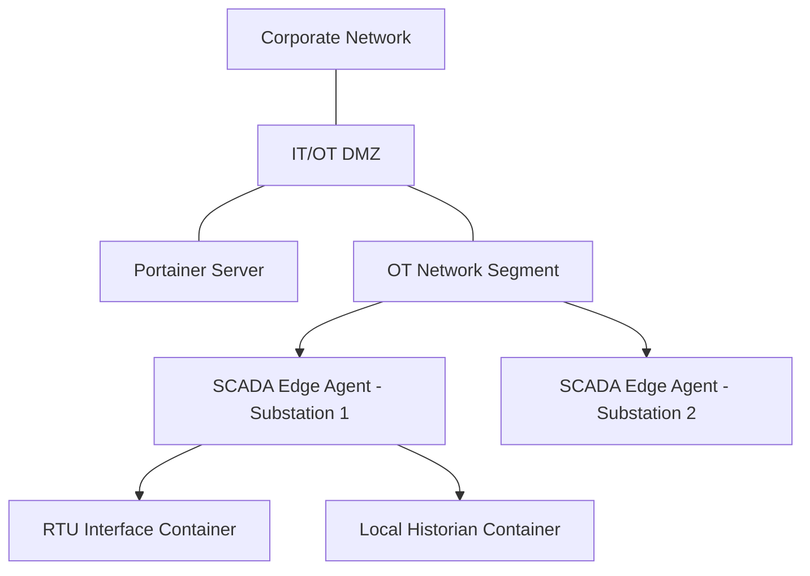

# How to Set Up Portainer for Energy Sector SCADA Systems

Author: [nawazdhandala](https://www.github.com/nawazdhandala)

Tags: Portainer, SCADA, Energy, ICS, Edge Computing, OT Security

Description: Deploy Portainer Edge Agent on energy sector SCADA and DCS infrastructure to manage containerized HMI, historian, and protocol gateway applications while respecting OT network isolation requirements.

---

Energy companies operating SCADA (Supervisory Control and Data Acquisition) systems face strict requirements: air-gapped or tightly isolated OT networks, rigorous change management, and zero tolerance for unplanned downtime. Portainer's Edge Agent model supports these constraints by establishing outbound-only connectivity from OT edge nodes to a management server in the IT DMZ.

## OT/IT Network Architecture



## Security Constraints for Energy OT

Before deployment, confirm these requirements with your OT security team:

- No inbound connections from IT to OT networks
- Container images must be pre-approved and cryptographically verified
- No internet access from OT nodes (use a local registry mirror)
- Change management approval required before any container update

## Step 1: Deploy Portainer in the IT/OT DMZ

Install Portainer Server on a hardened VM in the IT/OT DMZ:

```bash
docker run -d \
  --name portainer \
  --restart always \
  -p 9443:9443 \
  -p 8000:8000 \
  -v portainer_data:/data \
  portainer/portainer-ee:latest \
  --ssl --sslcert /certs/portainer.crt --sslkey /certs/portainer.key
```

Firewall rules: OT nodes can reach port 8000 outbound only. No return path allowed.

## Step 2: Set Up Offline Registry Mirror

Since OT nodes have no internet access, deploy a local registry mirror in the DMZ:

```bash
# Registry mirror in the DMZ

docker run -d \
  --name registry-mirror \
  -p 5000:5000 \
  -v registry-data:/var/lib/registry \
  registry:2
```

Pre-pull and push approved images to this mirror after security review.

## Step 3: Enroll SCADA Edge Nodes

For each substation or field device running Linux:

```bash
# Script run by OT team on-site (or via initial provisioning)
docker run -d \
  --name portainer-edge-agent \
  --restart always \
  -e EDGE=1 \
  -e EDGE_ID=<substation-id> \
  -e EDGE_KEY=<enrollment-key> \
  -v /var/run/docker.sock:/var/run/docker.sock \
  dmz-registry.internal:5000/portainer/agent:latest
```

## Step 4: Deploy SCADA Application Stack

Create an Edge Stack for historian and protocol gateway containers:

```yaml
# scada-edge-stack.yml
version: "3.8"

services:
  modbus-gateway:
    image: dmz-registry.internal:5000/modbus-gateway:1.2.0
    devices:
      # Map RS-485 serial port for Modbus RTU
      - /dev/ttyS0:/dev/ttyS0
    environment:
      - MODBUS_BAUD=9600
      - SCADA_SERVER=10.10.1.100:502
    restart: unless-stopped
    network_mode: host   # Direct access to OT subnet

  local-historian:
    image: dmz-registry.internal:5000/timescaledb:14
    volumes:
      - historian-data:/var/lib/postgresql/data
    environment:
      - POSTGRES_DB=historian
      - POSTGRES_PASSWORD_FILE=/run/secrets/db_pass
    restart: unless-stopped

volumes:
  historian-data:
```

## Step 5: Change Management Integration

For regulated environments, integrate Portainer API with your change management system:

```bash
# Portainer API - list pending edge deployments for change review
curl -X GET https://portainer-dmz:9443/api/edge/stacks \
  -H "Authorization: Bearer $TOKEN"
```

Only approved change tickets should trigger stack updates. Automate this with your ITSM tool's webhook integration.

## Summary

Portainer supports energy sector OT deployments by using outbound-only Edge Agent connectivity, local registry mirrors, and strict role-based access that maps to your organization's OT/IT separation requirements. The visual interface reduces operator error during the narrow change windows typical in SCADA environments.
