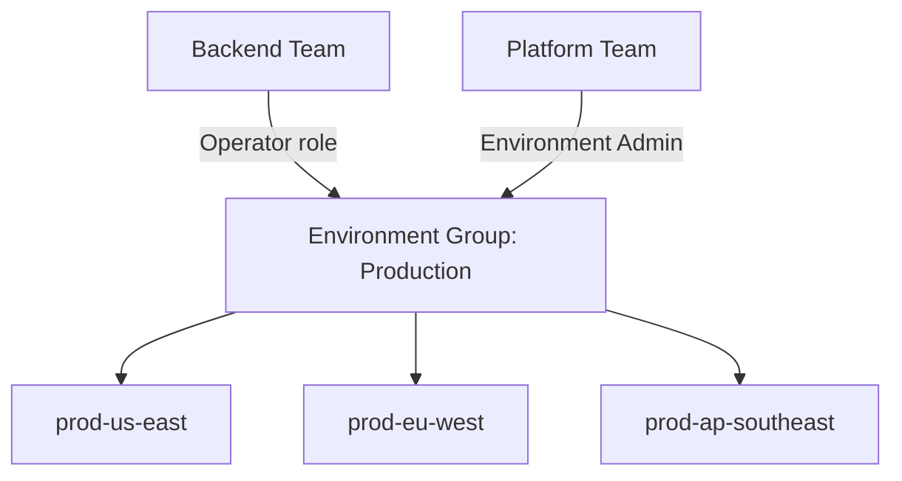

# How to Apply Access Policies to Environment Groups in Portainer

Author: [nawazdhandala](https://www.github.com/nawazdhandala)

Tags: Portainer, Environment Groups, Access Control, RBAC, Teams, Business Edition

Description: Assign team access policies to Portainer environment groups to efficiently manage permissions across multiple environments with a single configuration.

## Introduction

Managing access control individually for each environment becomes impractical as your Portainer installation grows. Environment groups let you bundle related environments (by stage, region, or team) and then assign a single access policy that applies to all environments in the group simultaneously. This guide covers applying group-level access policies via the Portainer UI and API.

## Understanding Group Access Policies

When you assign a team to an environment group with a specific role, that assignment applies to every environment in the group. If you later add a new environment to the group, the team automatically gains access to it with the same role.



## Step 1: Create an Environment Group

### Via Web UI

1. Go to **Environments** in the left sidebar
2. Click the **Groups** tab
3. Click **Add group**
4. Enter a name (e.g., "Production"), optional description
5. Select the environments to include
6. Click **Create group**

### Via API

```bash
TOKEN=$(curl -s -X POST \
  https://portainer.example.com/api/auth \
  -H "Content-Type: application/json" \
  -d '{"username":"admin","password":"adminpassword"}' \
  | python3 -c "import sys,json; print(json.load(sys.stdin)['jwt'])")

# Create a group with three environments
curl -X POST \
  -H "Authorization: Bearer $TOKEN" \
  -H "Content-Type: application/json" \
  https://portainer.example.com/api/endpoint_groups \
  -d '{
    "name": "Production",
    "description": "All production environments",
    "associatedEndpoints": [1, 2, 3]
  }'
```

## Step 2: Assign Team Access Policy to a Group

### Via Web UI

1. Navigate to **Environments** → **Groups**
2. Click on the group you want to configure
3. Scroll to the **Access control** section
4. Click **Add access** or **Manage access**
5. Select the team and the role to assign
6. Save

### Via API

Role IDs for Portainer Business Edition:
- `1` = Environment Administrator
- `2` = Operator
- `3` = Helpdesk
- `4` = Standard User
- `5` = Read-Only Viewer

```bash
# Get all teams to find team IDs
curl -s \
  -H "Authorization: Bearer $TOKEN" \
  https://portainer.example.com/api/teams \
  | python3 -c "import sys,json; [print(f'ID:{t[\"Id\"]} Name:{t[\"Name\"]}') for t in json.load(sys.stdin)]"

GROUP_ID=1

# Assign Backend Team (ID: 2) as Operator to the Production group
curl -X PUT \
  -H "Authorization: Bearer $TOKEN" \
  -H "Content-Type: application/json" \
  "https://portainer.example.com/api/endpoint_groups/${GROUP_ID}/teamaccesspolicies" \
  -d '{"2": {"RoleID": 2}}'

# Assign Platform Team (ID: 1) as Environment Administrator
curl -X PUT \
  -H "Authorization: Bearer $TOKEN" \
  -H "Content-Type: application/json" \
  "https://portainer.example.com/api/endpoint_groups/${GROUP_ID}/teamaccesspolicies" \
  -d '{"1": {"RoleID": 1}, "2": {"RoleID": 2}}'
```

## Step 3: Verify Access Propagation

After assigning the policy to the group, verify that team members can access the environments:

```bash
# Get the access policies for a specific environment in the group
ENDPOINT_ID=1
curl -s \
  -H "Authorization: Bearer $TOKEN" \
  "https://portainer.example.com/api/endpoints/${ENDPOINT_ID}" \
  | python3 -c "
import sys, json
e = json.load(sys.stdin)
print('Team policies:', e.get('TeamAccessPolicies', {}))
print('User policies:', e.get('UserAccessPolicies', {}))
"
```

## Bulk Access Policy Configuration Script

Apply consistent access policies across multiple groups:

```bash
#!/bin/bash
# configure-group-access.sh

TOKEN="your-admin-token"
PORTAINER_URL="https://portainer.example.com"

# Group access assignments: "group_id:team_id:role_id"
ASSIGNMENTS=(
  "1:1:1"   # Production group: Platform Team = Environment Admin
  "1:2:2"   # Production group: Backend Team = Operator
  "1:3:3"   # Production group: Support Team = Helpdesk
  "2:1:1"   # Staging group: Platform Team = Environment Admin
  "2:2:4"   # Staging group: Backend Team = Standard User
  "3:1:1"   # Development group: Platform Team = Environment Admin
  "3:2:4"   # Development group: Backend Team = Standard User
  "3:4:4"   # Development group: Frontend Team = Standard User
)

declare -A GROUP_POLICIES

# Build per-group policy objects
for assignment in "${ASSIGNMENTS[@]}"; do
  IFS=':' read -r group_id team_id role_id <<< "$assignment"
  if [[ -z "${GROUP_POLICIES[$group_id]}" ]]; then
    GROUP_POLICIES[$group_id]="{\"${team_id}\": {\"RoleID\": ${role_id}}"
  else
    GROUP_POLICIES[$group_id]="${GROUP_POLICIES[$group_id]}, \"${team_id}\": {\"RoleID\": ${role_id}}"
  fi
done

# Apply policies to each group
for group_id in "${!GROUP_POLICIES[@]}"; do
  POLICY_JSON="${GROUP_POLICIES[$group_id]}}"
  echo "Applying to group ${group_id}: ${POLICY_JSON}"
  curl -s -X PUT \
    -H "Authorization: Bearer $TOKEN" \
    -H "Content-Type: application/json" \
    "${PORTAINER_URL}/api/endpoint_groups/${group_id}/teamaccesspolicies" \
    -d "${POLICY_JSON}"
done

echo "Done"
```

## Adding a New Environment to a Group

When you add a new environment to an existing group, it inherits all team access policies:

```bash
# Add environment ID 5 to group ID 1 (inherits all team access policies)
curl -X POST \
  -H "Authorization: Bearer $TOKEN" \
  "https://portainer.example.com/api/endpoint_groups/1/endpoints/5"
```

The teams that had access to the Production group now automatically have access to environment 5 with their existing roles.

## Revoking Access from a Group

```bash
# Remove all team policies from a group
curl -X PUT \
  -H "Authorization: Bearer $TOKEN" \
  -H "Content-Type: application/json" \
  "https://portainer.example.com/api/endpoint_groups/${GROUP_ID}/teamaccesspolicies" \
  -d '{}'

# Remove a specific team's access (keep others)
# To remove Backend Team (ID: 2), only include the teams you want to KEEP
curl -X PUT \
  -H "Authorization: Bearer $TOKEN" \
  -H "Content-Type: application/json" \
  "https://portainer.example.com/api/endpoint_groups/${GROUP_ID}/teamaccesspolicies" \
  -d '{"1": {"RoleID": 1}}'
```

## Best Practices

**Use groups as the primary access control unit**: Avoid assigning per-environment access when groups can handle it. Per-environment overrides are harder to audit.

**Name groups for their purpose**: Use names like "Production", "Staging EU", or "Team Alpha Environments" to make access policies self-documenting.

**Limit who can modify groups**: Only system administrators should manage group membership and access policies. Use team roles carefully.

**Audit regularly**: Review group access policies periodically to remove teams that no longer need access to production environments.

## Conclusion

Group-level access policies dramatically simplify permission management in large Portainer deployments. Instead of configuring access for every environment individually, you configure it once per group, and Portainer propagates the policy to all member environments. When teams change scope or new environments are added, updating the group policy updates access everywhere simultaneously — reducing administrative overhead and the risk of misconfigured permissions.
