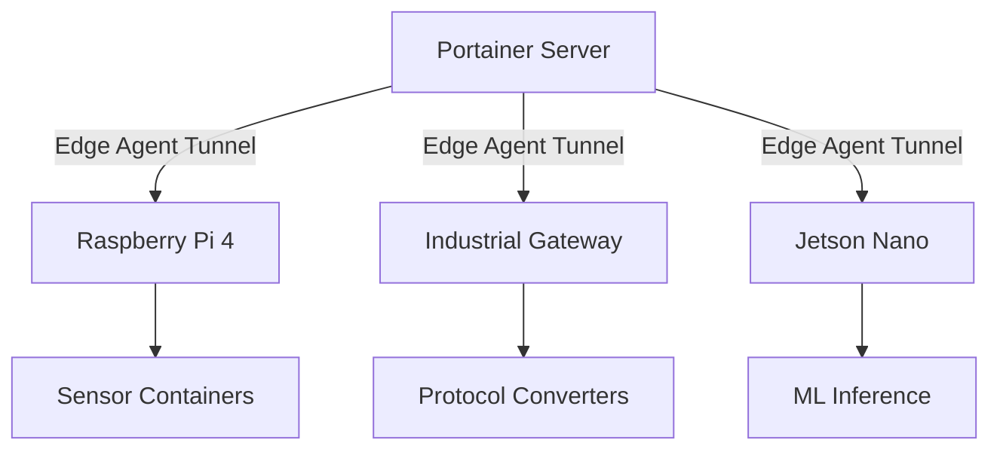

# How to Set Up Portainer for IoT Device Management

Author: [nawazdhandala](https://www.github.com/nawazdhandala)

Tags: IoT, Portainer, Edge Computing, Docker, Device Management, Raspberry Pi

Description: Configure Portainer Edge Agent on IoT devices to centrally manage containerized workloads across a fleet of resource-constrained edge nodes from a single Portainer instance.

---

Managing software on dozens or hundreds of IoT devices is one of the hardest operational problems in edge computing. Portainer's Edge Agent solves this by turning any Linux device running Docker into a managed endpoint you can deploy to, monitor, and update from a central web interface.

## Architecture



## Prerequisites

- A Portainer Business Edition instance (Edge features require BE)
- IoT devices running Linux with Docker installed
- Network connectivity from devices to the Portainer server (outbound only)

## Step 1: Enable Edge Compute in Portainer

In Portainer, go to **Settings > Edge Compute** and enable:

- **Enable Edge Compute features** — ON
- **Enforce Edge ID uniqueness** — ON (prevents duplicate registrations)

Set the **Edge Agent port** (default 8000) and make it reachable from your devices.

## Step 2: Create an Edge Environment

Navigate to **Environments > Add Environment > Edge Agent**. Portainer generates a unique enrollment command. Run it on each IoT device:

```bash
# This command is generated by Portainer — copy it from the UI
# Run it on each IoT device to register it as an edge endpoint
docker run -d \
  -v /var/run/docker.sock:/var/run/docker.sock \
  -v /var/lib/docker/volumes:/var/lib/docker/volumes \
  -v /:/host \
  -v portainer_agent_data:/data \
  --restart always \
  -e EDGE=1 \
  -e EDGE_ID=<unique-device-id> \
  -e EDGE_KEY=<enrollment-key-from-portainer> \
  -e EDGE_INSECURE_POLL=1 \
  --name portainer_edge_agent \
  portainer/agent:latest
```

## Step 3: Group Devices with Edge Groups

Use Edge Groups to organize devices by location, type, or purpose:

1. Go to **Edge Groups > Add Edge Group**
2. Name it (e.g., `factory-floor-us-west`)
3. Assign devices by tag (e.g., `location=us-west` and `type=gateway`)

## Step 4: Deploy Stacks to Device Groups

With Edge Groups defined, you can deploy a stack to an entire group of devices at once:

```yaml
# iot-sensor-collector.yml
# Deploys to all devices in the assigned Edge Group
version: "3.8"

services:
  sensor-agent:
    image: myregistry/sensor-collector:1.2.3
    environment:
      - DEVICE_ID=${EDGE_ID}
      - MQTT_BROKER=mqtt://broker.example.com:1883
      - REPORT_INTERVAL=30
    volumes:
      - sensor-data:/var/data
    restart: unless-stopped
    devices:
      # Pass through USB serial port for sensor communication
      - /dev/ttyUSB0:/dev/ttyUSB0

volumes:
  sensor-data:
```

## Monitoring Device Health

Each edge device appears as an environment in Portainer with:

- Container status and resource usage (CPU, memory)
- Container logs accessible remotely
- Last heartbeat timestamp to detect offline devices

## Security Considerations

- The Edge Agent initiates outbound connections only — no inbound ports needed on devices
- Use HTTPS for the Portainer server to encrypt the tunnel
- Rotate Edge Keys periodically via the Portainer API

## Summary

Portainer's Edge Agent turns complex IoT fleet management into a straightforward web UI operation. You can manage containerized workloads on thousands of devices from a single Portainer instance, making it an excellent choice for industrial and consumer IoT deployments.
