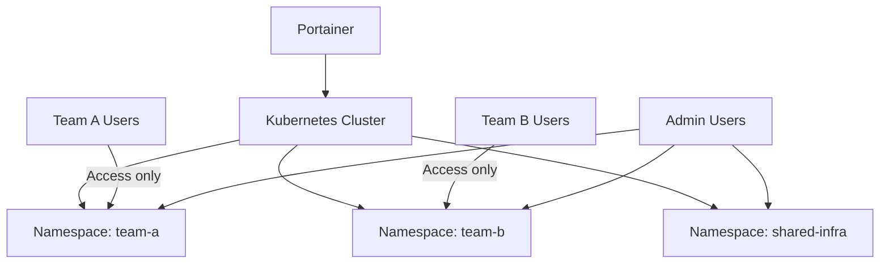

# How to Implement Namespace-Based Multi-Tenancy in Portainer for Kubernetes (2)

Author: [nawazdhandala](https://www.github.com/nawazdhandala)

Tags: Portainer, Kubernetes, Namespace, Multi-Tenancy, RBAC, Access Control

Description: Learn how to implement namespace-based multi-tenancy in Portainer for Kubernetes environments, giving each team isolated access to their own namespace.

---

Kubernetes namespaces provide natural isolation boundaries for multi-tenant deployments. Portainer exposes namespace-level access control so each team sees only their namespace, with appropriate RBAC enforced at the cluster level.

## Namespace Isolation Architecture



## Step 1: Create Namespaces

```bash
# Create namespaces for each tenant

kubectl create namespace team-a
kubectl create namespace team-b
kubectl create namespace shared-infra

# Add labels for Portainer and policy tools
kubectl label namespace team-a tenant=team-a environment=production
kubectl label namespace team-b tenant=team-b environment=production
```

## Step 2: Create Kubernetes RBAC

Create a Role and RoleBinding for each team to restrict them to their namespace:

```yaml
# team-a-rbac.yaml
apiVersion: rbac.authorization.k8s.io/v1
kind: Role
metadata:
  name: team-a-role
  namespace: team-a
rules:
  - apiGroups: ["", "apps", "batch", "extensions"]
    resources: ["pods", "deployments", "services", "configmaps",
                "persistentvolumeclaims", "jobs", "cronjobs", "ingresses"]
    verbs: ["get", "list", "watch", "create", "update", "patch", "delete"]
  - apiGroups: [""]
    resources: ["pods/log", "pods/exec"]
    verbs: ["get", "list", "create"]
---
apiVersion: rbac.authorization.k8s.io/v1
kind: RoleBinding
metadata:
  name: team-a-binding
  namespace: team-a
subjects:
  - kind: Group
    name: team-a-group    # Kubernetes group name (from OIDC/LDAP)
    apiGroup: rbac.authorization.k8s.io
roleRef:
  kind: Role
  name: team-a-role
  apiGroup: rbac.authorization.k8s.io
```

```bash
kubectl apply -f team-a-rbac.yaml
```

## Step 3: Configure Portainer Namespace Access

In Portainer, configure which teams can see which namespaces:

1. Go to **Environments > [K8s environment] > Namespaces**.
2. Click the namespace name.
3. Under **Access management**, enable **Restrict access to namespace** and add Team A.

This ensures Team A users only see the `team-a` namespace in the Portainer UI - all other namespaces are hidden.

## Step 4: Apply ResourceQuotas per Namespace

Prevent resource overconsumption per tenant:

```yaml
# team-a-quota.yaml
apiVersion: v1
kind: ResourceQuota
metadata:
  name: team-a-quota
  namespace: team-a
spec:
  hard:
    requests.cpu: "4"
    requests.memory: "8Gi"
    limits.cpu: "8"
    limits.memory: "16Gi"
    pods: "20"
    services: "10"
    persistentvolumeclaims: "5"
    services.loadbalancers: "2"
```

## Step 5: Apply NetworkPolicies for Traffic Isolation

Prevent pods in team-a from communicating with pods in team-b:

```yaml
# deny-cross-namespace.yaml
apiVersion: networking.k8s.io/v1
kind: NetworkPolicy
metadata:
  name: deny-cross-namespace
  namespace: team-a
spec:
  podSelector: {}
  policyTypes:
    - Ingress
    - Egress
  ingress:
    - from:
        - namespaceSelector:
            matchLabels:
              tenant: team-a   # Only allow traffic from same namespace
  egress:
    - to:
        - namespaceSelector:
            matchLabels:
              tenant: team-a
    - to:  {}  # Allow external traffic (internet)
      ports:
        - port: 443
        - port: 80
```

## Verifying Namespace Isolation

Log in as a Team A user via Portainer and verify they cannot see Team B's namespace:

```bash
# Using Team A's kubeconfig or token
kubectl get pods -n team-b
# Should return: Error from server (Forbidden)

kubectl get pods -n team-a
# Should work - shows Team A's pods
```

In Portainer's Kubernetes view, Team A users see only the `team-a` namespace in the namespace dropdown.
