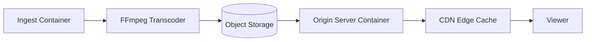

# How to Set Up Portainer for Media and Content Delivery

Author: [nawazdhandala](https://www.github.com/nawazdhandala)

Tags: Portainer, Media, Content Delivery, Docker, Streaming, CDN

Description: Configure Portainer to manage containerized media processing, transcoding, and content delivery workloads — from ingest pipelines to origin servers and streaming endpoints.

---

Media companies run containerized workloads for video transcoding, content ingest, metadata management, and origin serving. Portainer provides a unified management layer across these services, making it easier to deploy, scale, and monitor media infrastructure without writing complex orchestration code.

## Media Infrastructure Container Architecture



## Step 1: Deploy a Video Transcoding Stack

Use Portainer to deploy an FFmpeg-based transcoding pipeline:

```yaml
# media-transcode-stack.yml
version: "3.8"

services:
  transcode-worker:
    image: jrottenberg/ffmpeg:4.4-alpine
    entrypoint: ["/bin/sh", "-c"]
    command: >
      "while true; do
        if [ -f /input/pending.mp4 ]; then
          ffmpeg -i /input/pending.mp4
            -c:v libx264 -preset fast -crf 22
            -c:a aac -b:a 128k
            /output/output_720p.mp4 &&
          mv /input/pending.mp4 /input/processed/;
        fi;
        sleep 5;
      done"
    volumes:
      - media-input:/input
      - media-output:/output
    restart: unless-stopped
    deploy:
      resources:
        limits:
          cpus: "2.0"
          memory: 2g

  nginx-origin:
    image: nginx:alpine
    volumes:
      - media-output:/usr/share/nginx/html/media:ro
      - ./nginx.conf:/etc/nginx/conf.d/default.conf:ro
    ports:
      - "8080:80"
    restart: unless-stopped

volumes:
  media-input:
  media-output:
```

## Step 2: Configure Origin Server

Create an Nginx configuration optimized for media serving:

```nginx
# nginx.conf for media origin
server {
    listen 80;
    
    location /media/ {
        root /usr/share/nginx/html;
        
        # Enable sendfile for large media files
        sendfile on;
        sendfile_max_chunk 1m;
        tcp_nopush on;
        
        # Set cache headers for CDN caching
        add_header Cache-Control "public, max-age=86400";
        add_header Access-Control-Allow-Origin "*";
        
        # Range request support for video seeking
        add_header Accept-Ranges bytes;
    }
    
    location /hls/ {
        root /usr/share/nginx/html;
        # HLS segment-specific headers
        add_header Cache-Control "no-cache";
        types {
            application/vnd.apple.mpegurl m3u8;
            video/mp2t ts;
        }
    }
}
```

## Step 3: Deploy HLS Streaming with Portainer

For live streaming using nginx-rtmp:

```yaml
services:
  rtmp-ingest:
    image: tiangolo/nginx-rtmp:latest
    ports:
      - "1935:1935"   # RTMP ingest
      - "8081:80"     # HLS output
    volumes:
      - ./rtmp.conf:/etc/nginx/nginx.conf:ro
      - hls-segments:/tmp/hls
    restart: unless-stopped

volumes:
  hls-segments:
```

## Step 4: Scale Transcoding Workers

Portainer makes it easy to scale transcoding capacity for peak demand:

1. Open the `transcode-worker` service in Portainer
2. Click **Duplicate/Edit**
3. Change the container name to `transcode-worker-2`
4. Deploy with the same volume mounts

For Swarm-based scaling, use replicated services with Docker Swarm:

```yaml
deploy:
  replicas: 3
  update_config:
    parallelism: 1
    delay: 10s
```

## Step 5: Monitor Transcoding Queue

Use Portainer's container stats view to monitor CPU utilization on transcoding workers. Set alerts when average CPU drops to 0% (idle, no work) or spikes to 100% (overloaded queue).

## Summary

Portainer simplifies media infrastructure management by providing a single control plane for ingest, transcoding, origin serving, and streaming containers. The visual interface makes it easy to scale workers for live events, monitor processing queues, and manage media storage volumes without complex orchestration tooling.
