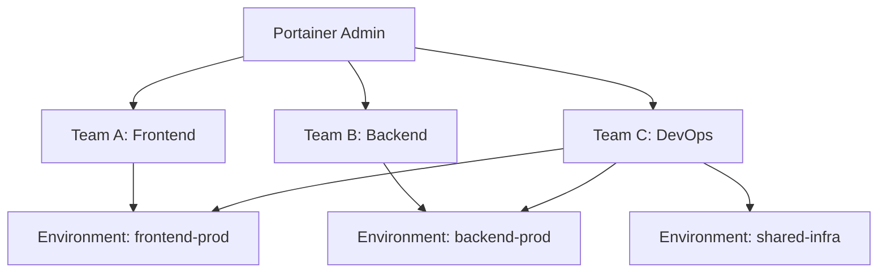

# How to Set Up Multi-Tenant Container Management with Portainer - Setup

Author: [nawazdhandala](https://www.github.com/nawazdhandala)

Tags: Portainer, Multi-Tenancy, Team, Access Control, RBAC, Docker

Description: Learn how to configure Portainer for multi-tenant container management using teams, environments, and role-based access control to isolate different users and groups.

---

Portainer's multi-tenancy model uses Teams and Environment-level access control to give different groups of users access to only their resources. This is ideal for MSPs, development teams, and organizations with multiple business units.

## Multi-Tenancy Concepts



Teams can be granted access to one or more environments. Within an environment, access levels range from read-only viewer to full manager.

## Step 1: Create Teams

1. In Portainer, go to **Settings > Teams > Add team**.
2. Create teams for each tenant or group: `Team Alpha`, `Team Beta`, `DevOps`.

Via the API:

```bash
TOKEN="your-admin-jwt-token"

# Create Team Alpha

curl -s -X POST https://portainer.example.com/api/teams \
  -H "Authorization: Bearer $TOKEN" \
  -H "Content-Type: application/json" \
  -d '{"Name": "Team Alpha"}'
```

## Step 2: Create Users and Assign to Teams

```bash
# Create a user
curl -s -X POST https://portainer.example.com/api/users \
  -H "Authorization: Bearer $TOKEN" \
  -H "Content-Type: application/json" \
  -d '{
    "Username": "alice",
    "Password": "securepassword",
    "Role": 2
  }'
# Role 1 = Administrator, Role 2 = Standard User

# Add user to Team Alpha (team ID and user ID from previous API calls)
curl -s -X PUT https://portainer.example.com/api/teams/1/memberships \
  -H "Authorization: Bearer $TOKEN" \
  -H "Content-Type: application/json" \
  -d '{"UserID": 2}'
```

## Step 3: Configure Environment Access

Grant Team Alpha access to a specific environment with a specific role:

1. Go to **Environments > [environment name] > Access**.
2. Under **Teams**, find Team Alpha.
3. Set the access level:

| Role | Permissions |
|------|-------------|
| `No access` | Cannot see environment |
| `Standard user` | View, start/stop containers they own |
| `Operator` | Can deploy stacks and manage containers |
| `Helpdesk` | Read-only access |
| `Administrator` | Full environment control |

Via API:

```bash
# Grant Team Alpha (ID 1) Operator access to Environment (ID 2)
curl -s -X PUT https://portainer.example.com/api/environments/2/teams/1 \
  -H "Authorization: Bearer $TOKEN" \
  -H "Content-Type: application/json" \
  -d '{"Role": 3}'  # 1=Admin, 2=Standard, 3=Operator, 4=Helpdesk
```

## Step 4: Create Separate Environments per Tenant

For strong isolation, provision a separate Docker environment for each tenant:

```bash
# On Tenant A's server, deploy Portainer Agent
docker run -d \
  --name portainer-agent \
  -v /var/run/docker.sock:/var/run/docker.sock \
  -v /var/lib/docker/volumes:/var/lib/docker/volumes \
  -p 9001:9001 \
  portainer/agent:latest

# In Portainer, add the environment:
# Environments > Add environment > Docker Standalone > Agent
# URL: tenant-a-host:9001
```

Each tenant's team only sees their environment.

## Step 5: Restrict Registry Access

Use Portainer's Registry management to control which registries each team can pull from:

1. Go to **Registries > [registry] > Access**.
2. Assign registry access to specific teams.
3. Teams without registry access cannot pull or use that registry in stacks.

## Access Control Summary

| Feature | CE | BE |
|---------|----|----|
| Teams | Yes | Yes |
| Environment-level RBAC | Yes | Yes |
| Custom roles | No | Yes |
| Resource quotas per team | No | Yes |
| Namespace isolation (K8s) | No | Yes |
| Activity log per user | No | Yes |

For organizations needing custom roles or resource quotas, Portainer Business Edition provides these advanced multi-tenancy features.
