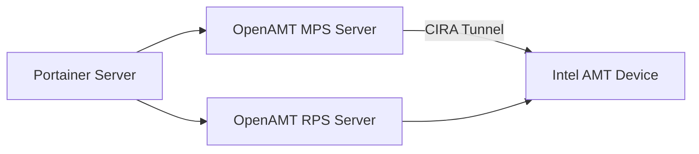

# How Portainer OpenAMT Integration Worked (Deprecated)

Author: [nawazdhandala](https://www.github.com/nawazdhandala)

Tags: Portainer, OpenAMT, Intel AMT, Deprecated, History, Edge Management

Description: A historical overview of Portainer's Intel OpenAMT integration for out-of-band edge device management, which was deprecated and removed in later releases.

---

Portainer Business Edition at one point included an integration with Intel's Open Active Management Technology (OpenAMT) - a feature that allowed operators to perform out-of-band management operations on Intel vPro-enabled devices directly from the Portainer interface. This feature has since been deprecated and removed. This post documents how it worked for historical reference.

## What Was OpenAMT?

Intel AMT (Active Management Technology) is a hardware feature built into Intel vPro processors that allows remote management of a device regardless of its operating system state - even if the OS is crashed or the device is powered off. OpenAMT was Intel's open-source toolkit for managing AMT-enabled devices.

Key capabilities AMT provided:

- **KVM (Keyboard-Video-Mouse)** - remote desktop access at the hardware level
- **Remote power control** - power on, off, reset devices remotely
- **Hardware inventory** - query hardware information without OS involvement
- **Disk redirection** - boot from a remote ISO image

## How the Integration Appeared in Portainer

When enabled, the Portainer UI showed an **Intel AMT** section within the Edge environment settings:

1. **Device Discovery** - Portainer scanned the network for AMT-capable devices using the OpenAMT RPS (Remote Provisioning Service)
2. **Provisioning** - Portainer provisioned AMT devices by running the OpenAMT RPS enrollment process, establishing trust between the device's AMT firmware and the Portainer management plane
3. **KVM Access** - Operators could open a KVM session directly from the Portainer environment page - useful for troubleshooting edge nodes that had failed to boot their OS
4. **Power Control** - Remote power on/off/restart was accessible from the Portainer environment card

## Architecture

The two OpenAMT components were:
- **RPS (Remote Provisioning Service)** - handled initial device enrollment and certificate provisioning
- **MPS (Management Presence Server)** - maintained persistent connections to enrolled AMT devices for ongoing management

## Why It Was Deprecated

The OpenAMT integration was removed from Portainer for several reasons:

1. **Limited hardware support** - AMT is only available on Intel vPro devices, a narrow subset of edge hardware
2. **Complexity** - The provisioning process was intricate and error-prone in practice
3. **Security concerns** - AMT has had serious CVEs over the years (including the famous "Intel AMT Silent Bob" vulnerability)
4. **Better alternatives** - The Portainer Edge Agent itself handles most edge management use cases without requiring specialized hardware

## Migration Path

If you were using Portainer's OpenAMT integration for out-of-band access, alternatives include:

- **IPMI/BMC** - most server hardware supports IPMI for remote power management
- **Pikvm** - open-source KVM-over-IP using Raspberry Pi
- **Redfish** - modern out-of-band management API (iDRAC, iLO, BMC)
- **Portainer Edge Agent** - handles container management and remote console without AMT

## Summary

Portainer's OpenAMT integration was a forward-looking feature that aimed to provide comprehensive edge device management, including hardware-level access. While it was innovative for its time, the limited hardware applicability and maintenance complexity led to its eventual removal. The core edge management capabilities continue through the Portainer Edge Agent without the AMT dependency.
