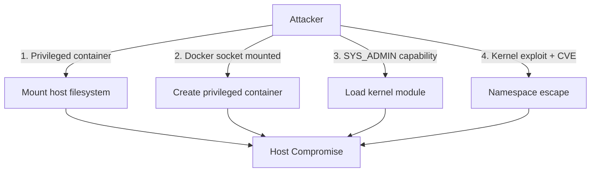

# How to Prevent Container Escape Attacks with Portainer Settings

Author: [nawazdhandala](https://www.github.com/nawazdhandala)

Tags: Portainer, Container Escape, Security, Docker Hardening, Privilege Escalation, CVE

Description: Learn how to configure Portainer and Docker to prevent container escape attacks by disabling dangerous capabilities, privileges, and mount options.

---

Container escape attacks exploit misconfigurations to break out of the container and gain access to the host. Most container escapes require either a privileged container, dangerous capabilities, or mounted host resources. Portainer lets you configure protections against all of these.

## Primary Container Escape Vectors



## 1. Never Run Privileged Containers

The single most important rule — `--privileged` gives a container nearly unrestricted access to the host:

```yaml
services:
  api:
    image: my-api:latest
    # NEVER add: privileged: true
    # privileged: true is equivalent to running without any container boundary
```

In Portainer, the **Runtime & Resources** tab shows a **Privileged mode** toggle. Keep it disabled for all production containers.

## 2. Do Not Mount the Docker Socket

Mounting `/var/run/docker.sock` into a container gives it the ability to create new privileged containers — effectively full host access:

```yaml
services:
  api:
    image: my-api:latest
    volumes:
      # NEVER add this to production containers:
      # - /var/run/docker.sock:/var/run/docker.sock

      # If a container truly needs Docker access, use a proxy like Tecnativa Docker Socket Proxy:
      - docker-socket-proxy:2375
```

Use the Docker Socket Proxy (Tecnativa) to limit which API calls are allowed:

```yaml
  socket-proxy:
    image: tecnativa/docker-socket-proxy:latest
    environment:
      CONTAINERS: 1    # Allow read-only container listing
      SERVICES: 0      # Block service management
      EXEC: 0          # Block exec
      POST: 0          # Block all POST requests
    volumes:
      - /var/run/docker.sock:/var/run/docker.sock:ro
    networks:
      - socket_proxy_net
```

## 3. Drop Dangerous Capabilities

Remove capabilities that are known escape vectors:

```yaml
services:
  api:
    cap_drop:
      - ALL
    cap_add:
      - NET_BIND_SERVICE   # Only if needed
    security_opt:
      - no-new-privileges:true
```

Specifically, these capabilities are used in known escape techniques:

| Capability | Escape Technique |
|------------|-----------------|
| `SYS_ADMIN` | Mount filesystems, load kernel modules |
| `SYS_MODULE` | Load malicious kernel module |
| `SYS_PTRACE` | Process memory injection |
| `NET_ADMIN` | Modify routing, intercept traffic |
| `DAC_READ_SEARCH` | Read arbitrary files via open_by_handle_at |

## 4. Prevent Privilege Escalation

The `no-new-privileges` flag prevents SUID/SGID binaries from granting elevated privileges inside the container:

```yaml
security_opt:
  - no-new-privileges:true
```

## 5. Use Read-Only Root Filesystem

A read-only filesystem prevents attackers from writing malicious binaries or modifying configuration:

```yaml
services:
  api:
    read_only: true
    tmpfs:
      - /tmp
      - /run
```

## 6. User Namespace Remapping

Enable user namespace remapping in `/etc/docker/daemon.json` to prevent host root access even if container root is compromised:

```json
{
  "userns-remap": "default"
}
```

## 7. Audit Containers for Escape Risks

Scan for common misconfigurations:

```bash
# Check for privileged containers
docker ps -q | xargs docker inspect \
  --format '{{.Name}}: privileged={{.HostConfig.Privileged}}' | grep "true"

# Check for docker socket mounts
docker ps -q | xargs docker inspect \
  --format '{{.Name}}: {{.HostConfig.Binds}}' | grep "docker.sock"

# Check for SYS_ADMIN capability
docker ps -q | xargs docker inspect \
  --format '{{.Name}}: {{.HostConfig.CapAdd}}' | grep SYS_ADMIN

# Use docker-bench-security for a comprehensive check
docker run --rm --net host --pid host --userns host --cap-add audit_control \
  -v /etc:/etc:ro -v /usr/bin/containerd:/usr/bin/containerd:ro \
  -v /usr/bin/runc:/usr/bin/runc:ro \
  -v /usr/lib/systemd:/usr/lib/systemd:ro \
  -v /var/lib:/var/lib:ro \
  -v /var/run/docker.sock:/var/run/docker.sock:ro \
  docker/docker-bench-security
```
