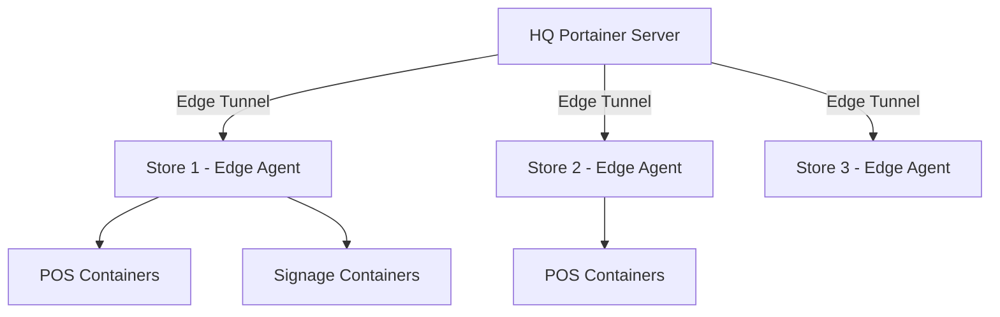

# How to Set Up Portainer for Retail Edge Computing

Author: [nawazdhandala](https://www.github.com/nawazdhandala)

Tags: Portainer, Retail, Edge Computing, Docker, IoT, POS

Description: Configure Portainer Edge Agent on retail store infrastructure to centrally manage POS, digital signage, and inventory applications across hundreds of locations from a single control plane.

---

Retail chains operate distributed edge compute infrastructure: point-of-sale terminals, digital signage systems, inventory management devices, and self-service kiosks spread across hundreds of store locations. Portainer's Edge Agent model lets a central Portainer instance manage all of these without requiring inbound network connectivity to store networks.

## Architecture



## Step 1: Deploy Portainer Server at HQ

Install Portainer Business Edition at headquarters with a public-facing domain:

```bash
docker run -d \
  --name portainer \
  --restart always \
  -p 9443:9443 \
  -p 8000:8000 \   # Tunnel port for Edge Agents
  -v portainer_data:/data \
  -v /var/run/docker.sock:/var/run/docker.sock \
  portainer/portainer-ee:latest
```

Port 8000 is the Edge tunnel port - Edge Agents connect outbound to this port.

## Step 2: Create Edge Groups for Store Tiers

In Portainer, create Edge Groups by region or store tier:

```text
Group: northeast-region
Group: flagship-stores
Group: franchise-locations
```

Edge Jobs and deployments can be targeted to these groups.

## Step 3: Enroll Store Devices

For each store, generate an Edge Agent enrollment command in Portainer:

```bash
# Generated by Portainer - run on the store device

docker run -d \
  --name portainer-agent \
  --restart always \
  -v /var/run/docker.sock:/var/run/docker.sock \
  -v /var/lib/docker/volumes:/var/lib/docker/volumes \
  -e EDGE=1 \
  -e EDGE_ID=<store-specific-id> \
  -e EDGE_KEY=<enrollment-key> \
  -e EDGE_INSECURE_POLL=0 \
  portainer/agent:latest
```

Devices connect outbound to HQ - no inbound firewall rules needed at store locations.

## Step 4: Deploy Retail Stack to Edge Groups

Create an Edge Stack targeting all store locations:

```yaml
# retail-store-stack.yml
version: "3.8"

services:
  pos-middleware:
    image: internal-registry/pos-api:2.1.4
    environment:
      - STORE_ID=${STORE_ID}
      - POS_DB_URL=${POS_DB_URL}
    ports:
      - "3000:3000"
    restart: unless-stopped

  digital-signage:
    image: internal-registry/signage-player:1.8.0
    environment:
      - CONTENT_SERVER=https://cms.headquarters.com
      - DISPLAY_ID=${DISPLAY_ID}
    restart: unless-stopped

  inventory-sync:
    image: internal-registry/inventory-agent:3.0.1
    environment:
      - CENTRAL_API=https://inventory.headquarters.com
    restart: unless-stopped
```

## Step 5: Edge Jobs for Maintenance

Schedule Edge Jobs for routine maintenance across all stores:

```bash
# Edge Job script - run nightly to clean up unused images
docker image prune -f --filter "until=24h"
docker system df
```

Target the job to all store groups and schedule it for low-traffic hours (3:00 AM local time).

## Step 6: Monitoring Store Health

Portainer's Edge environment dashboard shows:

- Last heartbeat time per device
- Container health status
- Pending update deployments

Integrate Portainer's REST API with your store operations platform to alert when a device goes offline for more than 15 minutes.

## Summary

Portainer Edge Agent transforms store infrastructure into a manageable fleet. From headquarters, operations teams can deploy updates, run diagnostics, and monitor container health across every location simultaneously - without VPN tunnels or inbound firewall exceptions at store sites.
