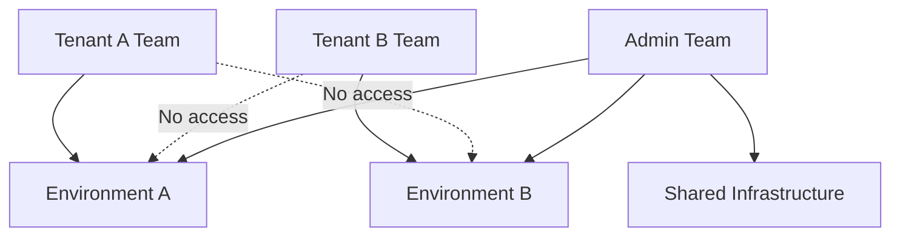

# How to Isolate Tenants Using Portainer Teams and Environments (2)

Author: [nawazdhandala](https://www.github.com/nawazdhandala)

Tags: Portainer, Teams, Environment Isolation, Multi-Tenancy, Access Control, RBAC

Description: Learn how to use Portainer Teams and Environment access control to provide true isolation between different tenant groups, preventing cross-tenant visibility.

---

Portainer's isolation model combines Teams (groups of users) with Environment access controls to ensure tenants only see and manage their own resources. This guide walks through configuring complete isolation between tenants.

## Isolation Architecture

The key principle: a tenant can only see an environment if their team has been explicitly granted access. No access grant = no visibility.



## Configuration Steps

### 1. Create Dedicated Environments

Each tenant should have their own Docker environment registered in Portainer. This prevents any possibility of a tenant's container accidentally accessing another tenant's container via a shared network.

For cloud-based isolation, provision a separate VM or Docker host per tenant. For single-host setups, use Docker's built-in network isolation.

### 2. Create Teams for Each Tenant

```bash
TOKEN="your-admin-jwt-token"
PORTAINER="https://portainer.example.com"

# Create Team A

TEAM_A_ID=$(curl -s -X POST "$PORTAINER/api/teams" \
  -H "Authorization: Bearer $TOKEN" \
  -H "Content-Type: application/json" \
  -d '{"Name":"Tenant A"}' | jq -r .Id)

# Create Team B
TEAM_B_ID=$(curl -s -X POST "$PORTAINER/api/teams" \
  -H "Authorization: Bearer $TOKEN" \
  -H "Content-Type: application/json" \
  -d '{"Name":"Tenant B"}' | jq -r .Id)

echo "Team A ID: $TEAM_A_ID, Team B ID: $TEAM_B_ID"
```

### 3. Create Users and Assign to Teams

```bash
# Create user for Tenant A
USER_A_ID=$(curl -s -X POST "$PORTAINER/api/users" \
  -H "Authorization: Bearer $TOKEN" \
  -H "Content-Type: application/json" \
  -d '{"Username":"alice","Password":"securepass123","Role":2}' | jq -r .Id)

# Add alice to Team A
curl -s -X POST "$PORTAINER/api/teams/$TEAM_A_ID/memberships" \
  -H "Authorization: Bearer $TOKEN" \
  -H "Content-Type: application/json" \
  -d "{\"UserID\": $USER_A_ID}"
```

### 4. Configure Environment Access per Team

Grant each team access only to their environment:

```bash
# Get environment IDs
ENV_A_ID=1   # Tenant A's environment
ENV_B_ID=2   # Tenant B's environment

# Grant Team A access to Environment A (role 2 = Operator)
curl -s -X PUT "$PORTAINER/api/environments/$ENV_A_ID/teams/$TEAM_A_ID" \
  -H "Authorization: Bearer $TOKEN" \
  -H "Content-Type: application/json" \
  -d '{"Role": 2}'

# Grant Team B access to Environment B
curl -s -X PUT "$PORTAINER/api/environments/$ENV_B_ID/teams/$TEAM_B_ID" \
  -H "Authorization: Bearer $TOKEN" \
  -H "Content-Type: application/json" \
  -d '{"Role": 2}'

# Do NOT grant Team A access to Environment B, or vice versa
```

### 5. Verify Isolation

Log in as a Tenant A user and verify they only see their environment:

```bash
# Get token as Tenant A user
TENANT_A_TOKEN=$(curl -s -X POST "$PORTAINER/api/auth" \
  -H "Content-Type: application/json" \
  -d '{"Username":"alice","Password":"securepass123"}' | jq -r .jwt)

# This should only return Environment A
curl -s -H "Authorization: Bearer $TENANT_A_TOKEN" \
  "$PORTAINER/api/environments" | jq '.[].Name'
```

## Network-Level Isolation

Even with environment-level access control, containers on the same host can communicate if they share a network. For strict isolation:

```yaml
# Tenant A stack - always use team-specific network names
networks:
  tenant_a_net:
    driver: bridge
    name: tenant_a_net  # Explicit name to avoid accidental overlap
```

Use naming conventions that include the tenant name in all network, volume, and stack names to prevent accidental cross-tenant connections.

## Registry Isolation

Prevent tenants from using each other's private registries:

1. In Portainer, go to **Registries**.
2. For each registry, click **Manage access**.
3. Add only the relevant team.
4. Teams without access cannot use that registry in their stacks.
