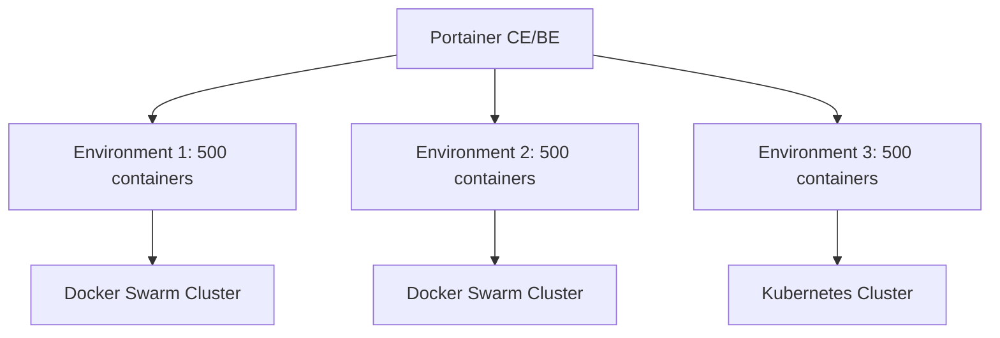

# How to Configure Portainer for Thousands of Containers - A Practical Guide

Author: [nawazdhandala](https://www.github.com/nawazdhandala)

Tags: Portainer, Large Scale, Performance, Docker Swarm, Optimization, Enterprise

Description: Learn how to configure Portainer to manage environments with thousands of containers using snapshot tuning, Swarm mode, and architecture best practices.

---

Managing thousands of containers with Portainer requires architectural decisions beyond simple tuning. This guide covers Swarm-based organization, snapshot management, and Portainer's limits at extreme scale.

## Architecture for Scale

At 1,000+ containers, the architecture matters more than tuning parameters:



Split large workloads across multiple environments. Each environment has its own snapshot, reducing the per-snapshot cost and improving UI responsiveness.

## Optimal Portainer Configuration

For environments with 500+ containers each:

```yaml
services:
  portainer:
    image: portainer/portainer-ce:latest
    command:
      - --snapshot-interval=600     # 10 minutes between snapshots
      - --log-level=warn            # Minimal logging
      - --log-mode=file             # Log to file, not stdout
      - --hide-label=maintenance    # Hide maintenance containers
    environment:
      GOGC: "50"           # More aggressive GC
      GOMEMLIMIT: "2GiB"   # Hard memory limit
    deploy:
      resources:
        limits:
          cpus: "4.0"
          memory: 2G
        reservations:
          cpus: "1.0"
          memory: 512M
    volumes:
      - /var/run/docker.sock:/var/run/docker.sock
      - portainer_data:/data
    ports:
      - "9000:9000"
```

## Docker Swarm for Efficient Management

In Docker Swarm mode, Portainer manages services (logical groups) rather than individual containers. A service with 50 replicas appears as one entry instead of 50, dramatically reducing UI complexity:

```bash
# Deploy a service with 50 replicas

docker service create \
  --name web-workers \
  --replicas 50 \
  my-app:latest

# Portainer shows 1 service entry with "50/50" replicas
```

## BoltDB Optimization at Scale

The database grows proportionally with the number of containers and snapshot frequency. At large scale, compact the database weekly:

```bash
#!/bin/bash
# weekly-compact.sh
docker stop portainer
docker run --rm -v portainer_data:/data \
  portainer/portainer-ce:latest --compact-db
docker start portainer
echo "Compaction complete: $(docker exec portainer du -sh /data/portainer.db)"
```

## Filtering Containers from Snapshots

Use labels to exclude ephemeral containers (job runners, test containers) from Portainer's snapshot to reduce noise:

```yaml
services:
  job-runner:
    image: my-jobs:latest
    labels:
      - "com.portainer.hide=true"   # Portainer hides these from the UI
```

Configure Portainer to respect this label:

```bash
portainer/portainer-ce:latest --hide-label "com.portainer.hide=true"
```

## Pagination and Filtering in the UI

For environments with thousands of containers, use Portainer's filtering:

- In **Containers**, use the search box to filter by name, image, or status.
- Use **Stacks** view instead of Containers for organized access.
- Use **Quick Filters** to show only running containers.

## Portainer Agent on Edge Nodes

For distributed deployments (IoT, edge, remote offices), use the Edge Agent with a check-in interval appropriate for your network:

```bash
docker run -d \
  -v /var/run/docker.sock:/var/run/docker.sock \
  portainer/agent:latest \
  --edge \
  --edge-id $EDGE_ID \
  --edge-key $EDGE_KEY \
  --edge-checkin-interval 300   # Check in every 5 minutes
```

## Hardware Requirements at Scale

| Container Count | CPU | RAM | Storage (SSD) |
|-----------------|-----|-----|----------------|
| Up to 500       | 2 vCPU | 1 GB | 10 GB |
| 500–2,000       | 4 vCPU | 2 GB | 20 GB |
| 2,000–5,000     | 8 vCPU | 4 GB | 50 GB |
| 5,000+          | 16 vCPU | 8 GB | 100 GB |

These are estimates for Portainer itself - the containers it manages run on separate hosts.
