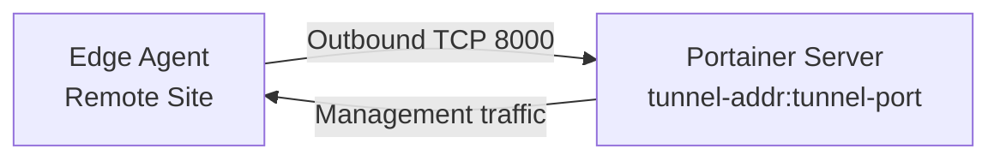

# How to Use the --tunnel-addr and --tunnel-port Flags for Edge Agents

Author: [nawazdhandala](https://www.github.com/nawazdhandala)

Tags: Portainer, CLI Flags, Edge Agent, Tunnel, Configuration, Networking

Description: Learn how to use the --tunnel-addr and --tunnel-port flags in Portainer to configure the Edge Agent tunnel server for remote site management.

---

The `--tunnel-addr` and `--tunnel-port` flags configure the address and port that Portainer uses for its Edge Agent tunnel server. Edge Agents at remote sites connect outbound to this address to establish a reverse tunnel for management.

## Default Values

By default, Portainer listens for Edge Agent tunnel connections on:

- **Address**: `0.0.0.0` (all interfaces)
- **Port**: `8000`

## Changing the Tunnel Port

If port 8000 is in use by another service, change the tunnel port:

```bash
docker run -d \
  --name portainer \
  --restart=always \
  -p 9000:9000 \
  -p 9443:9443 \
  -p 8001:8001 \            # Map the new tunnel port
  -v /var/run/docker.sock:/var/run/docker.sock \
  -v portainer_data:/data \
  portainer/portainer-ce:latest \
  --edge-compute \
  --tunnel-port 8001         # Tell Portainer to listen on 8001
```

Update the Edge Agent deployment commands to reference the new port when creating Edge environments.

## Binding the Tunnel to a Specific IP

For multi-homed hosts, bind the tunnel to a specific interface:

```bash
docker run -d \
  --name portainer \
  --network host \
  -v /var/run/docker.sock:/var/run/docker.sock \
  -v portainer_data:/data \
  portainer/portainer-ce:latest \
  --edge-compute \
  --tunnel-addr 10.0.0.5 \    # Only accept Edge connections on this IP
  --tunnel-port 8000
```

## Understanding the Edge Connection Flow



The Edge Agent dials out — no inbound firewall rules needed at the remote site. Only the Portainer server needs port `8000` (or your custom port) publicly accessible.

## Configuring Edge Agent to Use Custom Tunnel Port

When creating an Edge environment in Portainer, the generated deployment command includes the tunnel address and port from your settings. If you change the tunnel port after creating Edge environments, you must regenerate and redeploy Edge Agents.

```bash
# The edge key encodes the tunnel endpoint
# If tunnel-port changes, generate a new Edge environment and redeploy agents
```

## Docker Compose Example

```yaml
version: "3.8"
services:
  portainer:
    image: portainer/portainer-ce:latest
    restart: unless-stopped
    command:
      - --edge-compute
      - --tunnel-port=8000
      - --tunnel-addr=0.0.0.0
    ports:
      - "9000:9000"
      - "8000:8000"
    volumes:
      - /var/run/docker.sock:/var/run/docker.sock
      - portainer_data:/data

volumes:
  portainer_data:
```
