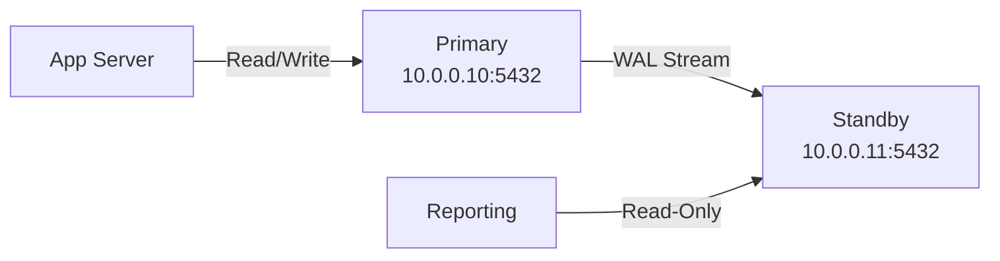

# How to Set Up PostgreSQL Streaming Replication Over IPv4

Author: [nawazdhandala](https://www.github.com/nawazdhandala)

Tags: PostgreSQL, Streaming Replication, IPv4, High Availability, Database, WAL

Description: Learn how to configure PostgreSQL primary-standby streaming replication over IPv4 for real-time data replication and high availability.

---

PostgreSQL streaming replication continuously ships WAL (Write-Ahead Log) records from the primary to one or more standbys. The standby applies these records to maintain an up-to-date read-only copy of the primary.

## Architecture



## Primary Server Configuration

### postgresql.conf

```ini
# /etc/postgresql/15/main/postgresql.conf

# Bind to the primary's IPv4 address (and localhost)
listen_addresses = '10.0.0.10,127.0.0.1'

# WAL settings for streaming replication
wal_level = replica              # Minimum: replica
max_wal_senders = 5              # Allow up to 5 standby connections
wal_keep_size = 256              # Keep 256MB of WAL segments (for slow standbys)
max_replication_slots = 5        # Allow replication slots if needed

# Optional: synchronous replication (guarantees no data loss)
# synchronous_standby_names = 'standby1'
```

### pg_hba.conf

```
# /etc/postgresql/15/main/pg_hba.conf
# Allow the replication user from the standby server's IPv4 address
host    replication     replicator     10.0.0.11/32     scram-sha-256
```

```sql
-- Create the replication user on the primary
CREATE ROLE replicator WITH REPLICATION LOGIN PASSWORD 'ReplPass123!';
```

```bash
# Reload PostgreSQL to apply pg_hba.conf changes
pg_ctlcluster 15 main reload
```

## Standby Server Setup

### Step 1: Copy Primary Data

```bash
# Create a base backup on the standby server
# Run as the postgres user
pg_basebackup \
  -h 10.0.0.10 \
  -U replicator \
  -D /var/lib/postgresql/15/main \
  -Fp \      # Plain format
  -Xs \      # Stream WAL during backup
  -P         # Show progress
  # Enter the replicator password when prompted
```

### Step 2: Configure postgresql.conf on Standby

```ini
# /etc/postgresql/15/main/postgresql.conf (on the standby)
listen_addresses = '10.0.0.11,127.0.0.1'
hot_standby = on    # Allow read-only queries while in standby mode
```

### Step 3: Create standby.signal and Connection Info

```bash
# In PostgreSQL 12+, create an empty standby.signal file
touch /var/lib/postgresql/15/main/standby.signal

# Add primary connection info to postgresql.conf (or recovery.conf for PG < 12)
cat >> /etc/postgresql/15/main/postgresql.conf << EOF
primary_conninfo = 'host=10.0.0.10 port=5432 user=replicator password=ReplPass123!'
EOF
```

### Step 4: Start the Standby

```bash
pg_ctlcluster 15 main start
```

## Verifying Replication

```sql
-- On the primary: check connected standbys
SELECT client_addr, state, sent_lsn, write_lsn, flush_lsn, replay_lsn
FROM pg_stat_replication;

-- On the standby: check replication status
SELECT now() - pg_last_xact_replay_timestamp() AS replication_delay;
-- Close to 0 seconds means replication is nearly real-time
```

## Key Takeaways

- Set `wal_level = replica` and `max_wal_senders >= 1` on the primary.
- Use `pg_basebackup` to copy the primary's data directory to the standby.
- Create `standby.signal` (PG 12+) and set `primary_conninfo` on the standby.
- Monitor lag with `pg_stat_replication` on the primary and `pg_last_xact_replay_timestamp()` on the standby.
