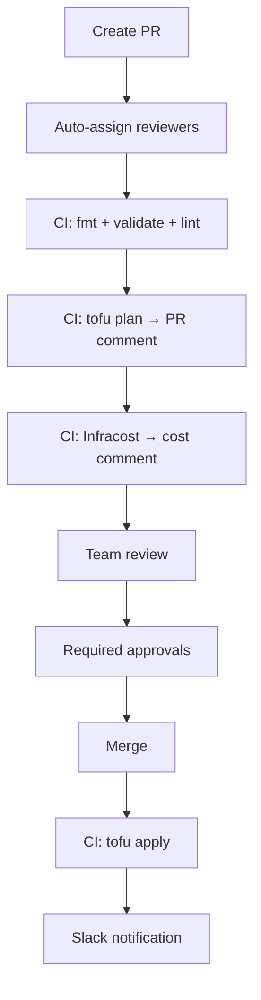

# How to Set Up Pull Request-Based Infrastructure Workflows with OpenTofu

Author: [nawazdhandala](https://www.github.com/nawazdhandala)

Tags: OpenTofu, Pull Requests, GitOps, GitHub Action, Code Review, Infrastructure as Code

Description: Learn how to implement pull request-based infrastructure workflows with OpenTofu where every change goes through a PR with automated plan comments, cost estimates, and required approvals.

---

A PR-based infrastructure workflow makes every change visible, reviewed, and auditable. No direct `tofu apply` runs in production - all changes flow through pull requests with automated checks, plan output, and required approvals before merging triggers the apply.

## PR Workflow Overview



## Complete PR Workflow

```yaml
# .github/workflows/infra-pr.yml

name: Infrastructure PR
on:
  pull_request:
    paths: ['environments/**', 'modules/**', '**.tf', '**.tfvars']

concurrency:
  group: ${{ github.workflow }}-${{ github.ref }}
  cancel-in-progress: true

jobs:
  validate:
    runs-on: ubuntu-latest
    steps:
      - uses: actions/checkout@v4
      - uses: opentofu/setup-opentofu@v1

      - name: Format check
        run: tofu fmt -check -recursive .

      - name: tfsec
        uses: aquasecurity/tfsec-action@v1.0.3
        with:
          soft_fail: false

      - name: Checkov
        uses: bridgecrewio/checkov-action@master
        with:
          framework: terraform
          soft_fail: false

  plan:
    needs: validate
    runs-on: ubuntu-latest
    permissions:
      pull-requests: write
      id-token: write

    strategy:
      fail-fast: false
      matrix:
        environment: [dev, staging, production]

    steps:
      - uses: actions/checkout@v4
      - uses: aws-actions/configure-aws-credentials@v4
        with:
          role-to-assume: ${{ secrets[format('AWS_PLAN_ROLE_{0}', matrix.environment)] }}
          aws-region: us-east-1
      - uses: opentofu/setup-opentofu@v1

      - run: tofu init
        working-directory: environments/${{ matrix.environment }}

      - name: Plan
        id: plan
        run: |
          tofu plan \
            -no-color \
            -detailed-exitcode \
            -out=tfplan \
            2>&1 | tee plan_output.txt
          echo "exitcode=${PIPESTATUS[0]}" >> $GITHUB_OUTPUT
        working-directory: environments/${{ matrix.environment }}
        continue-on-error: true

      - name: Comment plan on PR
        uses: actions/github-script@v7
        with:
          script: |
            const fs = require('fs');
            const plan = fs.readFileSync('environments/${{ matrix.environment }}/plan_output.txt', 'utf8');
            const icon = '${{ steps.plan.outputs.exitcode }}' === '2' ? '⚠️' : '✅';
            github.rest.issues.createComment({
              issue_number: context.issue.number,
              owner: context.repo.owner,
              repo: context.repo.repo,
              body: `## ${icon} Plan: ${{ matrix.environment }}\n```\n${plan.substring(0, 60000)}\n````
            });

      - name: Fail if plan errors
        if: steps.plan.outputs.exitcode == '1'
        run: exit 1

  cost:
    needs: validate
    runs-on: ubuntu-latest
    permissions:
      pull-requests: write

    steps:
      - uses: actions/checkout@v4
      - uses: infracost/actions/setup@v2
        with:
          api-key: ${{ secrets.INFRACOST_API_KEY }}
      - run: infracost breakdown --path environments/production --format json --out-file cost.json
      - run: infracost comment github --path cost.json --repo ${{ github.repository }} --pull-request ${{ github.event.pull_request.number }} --github-token ${{ github.token }} --behavior update
```

## PR Template

```hcl
resource "github_repository_file" "pr_template" {
  repository = var.infra_repo
  file       = ".github/PULL_REQUEST_TEMPLATE.md"
  content    = <<-EOT
    ## Summary
    <!-- What infrastructure is changing and why? -->

    ## Environment Impact
    - [ ] Dev
    - [ ] Staging
    - [ ] Production

    ## Checklist
    - [ ] Plan output reviewed (no unexpected deletions)
    - [ ] Resources properly tagged
    - [ ] Cost impact reviewed
    - [ ] Security review if adding new IAM/SGs
    - [ ] Tested in dev/staging first
  EOT
}
```

## Best Practices

- Use `concurrency` groups in GitHub Actions to cancel in-progress plan runs when new commits are pushed to the same PR.
- Run plan with `-detailed-exitcode` to distinguish errors (exit 1) from changes (exit 2) from no-changes (exit 0).
- Run security scanning (tfsec, Checkov) as a separate job before plan - these are fast and catch issues before spending time on planning.
- Show cost estimates on every PR - teams make better decisions when the dollar impact is visible.
- Use matrix strategy to plan all environments in parallel and show the impact across all environments in one PR.
