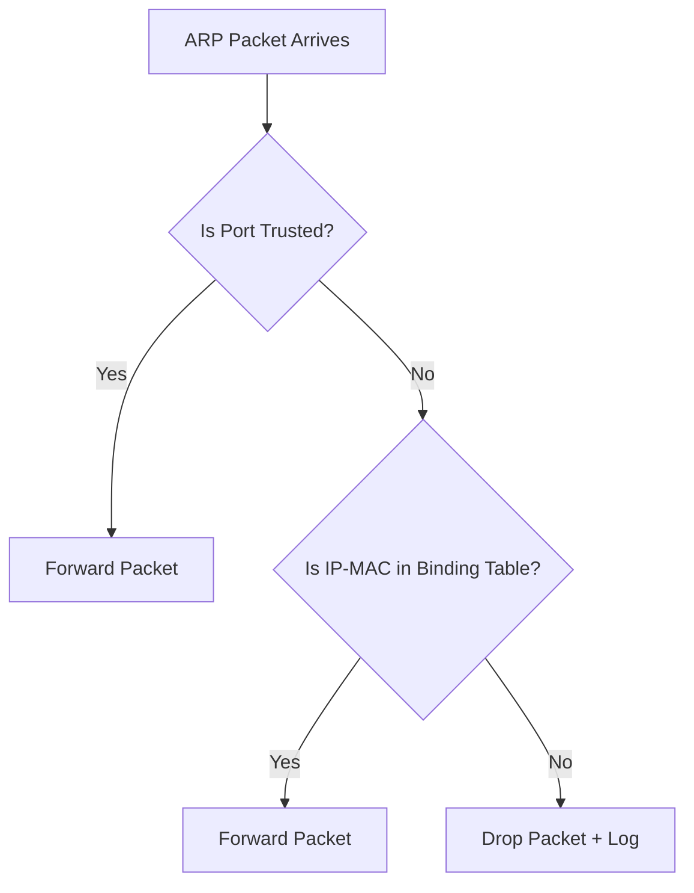

# How to Prevent ARP Poisoning with Dynamic ARP Inspection

Author: [nawazdhandala](https://www.github.com/nawazdhandala)

Tags: Networking, ARP, Security, Cisco, Switching

Description: Learn how to configure Dynamic ARP Inspection (DAI) on Cisco switches to prevent ARP poisoning and man-in-the-middle attacks.

## What Is ARP Poisoning?

ARP poisoning (also called ARP spoofing) is when an attacker sends forged ARP replies to associate their MAC address with a legitimate IP, redirecting traffic through the attacker's machine.

```text
Attack Flow:
  Attacker sends: "192.168.1.1 is at attacker_MAC"
  Attacker sends: "192.168.1.10 is at attacker_MAC"
  Result: All traffic between gateway and victim passes through attacker
```

## What Is Dynamic ARP Inspection (DAI)?

DAI is a Cisco switch security feature that:
1. Intercepts all ARP packets on untrusted ports
2. Validates ARP packets against a DHCP snooping binding table
3. Drops ARP packets with invalid IP-to-MAC mappings

## How DAI Works



## Configuring DAI on Cisco Switches

### Step 1: Enable DHCP Snooping (DAI depends on it)

```cisco
! Enable DHCP snooping globally
ip dhcp snooping

! Enable on specific VLAN
ip dhcp snooping vlan 10

! Trust the uplink port (toward DHCP server)
interface GigabitEthernet0/1
 ip dhcp snooping trust

! Do not insert Option 82
no ip dhcp snooping information option
```

### Step 2: Enable DAI

```cisco
! Enable DAI on VLAN 10
ip arp inspection vlan 10

! Verify DAI status
show ip arp inspection vlan 10
```

### Step 3: Configure Trusted Ports

Ports connected to routers, switches, or servers should be trusted:

```cisco
interface GigabitEthernet0/1
 ip arp inspection trust
```

### Step 4: Configure ARP ACLs for Static Hosts

For devices with static IPs (not in DHCP binding table):

```cisco
! Define ARP ACL for static host
arp access-list STATIC_HOSTS
 permit ip host 192.168.1.10 mac host aa:bb:cc:dd:ee:01
 permit ip host 192.168.1.20 mac host 00:11:22:33:44:55

! Apply the ARP ACL to VLAN
ip arp inspection filter STATIC_HOSTS vlan 10
```

### Step 5: Configure Rate Limiting (Prevent ARP Flood)

```cisco
interface GigabitEthernet0/2
 ip arp inspection limit rate 100
 ! Limit to 100 ARP packets/second per port
```

## Verification Commands

```cisco
! Check DAI statistics
show ip arp inspection statistics

! Show ARP inspection VLANs
show ip arp inspection vlan 10

! Show DHCP snooping binding table
show ip dhcp snooping binding

! Show ARP ACLs
show arp access-list
```

Sample output:

```text
Vlan    Forwarded  Dropped  DHCP Drops  ACL Drops
----    ---------  -------  ----------  ---------
  10        12548       45           2         43
```

## DAI Validation Options

```cisco
! Enable additional validations
ip arp inspection validate src-mac
ip arp inspection validate dst-mac
ip arp inspection validate ip

! Enable all three
ip arp inspection validate src-mac dst-mac ip
```

| Validation | What It Checks |
|------------|----------------|
| `src-mac` | Ethernet source MAC matches ARP sender MAC |
| `dst-mac` | Ethernet destination MAC matches ARP target MAC |
| `ip` | Sender IP is not 0.0.0.0, broadcast, or multicast |

## Key Takeaways

- DAI validates ARP packets against the DHCP snooping binding table.
- Untrusted ports have all ARP packets inspected; trusted ports are bypassed.
- Use ARP ACLs for static IP devices that won't be in the DHCP binding table.
- Rate limiting on ports prevents ARP flood-based DoS attacks.

**Related Reading:**

- [How to Detect ARP Spoofing Attacks on Your Network](https://oneuptime.com/blog/post/2026-03-20-arp-spoofing-detection-scapy-ipv4/view)
- [How to Configure ARP Inspection on Cisco Switches](https://oneuptime.com/blog/post/2026-03-20-cisco-arp-inspection/view)
