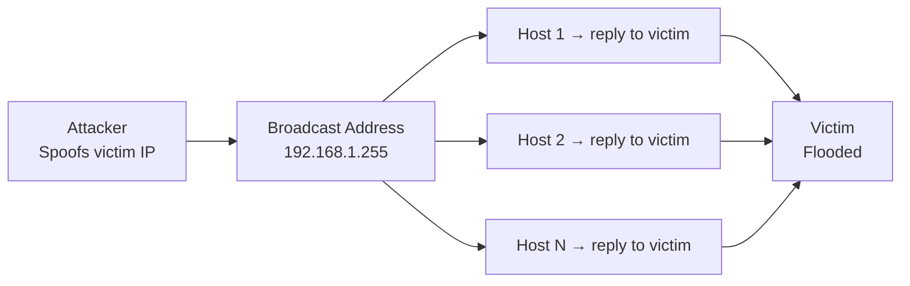

# How to Prevent Broadcast Amplification Attacks

Author: [nawazdhandala](https://www.github.com/nawazdhandala)

Tags: Networking, Security, DDoS, Broadcast, iptables, Linux, Cisco

Description: Prevent broadcast amplification attacks including Smurf and fraggle by disabling directed broadcasts, blocking ICMP/UDP echo to broadcast addresses, and enabling source address validation.

## Introduction

Broadcast amplification attacks exploit the property that a single packet sent to a broadcast address generates replies from every host on the segment. The most famous are the **Smurf attack** (ICMP) and **Fraggle attack** (UDP), both of which use a spoofed victim IP as the source. Modern networks are largely protected, but misconfigurations still create vulnerability.

## Attack Mechanism



The amplification factor = number of hosts on target subnet.

## Layer 1: Disable Directed Broadcasts at the Router

```
! Cisco IOS — already default since IOS 12.0; verify explicitly
interface GigabitEthernet0/0
 no ip directed-broadcast

interface GigabitEthernet0/1
 no ip directed-broadcast

! Verify no interfaces have it enabled
show running-config | include directed-broadcast
```

## Layer 2: Configure Hosts to Ignore Broadcast Pings

```bash
# Linux — ignore ICMP echo requests to broadcast/multicast
echo 1 | sudo tee /proc/sys/net/ipv4/icmp_echo_ignore_broadcasts

# Make permanent
echo "net.ipv4.icmp_echo_ignore_broadcasts = 1" \
  | sudo tee -a /etc/sysctl.d/99-security.conf
sudo sysctl --system
```

## Layer 3: Block ICMP Echo to Broadcast in iptables

```bash
# Drop ICMP echo requests arriving at broadcast destinations
sudo iptables -A INPUT -d 255.255.255.255 -p icmp --icmp-type echo-request -j DROP
sudo iptables -A INPUT -m addrtype --dst-type BROADCAST -p icmp --icmp-type echo-request -j DROP
sudo iptables -A INPUT -m addrtype --dst-type MULTICAST -p icmp --icmp-type echo-request -j DROP
```

## Layer 4: Block UDP Echo (Fraggle Attack Prevention)

The Fraggle attack uses UDP echo (port 7) and discard (port 9):

```bash
# Block UDP port 7 (echo) to broadcast
sudo iptables -A INPUT -p udp --dport 7 -d 255.255.255.255 -j DROP
sudo iptables -A INPUT -p udp --dport 7 -m addrtype --dst-type BROADCAST -j DROP

# Block UDP port 9 (discard) — note this conflicts with WoL; adjust if needed
sudo iptables -A INPUT -p udp --dport 9 -d 255.255.255.255 -j DROP
```

## Layer 5: Enable Reverse Path Filtering (Anti-Spoofing)

uRPF prevents attackers from spoofing source IPs:

```bash
# Enable strict RP filtering on all interfaces
echo 1 | sudo tee /proc/sys/net/ipv4/conf/all/rp_filter
echo 1 | sudo tee /proc/sys/net/ipv4/conf/default/rp_filter

# Make permanent
cat >> /etc/sysctl.d/99-security.conf << 'EOF'
net.ipv4.conf.all.rp_filter = 1
net.ipv4.conf.default.rp_filter = 1
EOF
sudo sysctl --system
```

## Layer 6: Rate-Limit ICMP Echo Replies at the Perimeter

Even if one misconfigured host generates replies, limit their impact:

```bash
# Limit ICMP echo-reply rate leaving your network to 100/second
sudo iptables -A OUTPUT -p icmp --icmp-type echo-reply \
  -m limit --limit 100/sec --limit-burst 200 \
  -j ACCEPT
sudo iptables -A OUTPUT -p icmp --icmp-type echo-reply -j DROP
```

## Verification

```bash
# Test that broadcast pings are ignored
ping -b 192.168.1.255 -c 3
# Should receive 0 replies from your hosts
```

## Conclusion

Combining disabled directed broadcasts (router), ignored broadcast pings (kernel), iptables DROP rules (host), and uRPF anti-spoofing (all devices) provides defense-in-depth against broadcast amplification attacks. Any one layer alone is insufficient; all four together make the attack economically unfeasible.
