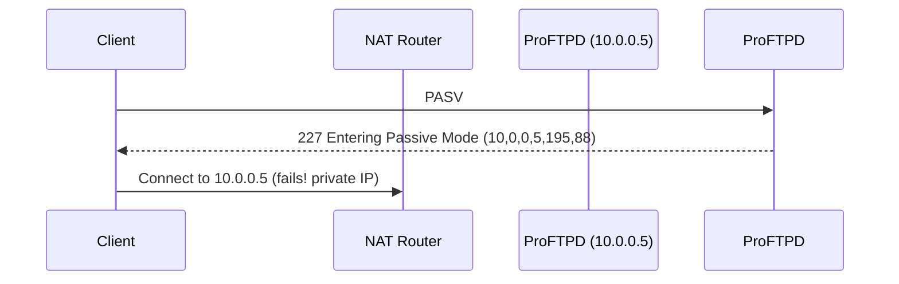
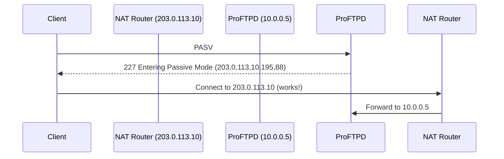

# How to Set Up ProFTPD MasqueradeAddress for IPv4 NAT Servers

Author: [nawazdhandala](https://www.github.com/nawazdhandala)

Tags: ProFTPD, FTP, IPv4, NAT, MasqueradeAddress, Passive Mode, Configuration

Description: Learn how to configure ProFTPD's MasqueradeAddress directive to return the correct public IPv4 address in passive mode responses when the server is behind NAT.

---

When a ProFTPD server is behind NAT (e.g., a cloud VM or home router), the PASV response includes an internal RFC-1918 IP address. FTP clients that try to connect to this address from outside the network fail. `MasqueradeAddress` tells ProFTPD to advertise the public IPv4 address instead.

## How Passive Mode Works with NAT



With `MasqueradeAddress`:



## ProFTPD Configuration

```apache
# /etc/proftpd/proftpd.conf

ServerName    "My FTP Server"
ServerType    standalone
DefaultServer on

# --- Listening address ---

# Bind to all IPv4 interfaces (internal address)
Port          21

# --- NAT / Masquerade configuration ---
# Tell clients to connect to the public IPv4 address for data transfers
MasqueradeAddress 203.0.113.10

# Passive mode port range (must be forwarded through the NAT router)
PassivePorts  40000 50000

# --- User configuration ---
AuthUserFile  /etc/proftpd/ftpd.passwd
AuthGroupFile /etc/proftpd/ftpd.group
RequireValidShell off

# --- Security ---
DefaultRoot   ~             # Chroot users to their home directories
AllowOverwrite yes
```

## Dynamic MasqueradeAddress (DNS Name)

If your public IP changes (dynamic DNS), use a hostname:

```apache
# ProFTPD will resolve this hostname to get the current public IP
MasqueradeAddress myserver.dyndns.org
```

## Firewall Rules for Passive Mode

```bash
# Allow FTP control port (21)
iptables -A INPUT -p tcp --dport 21 -j ACCEPT

# Allow passive mode data ports
iptables -A INPUT -p tcp --dport 40000:50000 -j ACCEPT

# NAT forwarding rule (on the router/gateway)
iptables -t nat -A PREROUTING -p tcp --dport 21 -j DNAT --to-destination 10.0.0.5:21
iptables -t nat -A PREROUTING -p tcp --dport 40000:50000 -j DNAT --to-destination 10.0.0.5
```

## Testing

```bash
# Restart ProFTPD
systemctl restart proftpd

# Connect from an external client
ftp 203.0.113.10

# Run PASV and verify the response contains the public IP
# Expected: 227 Entering Passive Mode (203,0,113,10,x,y)
```

## Key Takeaways

- `MasqueradeAddress` replaces the internal IP in PASV responses with the public IPv4.
- `PassivePorts` limits which port range is used for passive data connections - forward this range through NAT.
- You can use a DNS hostname for `MasqueradeAddress` when the public IP is dynamic.
- FTP passive mode requires both the control port (21) and the passive port range to be forwarded through NAT.
