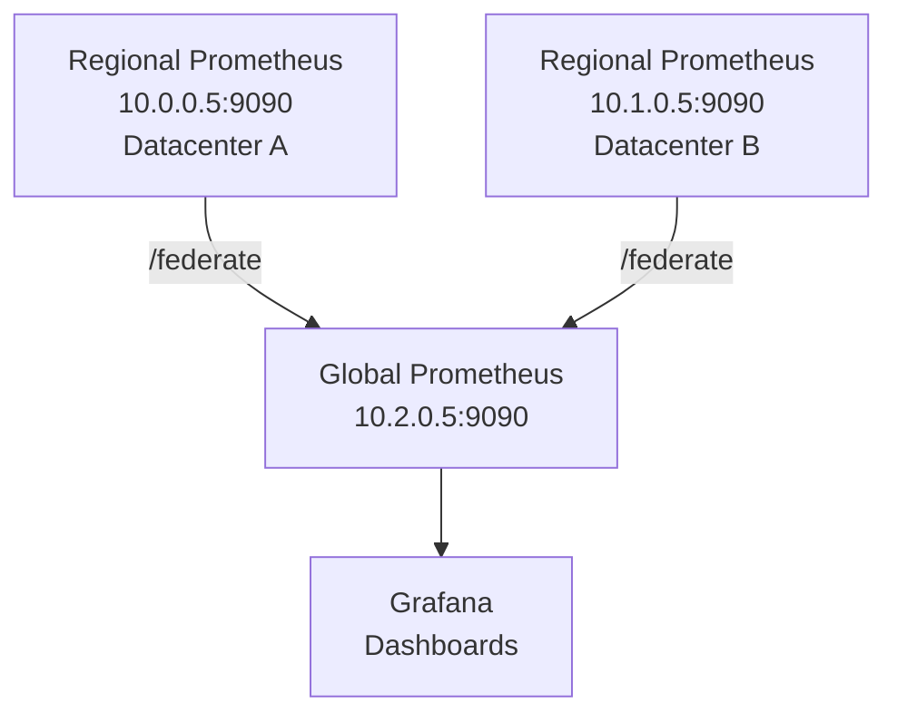

# How to Configure Prometheus Federation Across IPv4 Networks

Author: [nawazdhandala](https://www.github.com/nawazdhandala)

Tags: Prometheus, Federation, IPv4, Monitoring, Multi-Datacenter, Configuration, Metrics

Description: Learn how to configure Prometheus federation to aggregate metrics from multiple regional Prometheus instances across IPv4 networks into a global Prometheus.

---

Prometheus federation allows a central "global" Prometheus to scrape aggregated metrics from multiple regional Prometheus instances. Each regional Prometheus monitors its own IPv4 network; the global Prometheus pulls a subset of metrics for cross-datacenter views.

## Architecture



## Regional Prometheus Configuration

Each regional Prometheus scrapes its local targets normally.

```yaml
# /etc/prometheus/prometheus.yml (on 10.0.0.5 - Datacenter A)

global:
  scrape_interval: 15s
  # Attach a label identifying the datacenter to all metrics
  external_labels:
    datacenter: dc-a
    region: us-east-1

scrape_configs:
  - job_name: 'node_exporter'
    static_configs:
      - targets: ['10.0.0.10:9100', '10.0.0.11:9100']
```

## Global Prometheus Configuration (Federation)

The global Prometheus scrapes the `/federate` endpoint of each regional Prometheus.

```yaml
# /etc/prometheus/prometheus.yml (on 10.2.0.5 - Global)

global:
  scrape_interval: 30s    # Scrape global federation less frequently
  external_labels:
    monitor: global

scrape_configs:
  # --- Federate from Datacenter A ---
  - job_name: 'federate_dc_a'
    honor_labels: true      # Preserve original labels (datacenter, region)
    metrics_path: '/federate'
    params:
      # Select which metrics to pull (use PromQL match[] selectors)
      match[]:
        - '{job=~"node_exporter|kafka|postgres"}'   # Scrape these jobs
        - 'up'                                       # Always scrape 'up' for availability

    static_configs:
      - targets:
          - '10.0.0.5:9090'   # Datacenter A regional Prometheus IPv4
        labels:
          source_datacenter: dc-a

  # --- Federate from Datacenter B ---
  - job_name: 'federate_dc_b'
    honor_labels: true
    metrics_path: '/federate'
    params:
      match[]:
        - '{job=~"node_exporter|kafka|postgres"}'
        - 'up'

    static_configs:
      - targets:
          - '10.1.0.5:9090'   # Datacenter B regional Prometheus IPv4
        labels:
          source_datacenter: dc-b
```

## Selecting Metrics with match[]

The `match[]` parameter accepts PromQL selectors. Be selective to avoid pulling every metric:

```yaml
params:
  match[]:
    # Pull all metrics from specific jobs
    - '{job="node_exporter"}'
    # Pull specific metrics from any job
    - '{__name__=~"node_cpu_seconds_total|node_memory_MemAvailable_bytes"}'
    # Pull recording rules (pre-aggregated metrics)
    - '{__name__=~"instance:.*"}'
```

## Verifying Federation

```bash
# Check the /federate endpoint on a regional Prometheus

curl "http://10.0.0.5:9090/federate?match[]={job='node_exporter'}" | head -20

# On the global Prometheus: verify all regional targets are UP
curl -s "http://10.2.0.5:9090/api/v1/targets" | python3 -m json.tool | grep '"health"'
```

## Key Takeaways

- `honor_labels: true` preserves the original `instance` and `job` labels from regional Prometheus instances.
- Use `match[]` selectors carefully - pulling all metrics via federation negates the benefit and creates load.
- Set `external_labels` on each regional Prometheus to identify the datacenter/region in all metrics.
- Federation is pull-based; for push-based global aggregation, use remote write to a central storage like Thanos or VictoriaMetrics.
