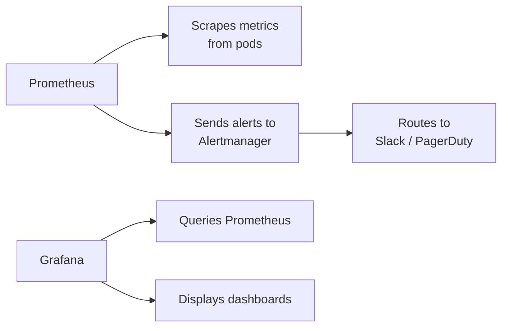

# How to Deploy Prometheus and Grafana with OpenTofu

Author: [nawazdhandala](https://www.github.com/nawazdhandala)

Tags: OpenTofu, Prometheus, Grafana, Monitoring, Kubernetes, Helm, kube-prometheus-stack, Infrastructure as Code

Description: Learn how to deploy a complete Prometheus and Grafana monitoring stack on Kubernetes using OpenTofu and the kube-prometheus-stack Helm chart, with persistent storage, alerting, and ingress configuration.

---

The kube-prometheus-stack Helm chart deploys Prometheus, Grafana, Alertmanager, and a collection of pre-built dashboards and alert rules in a single chart. OpenTofu deploys and configures this complete monitoring stack with environment-appropriate resources.

## Monitoring Architecture



## kube-prometheus-stack Deployment

```hcl
# monitoring.tf
resource "helm_release" "kube_prometheus_stack" {
  name             = "kube-prometheus-stack"
  repository       = "https://prometheus-community.github.io/helm-charts"
  chart            = "kube-prometheus-stack"
  version          = "55.5.0"
  namespace        = "monitoring"
  create_namespace = true

  values = [
    yamlencode({
      # Prometheus configuration
      prometheus = {
        prometheusSpec = {
          retention = var.environment == "production" ? "30d" : "7d"

          storageSpec = {
            volumeClaimTemplate = {
              spec = {
                storageClassName = "gp3"
                accessModes      = ["ReadWriteOnce"]
                resources = {
                  requests = {
                    storage = var.environment == "production" ? "100Gi" : "20Gi"
                  }
                }
              }
            }
          }

          resources = {
            requests = { cpu = "200m", memory = "512Mi" }
            limits   = { cpu = "1000m", memory = "2Gi" }
          }
        }
      }

      # Alertmanager configuration
      alertmanager = {
        alertmanagerSpec = {
          storage = {
            volumeClaimTemplate = {
              spec = {
                storageClassName = "gp3"
                accessModes      = ["ReadWriteOnce"]
                resources = { requests = { storage = "2Gi" } }
              }
            }
          }
        }

        config = {
          global = {
            slack_api_url = var.slack_webhook_url
          }

          route = {
            group_by        = ["alertname", "cluster", "service"]
            group_wait      = "30s"
            group_interval  = "5m"
            repeat_interval = "12h"
            receiver         = "slack"

            routes = [{
              match    = { severity = "critical" }
              receiver = "pagerduty"
            }]
          }

          receivers = [
            {
              name = "slack"
              slack_configs = [{
                channel = "#alerts-${var.environment}"
                title   = "{{ .GroupLabels.alertname }}"
                text    = "{{ range .Alerts }}{{ .Annotations.summary }}\n{{ end }}"
              }]
            },
            {
              name = "pagerduty"
              pagerduty_configs = [{
                service_key = var.pagerduty_service_key
              }]
            }
          ]
        }
      }

      # Grafana configuration
      grafana = {
        enabled           = true
        adminPassword     = var.grafana_admin_password
        persistence = {
          enabled          = true
          storageClassName = "gp3"
          size             = "5Gi"
        }

        ingress = {
          enabled = true
          annotations = {
            "kubernetes.io/ingress.class"    = "nginx"
            "cert-manager.io/cluster-issuer" = "letsencrypt-prod"
          }
          hosts = ["grafana.${var.domain}"]
          tls   = [{ secretName = "grafana-tls", hosts = ["grafana.${var.domain}"] }]
        }

        # Pre-configure data sources
        additionalDataSources = [{
          name      = "Loki"
          type      = "loki"
          url       = "http://loki:3100"
          access    = "proxy"
          isDefault = false
        }]
      }

      # Node exporter for host metrics
      nodeExporter = { enabled = true }

      # kube-state-metrics for Kubernetes metrics
      kubeStateMetrics = { enabled = true }
    })
  ]
}
```

## Custom Alerting Rules

```hcl
resource "kubernetes_manifest" "custom_alert_rules" {
  manifest = {
    apiVersion = "monitoring.coreos.com/v1"
    kind       = "PrometheusRule"
    metadata = {
      name      = "application-rules"
      namespace = "monitoring"
      labels = {
        "prometheus"  = "kube-prometheus-stack-prometheus"
        "app"         = "kube-prometheus-stack"
      }
    }
    spec = {
      groups = [{
        name = "application"
        rules = [
          {
            alert = "HighErrorRate"
            expr  = "rate(http_requests_total{status=~'5..'}[5m]) / rate(http_requests_total[5m]) > 0.05"
            for   = "5m"
            labels = { severity = "warning" }
            annotations = {
              summary     = "High error rate detected"
              description = "Error rate is {{ $value | humanizePercentage }} for {{ $labels.service }}"
            }
          }
        ]
      }]
    }
  }
}
```

## Best Practices

- Set Prometheus retention based on environment — 30 days for production, 7 days for dev to save storage costs.
- Use persistent storage for Prometheus and Grafana — losing metrics history after a pod restart is disruptive.
- Configure Alertmanager routes before going to production — default routes don't alert anyone.
- Enable kube-state-metrics and node-exporter — they provide essential Kubernetes and host-level metrics.
- Store Grafana admin password in Kubernetes Secrets or Sealed Secrets, not in plaintext Helm values.
