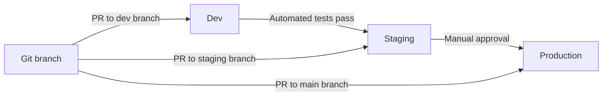

# How to Promote Infrastructure Changes Across Environments in OpenTofu

Author: [nawazdhandala](https://www.github.com/nawazdhandala)

Tags: OpenTofu, Promotion, Environment Management, CI/CD, Infrastructure as Code, Workflow

Description: Learn how to implement a structured infrastructure change promotion workflow with OpenTofu that moves changes from dev through staging to production with proper testing gates.

---

Promoting infrastructure changes across environments requires discipline. The same config changes that work in dev need to be validated in staging before reaching production. OpenTofu combined with CI/CD makes this promotion workflow explicit, auditable, and safe.

## The Promotion Workflow



## Branch-Based Promotion

```yaml
# .github/workflows/promote.yml
name: Promote Infrastructure
on:
  push:
    branches: [dev, staging, main]

jobs:
  deploy:
    runs-on: ubuntu-latest
    steps:
      - uses: actions/checkout@v4

      - name: Determine environment
        id: env
        run: |
          if [ "${{ github.ref }}" = "refs/heads/main" ]; then
            echo "environment=production" >> $GITHUB_OUTPUT
            echo "tf_dir=environments/production" >> $GITHUB_OUTPUT
          elif [ "${{ github.ref }}" = "refs/heads/staging" ]; then
            echo "environment=staging" >> $GITHUB_OUTPUT
            echo "tf_dir=environments/staging" >> $GITHUB_OUTPUT
          else
            echo "environment=dev" >> $GITHUB_OUTPUT
            echo "tf_dir=environments/dev" >> $GITHUB_OUTPUT
          fi

      - name: Setup OpenTofu
        uses: opentofu/setup-opentofu@v1

      - name: Init and Apply
        run: |
          tofu init
          tofu apply -auto-approve -var="app_image=${{ env.IMAGE_TAG }}"
        working-directory: ${{ steps.env.outputs.tf_dir }}
```

## Validating Before Promotion

```hcl
# environments/staging/validation.tf
# Validation that must pass before promoting to production
resource "terraform_data" "pre_promote_checks" {
  lifecycle {
    precondition {
      # Verify staging tests have passed (via SSM parameter set by CI)
      condition = data.aws_ssm_parameter.staging_tests_passed.value == "true"
      error_message = "Staging tests must pass before promoting to production"
    }
  }
}

data "aws_ssm_parameter" "staging_tests_passed" {
  name = "/staging/tests/passed"
}
```

## Promoting Specific Changes

```bash
# Promote only the application module changes (not network or database)
cd environments/staging
tofu plan -target=module.application

# If plan looks correct, apply only application changes
tofu apply -target=module.application

# After staging validation, promote to production
cd ../production
tofu apply -target=module.application
```

## Tracking What's in Each Environment

```hcl
# outputs.tf — track versions per environment for auditing
output "deployed_versions" {
  description = "Versions currently deployed in this environment"
  value = {
    app_image       = var.app_image
    terraform_version = terraform.version
    deployed_at     = timestamp()
    git_commit      = var.git_commit_sha
  }
}
```

## Best Practices

- Never skip environments — changes go dev → staging → production without exception.
- Use different Git branches per environment and require PRs to promote changes.
- Add automated smoke tests that run after each environment deployment and gate promotion.
- Require manual approval in GitHub Environments before applying to production.
- Log all promotions with timestamps and approver information for change management audits.
