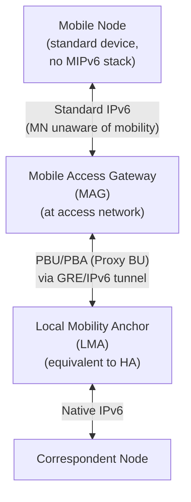

# How to Understand Proxy Mobile IPv6 (PMIPv6)

Author: [nawazdhandala](https://www.github.com/nawazdhandala)

Tags: Proxy Mobile IPv6, PMIPv6, LTE, Networking, RFC 5213, Mobility

Description: Understand Proxy Mobile IPv6 (PMIPv6), a network-based mobility protocol where the network handles mobility signaling on behalf of mobile devices, eliminating client-side MIPv6 requirements.

## Introduction

Proxy Mobile IPv6 (PMIPv6), defined in RFC 5213, is a network-based approach to IPv6 mobility. Unlike host-based MIPv6, the Mobile Node does not need any mobility software - the network infrastructure handles Binding Updates on the MN's behalf. This makes PMIPv6 ideal for LTE/4G and 5G core networks.

## PMIPv6 vs MIPv6

| Aspect | MIPv6 (RFC 6275) | PMIPv6 (RFC 5213) |
|---|---|---|
| Mobility software on MN | Required | Not required |
| Signaling initiated by | Mobile Node | Network (MAG) |
| MN awareness | MN is aware of mobility | MN is transparent |
| Deployment | End-device support needed | Network-only deployment |
| Standard usage | VPN-like mobility | LTE/4G/5G mobile cores |

## PMIPv6 Architecture



## Key PMIPv6 Components

### Mobile Access Gateway (MAG)

The MAG runs at the access router/base station and:
1. Detects when an MN attaches to the network
2. Authenticates the MN (via RADIUS/AAA)
3. Sends Proxy Binding Updates (PBU) to the LMA
4. Creates a GRE or IPv4-in-IPv6 tunnel to the LMA
5. Routes traffic between MN and LMA through the tunnel

### Local Mobility Anchor (LMA)

The LMA is the PMIPv6 equivalent of the MIPv6 Home Agent:
1. Maintains the Binding Cache (MN-ID → MAG address)
2. Anchors the MN's stable IPv6 prefix
3. Tunnels traffic to the appropriate MAG

## PMIPv6 Message Types

### Proxy Binding Update (PBU) - MH Type 3 (same as standard BU with P flag)

```text
Sent by MAG to LMA when MN attaches:
  Handoff Indicator: 1 (new attachment)
  Access Technology Type: e.g., 8 (LTE)
  Home Network Prefix Option: MN's assigned prefix
  Mobile Node Identifier: NAI or MAC address
```

### Proxy Binding Acknowledgement (PBA) - MH Type 4

```text
Sent by LMA to MAG confirming binding:
  Status: 0 (success)
  Home Network Prefix Option: confirmed prefix
  IPv6 Home Address Option
```

## Simplified PMIPv6 MAG Logic

```python
# pmipv6_mag.py - simplified MAG event handler

class MobileAccessGateway:
    def __init__(self, lma_address, mag_address):
        self.lma_address = lma_address
        self.mag_address = mag_address
        self.attached_nodes = {}

    def on_mn_attach(self, mn_identifier: str, access_type: str):
        """Called when a Mobile Node attaches to this MAG."""
        print(f"MN attached: {mn_identifier} via {access_type}")

        # Query AAA for MN's mobility profile
        profile = self.query_aaa(mn_identifier)

        # Send Proxy Binding Update to LMA
        pbu = ProxyBindingUpdate(
            mag_address=self.mag_address,
            mn_identifier=mn_identifier,
            home_network_prefix=profile.assigned_prefix,
            lifetime=3600,
            handoff_indicator=1,
            access_technology_type=access_type
        )
        self.send_to_lma(pbu)

    def on_pba_received(self, pba: ProxyBindingAck):
        """Process the LMA's confirmation."""
        if pba.status == 0:
            # Establish GRE tunnel to LMA for this MN
            self.create_tunnel(
                mn_id=pba.mn_identifier,
                lma_address=self.lma_address,
                mn_prefix=pba.home_network_prefix
            )
            print(f"Tunnel established for {pba.mn_identifier}")

    def on_mn_detach(self, mn_identifier: str):
        """Called when MN detaches - send deregistration PBU."""
        pbu = ProxyBindingUpdate(
            mn_identifier=mn_identifier,
            lifetime=0  # Deregistration
        )
        self.send_to_lma(pbu)
        self.remove_tunnel(mn_identifier)
```

## Linux PMIPv6 with OAI or OpenMobility

```bash
# Install UMIP with PMIPv6 support

sudo apt-get install umip-pmip

# /etc/mip6d.conf - MAG configuration
NodeConfig MAG;

MagAddressIngress 2001:db8:access::1;
MagAddressEgress 2001:db8:core::1;
LmaAddress 2001:db8:lma::1;

MagDefaultRetransmitDelay 1.0;
DefaultBindingAcl Allow;
```

## Conclusion

PMIPv6 enables IPv6 mobility for devices that do not support MIPv6, making it the standard for 4G/LTE and 5G mobile cores. The network (MAG and LMA) handles all mobility signaling transparently. Monitor LMA Binding Cache counts and PBU success rates with OneUptime to ensure mobile core health.
