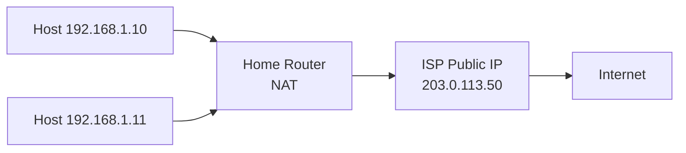

# How to Understand Public vs Private IPv4 Addresses

Author: [nawazdhandala](https://www.github.com/nawazdhandala)

Tags: IPv4, Networking, Public IP, Private IP, NAT, RFC 1918

Description: Public IPv4 addresses are globally routable and unique on the internet, while private addresses (RFC 1918) are reused across organizations and require NAT to communicate with the internet.

## The Key Difference

| Property | Private Address | Public Address |
|----------|----------------|---------------|
| Globally unique? | No (reused everywhere) | Yes (IANA-assigned) |
| Internet routable? | No | Yes |
| Free to use? | Yes (no registration) | Must be allocated by ISP/RIR |
| Examples | 10.x.x.x, 192.168.x.x | 8.8.8.8, 203.0.113.1 |

## Private Ranges (RFC 1918)

- `10.0.0.0/8`
- `172.16.0.0/12`
- `192.168.0.0/16`

## How NAT Bridges Private and Public

NAT (Network Address Translation) at the gateway translates private addresses to the single (or pooled) public IP assigned by your ISP:



## Checking Address Type in Python

```python
import ipaddress

def is_public(ip: str) -> bool:
    """Return True if the address is a globally routable public IP."""
    addr = ipaddress.IPv4Address(ip)
    return addr.is_global

# Test
test_ips = ["10.0.0.1", "172.17.0.5", "192.168.1.1",
            "8.8.8.8", "203.0.113.5", "100.64.0.1"]

for ip in test_ips:
    pub = is_public(ip)
    print(f"{ip:18s} public={pub}")
```

## Why Both Exist: Address Exhaustion

IPv4 has ~4.3 billion addresses. With billions of devices, every device cannot have a unique public IP. RFC 1918 private ranges + NAT allow millions of devices to share a single public IP, dramatically extending IPv4 longevity.

## Practical Implications

1. **Port forwarding**: To host a service on a private IP, you must configure port forwarding on the NAT gateway.
2. **Peer-to-peer**: P2P applications (gaming, VoIP) have trouble with NAT; workarounds include STUN, TURN, and UPnP.
3. **Security**: Private hosts are hidden behind NAT, providing a degree of obscurity (but not real security).
4. **Cloud**: Each cloud VM typically gets a private IP internally and a public IP (Elastic IP / Public IP) mapped externally.

## Key Takeaways

- Private IPs are freely reusable within any organization; public IPs are globally unique.
- NAT at the gateway maps private-to-public for outbound internet access.
- IPv6 eliminates NAT by providing enough addresses for every device to have a public address.
- Private IP ranges are not routable on the internet; ISPs drop packets with RFC 1918 source addresses.
