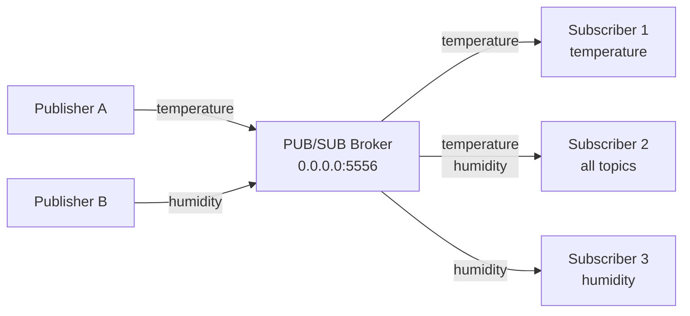

# How to Implement the Publish-Subscribe Pattern over IPv4 Networks

Author: [nawazdhandala](https://www.github.com/nawazdhandala)

Tags: IPv4, Pub/Sub, ZeroMQ, Python, Networking, Messaging

Description: Learn how to implement the publish-subscribe pattern over IPv4 using ZeroMQ PUB/SUB sockets and a custom broker, with topic filtering, fanout messaging, and fault tolerance.

## ZeroMQ PUB/SUB

```python
# --- publisher.py ---
import zmq
import time
import json

ctx    = zmq.Context()
socket = ctx.socket(zmq.PUB)
socket.bind("tcp://0.0.0.0:5556")   # all IPv4 interfaces
print("Publisher on tcp://0.0.0.0:5556")
time.sleep(0.5)  # allow subscribers to connect

for i in range(10):
    topic   = "sensor.temperature" if i % 2 == 0 else "sensor.humidity"
    payload = json.dumps({"value": 20 + i, "unit": "C" if "temp" in topic else "%"})
    # ZMQ pub/sub uses topic prefix matching: send "topic payload"
    socket.send_multipart([topic.encode(), payload.encode()])
    print(f"Published [{topic}]: {payload}")
    time.sleep(1)


# --- subscriber.py ---
import zmq
import json

ctx    = zmq.Context()
socket = ctx.socket(zmq.SUB)
socket.connect("tcp://192.168.1.10:5556")

# Subscribe to specific topics (empty string = subscribe to all)
socket.setsockopt_string(zmq.SUBSCRIBE, "sensor.temperature")
# socket.setsockopt_string(zmq.SUBSCRIBE, "")   # all topics

print("Subscribed to sensor.temperature")

while True:
    topic, payload = socket.recv_multipart()
    data = json.loads(payload)
    print(f"[{topic.decode()}] {data}")
```

## Custom Pub/Sub Broker (Pure Python)

```python
import asyncio
import json
from collections import defaultdict

subscribers: dict[str, set[asyncio.Queue]] = defaultdict(set)

async def publish(topic: str, message: dict) -> int:
    """Publish to all subscribers of a topic. Returns delivery count."""
    payload = json.dumps({"topic": topic, "data": message})
    count = 0
    for queue in list(subscribers[topic]):
        await queue.put(payload)
        count += 1
    return count

async def subscribe(topic: str) -> asyncio.Queue:
    q: asyncio.Queue = asyncio.Queue(maxsize=100)
    subscribers[topic].add(q)
    return q

async def unsubscribe(topic: str, queue: asyncio.Queue) -> None:
    subscribers[topic].discard(queue)

# Example usage
async def demo():
    q = await subscribe("news")
    await publish("news", {"title": "Breaking: IPv4 still widely used"})
    msg = await asyncio.wait_for(q.get(), timeout=1.0)
    print(f"Received: {msg}")
    await unsubscribe("news", q)

asyncio.run(demo())
```

## Pattern Diagram



## Redis Pub/Sub Alternative

```python
import redis
import threading

r = redis.Redis(host="192.168.1.10", port=6379)

# Publisher
def publish_events():
    for i in range(5):
        r.publish("events", f'{{"seq": {i}, "msg": "hello"}}')

# Subscriber
def subscribe_events():
    pubsub = r.pubsub()
    pubsub.subscribe("events")
    for msg in pubsub.listen():
        if msg["type"] == "message":
            print(f"Received: {msg['data'].decode()}")

sub_thread = threading.Thread(target=subscribe_events, daemon=True)
sub_thread.start()

publish_events()
```

## Conclusion

ZeroMQ `PUB`/`SUB` sockets provide low-latency fanout with topic prefix filtering. Bind the `PUB` socket on the server side and `connect` on the subscriber side. An empty SUBSCRIBE filter subscribes to all topics. For Python-only deployments, a custom asyncio queue-based broker is simpler and avoids the ZeroMQ dependency. Redis pub/sub is a popular middle ground — it's persistent, widely available, and easy to monitor. All three approaches work over standard IPv4 TCP connections.
