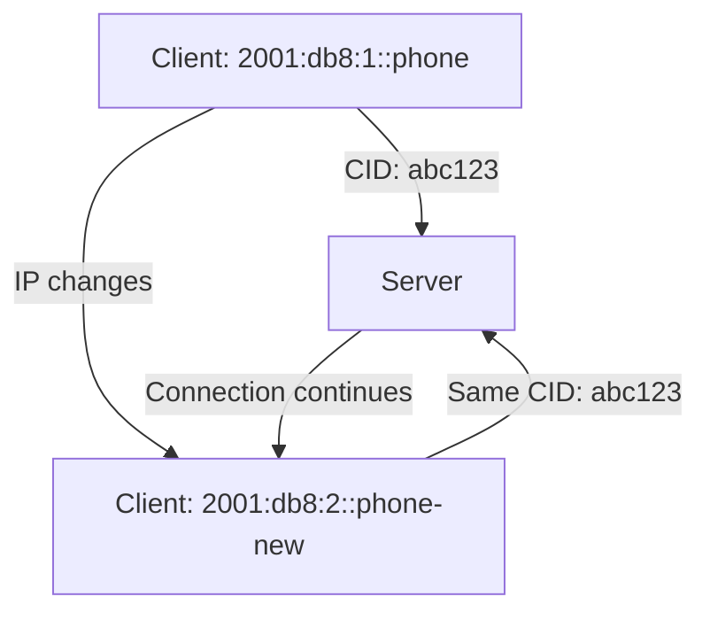

# How to Understand QUIC Connection Migration with IPv6

Author: [nawazdhandala](https://www.github.com/nawazdhandala)

Tags: QUIC, IPv6, Connection Migration, Networking, Mobile

Description: Understand QUIC connection migration - how connections survive IP address changes in IPv6 environments and how to enable and test this feature.

## What is QUIC Connection Migration?

QUIC connection migration (RFC 9000 §9) allows an active QUIC connection to survive changes in the client's IP address or port without interrupting the application stream. This is particularly valuable for:

- Mobile devices switching between WiFi and cellular networks
- IPv6 privacy address rotation (RFC 4941)
- Load balancer failover without session interruption

## How Connection IDs Enable Migration

Unlike TCP (which uses a 4-tuple: src IP, src port, dst IP, dst port), QUIC identifies connections using **Connection IDs (CIDs)**:



The server identifies the connection by CID, not by IP. When the client's IP changes, it sends a PATH_CHALLENGE frame to verify the new path, then migrates the connection.

## IPv6 Privacy Addresses Challenge

IPv6 hosts with privacy extensions (RFC 4941) regularly rotate their source addresses. Without connection migration, every address change would break connections:

```bash
# See current IPv6 privacy addresses on Linux

ip -6 addr show | grep "temporary"
# inet6 2001:db8::abc1 scope global temporary dynamic
# inet6 2001:db8::def2 scope global temporary dynamic (expired)

# Configure privacy address rotation timer
sysctl net.ipv6.conf.eth0.temp_prefered_lft    # How long temporary address is preferred
sysctl net.ipv6.conf.eth0.temp_valid_lft       # How long temporary address is valid
```

## Enabling Connection Migration on Nginx

```nginx
server {
    listen [::]:443 quic;

    # Ensure connection ID is used for routing (not IP)
    # This is important for load balancers routing QUIC
    quic_retry on;

    # Connection migration is enabled by default in Nginx QUIC
    # Ensure your load balancer uses connection IDs, not IP:port hashing
}
```

## Load Balancer Configuration for Migration

For connection migration to work through load balancers, backends must share connection state or the load balancer must route by CID:

```text
# HAProxy - route QUIC by connection ID (consistent hashing)
# HAProxy 2.7+ supports QUIC CID-based routing
backend quic_backends
    balance first  # Or use CID-based consistent routing

# Alternative: Use QUIC's server retry mechanism to encode
# routing information in the connection ID (ODCID)
```

## Testing Connection Migration

```python
#!/usr/bin/env python3
"""Simulate QUIC connection migration by changing source address."""
# This requires a QUIC client library like aioquic

import asyncio
import aioquic
from aioquic.asyncio import connect
from aioquic.quic.configuration import QuicConfiguration

async def test_migration():
    config = QuicConfiguration(is_client=True, alpn_protocols=["h3"])
    config.verify_mode = False  # For testing only

    async with connect(
        "2001:db8::1",
        443,
        configuration=config,
        local_port=0  # OS assigns port
    ) as client:
        # Make initial request
        print(f"Connected from: {client._quic._network_paths[0].addr}")

        # Trigger migration (simulate by changing local address)
        # In practice, this happens automatically when network changes
        await client.send_ping(client._quic.host_cid)

        print("Connection migrated successfully")

asyncio.run(test_migration())
```

## PATH_CHALLENGE Flow

```text
Client (old IP)     Server
     |                |
     |-- Initial ---->|   Connection established with CID=abc123
     |                |
     | [IP changes]   |
     |                |
Client (new IP)     Server
     |                |
     |-- PATH_CHALLENGE (new path) -->|
     |<-- PATH_RESPONSE --------------|
     |                |
     | [Path verified - migration complete]
     |                |
     |-- QUIC frames with CID=abc123 -->|   Same connection!
```

## Monitoring Migration Events

```bash
# In nginx access logs, connection migrations appear as new source IPs
# with the same QUIC connection ID in extended logs

# Enable QUIC-specific logging in Nginx
log_format quic_log '$remote_addr - $http3 $status - CID: $quic_connection_id';
access_log /var/log/nginx/quic_access.log quic_log;

# Filter for migration events (multiple IPs, same CID)
awk '{print $NF}' /var/log/nginx/quic_access.log | sort | uniq -d
```

## Monitoring with OneUptime

Use [OneUptime](https://oneuptime.com) to monitor the real-world impact of QUIC connection migration. Set up monitors from mobile network vantage points and compare connection continuity with HTTP/2 over the same network transitions.

## Conclusion

QUIC connection migration leverages Connection IDs to survive IP address changes, making it invaluable for IPv6 environments where privacy extensions rotate addresses frequently. Ensure your load balancers support CID-based routing and monitor migration events to validate the feature works in production.
