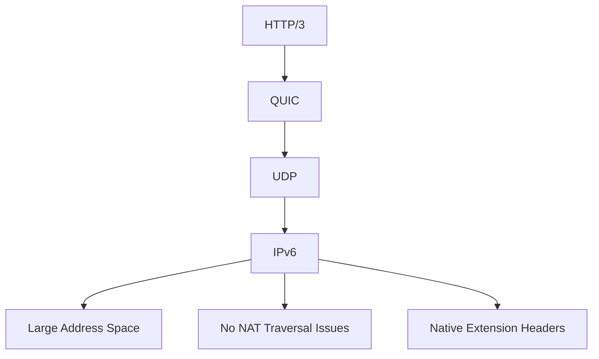

# How to Understand QUIC Protocol with IPv6

Author: [nawazdhandala](https://www.github.com/nawazdhandala)

Tags: QUIC, HTTP/3, IPv6, Protocol, Networking

Description: A technical overview of how QUIC protocol works with IPv6, including its advantages, connection establishment, and migration capabilities.

## What is QUIC?

QUIC is a transport protocol developed by Google and standardized by the IETF (RFC 9000). It runs over UDP and provides the reliability of TCP with reduced latency. HTTP/3 uses QUIC as its transport layer.

## QUIC and IPv6: A Natural Fit



IPv6 and QUIC work well together because:
- IPv6's large address space eliminates many NAT issues that complicate QUIC's connection ID handling
- IPv6 flow labels can assist with QUIC connection routing
- QUIC's connection migration works better in IPv6 environments without NAT

## QUIC Connection Establishment

QUIC dramatically reduces connection setup time:

```
TCP + TLS 1.3:
  1. SYN → SYN-ACK → ACK (1.5 RTT)
  2. TLS ClientHello → ServerHello → Finished (1 RTT)
  Total: 2+ RTTs before data

QUIC (0-RTT for new connections):
  1. Initial packet with crypto data (1 RTT)
  Total: 1 RTT

QUIC (0-RTT for resumed connections):
  1. Resumes with cached session ticket — data sent immediately
  Total: 0 RTT
```

## Testing QUIC/HTTP3 with IPv6

```bash
# Install curl with HTTP/3 support (Ubuntu 22.04+)
sudo apt-get install curl

# Test HTTP/3 over IPv6
curl -6 --http3 https://www.example.com -v 2>&1 | grep -E "QUIC|HTTP/3|IPv6"

# Check if a server supports HTTP/3
curl -6 -I https://www.example.com | grep -i alt-svc

# Use quiche-client (Cloudflare's QUIC implementation)
quiche-client --no-verify https://[2001:db8::1]/

# ngtcp2 test client
ngtcp2client --disable-early-data [2001:db8::1] 443 https://example.com/
```

## QUIC Packet Structure for IPv6

A QUIC packet over IPv6 looks like:

```
IPv6 Header (40 bytes)
  ├── Version: 6
  ├── Traffic Class: DSCP/ECN
  ├── Flow Label: (can identify QUIC connection)
  ├── Payload Length
  ├── Next Header: 17 (UDP)
  ├── Hop Limit
  ├── Source: 2001:db8::1
  └── Destination: 2001:db8::2

UDP Header (8 bytes)
  ├── Source Port: 54321
  ├── Destination Port: 443
  └── Length + Checksum

QUIC Packet
  ├── Header Form + Version
  ├── Connection ID (up to 20 bytes)
  ├── Packet Number
  └── Protected Payload (TLS-encrypted frames)
```

## IPv6 Flow Labels and QUIC

IPv6 flow labels can help routers and load balancers route QUIC packets belonging to the same connection:

```python
import socket
import struct

# Set IPv6 flow label for QUIC traffic
# Flow labels help identify connection streams at the network layer
sock = socket.socket(socket.AF_INET6, socket.SOCK_DGRAM)

# Flow label is embedded in the IPv6 header — set via IPV6_FLOWINFO socket option
# Value is (traffic class << 20) | flow_label
flow_label = 0x12345  # 20-bit value
traffic_class = 0b00000000  # Default
flowinfo = (traffic_class << 20) | flow_label

sock.setsockopt(socket.IPPROTO_IPV6, socket.IPV6_FLOWINFO_SEND, 1)
# Connect with flow label
sock.connect(("2001:db8::1", 443, flowinfo, 0))
```

## Key QUIC Features for IPv6 Networks

1. **Connection Migration**: QUIC connections survive IP address changes — useful for mobile IPv6
2. **Multiplexing**: Multiple streams over one connection without head-of-line blocking
3. **0-RTT Resumption**: Reconnect without new handshake using IPv6 QUIC tokens
4. **ECN Support**: Explicit Congestion Notification works natively with IPv6

## Monitoring QUIC over IPv6

Use [OneUptime](https://oneuptime.com) to monitor HTTP/3 endpoint availability over IPv6. Configure monitors that specifically test QUIC connectivity and alert when servers fall back to HTTP/2 or HTTP/1.1.

## Conclusion

QUIC and IPv6 complement each other well. QUIC's connection IDs, migration capabilities, and 0-RTT resumption benefit from IPv6's clean addressing model. Enable HTTP/3 on your IPv6-enabled servers to offer users reduced latency and improved reliability.
