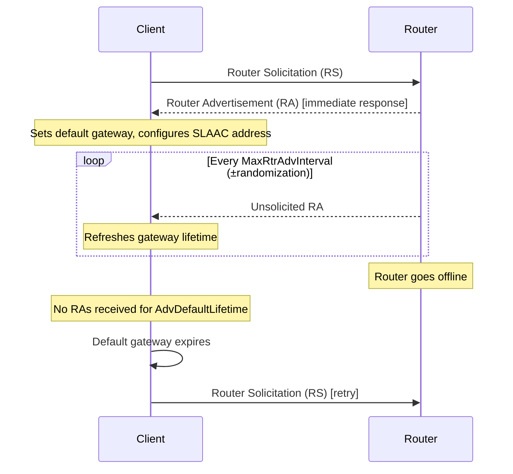

# How to Understand Router Advertisement Interval and Lifetime Settings

Author: [nawazdhandala](https://www.github.com/nawazdhandala)

Tags: IPv6, Router Advertisement, radvd, Timing, Lifetime, Networking

Description: Understand how Router Advertisement interval and lifetime settings affect client behavior, network convergence time, and battery life on wireless devices.

## Introduction

Router Advertisement timing parameters control how often RA messages are sent and how long they remain valid. These settings have a direct impact on how quickly clients detect network changes, how long a router outage can go undetected, and battery consumption on mobile and IoT devices.

## Key Timing Parameters

| Parameter | RFC Name | Default | Range | Purpose |
|---|---|---|---|---|
| MaxRtrAdvInterval | MaxRtrAdvInterval | 200s | 4–1800s | Maximum time between unsolicited RAs |
| MinRtrAdvInterval | MinRtrAdvInterval | 0.33 * Max | 3–1350s | Minimum time between unsolicited RAs |
| Router Lifetime | AdvDefaultLifetime | 3 * Max | 0–65535s | How long the router is a valid default gateway |
| Reachable Time | AdvReachableTime | 0 (unspecified) | 0–3600000ms | How long a neighbor is considered reachable |
| Retrans Timer | AdvRetransTimer | 0 (unspecified) | 0–4294967295ms | Retransmission time for NS messages |

## RFC Constraints

RFC 4861 defines critical constraints:
- `MinRtrAdvInterval` must be >= 3 seconds and <= 0.75 * `MaxRtrAdvInterval`
- `AdvDefaultLifetime` (router lifetime) must be >= `MaxRtrAdvInterval`
- For a router lifetime of 0, the router is not a default gateway (useful for route injection only)

## radvd Configuration Examples

### Default Behavior (RFC Defaults)

```text
# /etc/radvd.conf - RFC default timing
interface eth1 {
    AdvSendAdvert on;
    MinRtrAdvInterval 33;    # ~1/3 of MaxRtrAdvInterval
    MaxRtrAdvInterval 100;   # Send RA at least every 100 seconds
    AdvDefaultLifetime 300;  # Router valid for 300s (3x MaxRtrAdvInterval)

    prefix 2001:db8:1:1::/64 {
        AdvOnLink on;
        AdvAutonomous on;
        AdvValidLifetime 86400;
        AdvPreferredLifetime 14400;
    };
};
```

### Fast Convergence (High Traffic Networks)

For networks where rapid detection of router changes is critical:

```text
interface eth1 {
    AdvSendAdvert on;
    MinRtrAdvInterval 3;     # Minimum allowed: 3 seconds
    MaxRtrAdvInterval 10;    # Very frequent RAs
    AdvDefaultLifetime 30;   # Router expires quickly if RAs stop

    prefix 2001:db8:1:1::/64 {
        AdvOnLink on;
        AdvAutonomous on;
        AdvValidLifetime 3600;
        AdvPreferredLifetime 1800;
    };
};
```

**Tradeoff:** High RA frequency increases network overhead and reduces battery life on wireless clients.

### Power-Saving (IoT / Wireless Networks)

For networks with many battery-powered devices:

```text
interface wlan0 {
    AdvSendAdvert on;
    MinRtrAdvInterval 300;   # 5 minutes minimum
    MaxRtrAdvInterval 600;   # 10 minutes maximum
    # Router lifetime must be >= MaxRtrAdvInterval
    AdvDefaultLifetime 1800; # Router valid for 30 minutes

    prefix 2001:db8:iot:1::/64 {
        AdvOnLink on;
        AdvAutonomous on;
        AdvValidLifetime 86400;
        AdvPreferredLifetime 43200;
    };
};
```

## How Clients Use These Values



## Impact of Router Lifetime = 0

Setting `AdvDefaultLifetime 0` means the router is not a default gateway:

```text
interface eth1 {
    AdvSendAdvert on;
    # Router lifetime of 0 means: "I am not a default gateway"
    AdvDefaultLifetime 0;

    # But still advertise route information via route option
    route 2001:db8:specific::/48 {
        AdvRouteLifetime 1800;
        AdvRoutePreference high;
    };
};
```

## Monitoring RA Timing from a Client

```bash
# On a Linux client, check when the default route expires
ip -6 route show default
# The 'expires' field shows the remaining router lifetime

# Watch RA reception in real time
sudo tcpdump -i eth0 -v "icmp6 and ip6[40] == 134" 2>/dev/null | \
    grep -E "(Router Advertisement|lifetime)"
```

## Conclusion

RA interval and lifetime settings are a critical balance between convergence speed, network overhead, and device battery life. High-frequency RAs (short intervals, short lifetimes) provide faster failover detection but increase traffic and power consumption. Low-frequency settings suit IoT and wireless deployments. Always ensure the router lifetime is at least as long as the maximum RA interval to prevent clients from prematurely expiring their default gateway.
