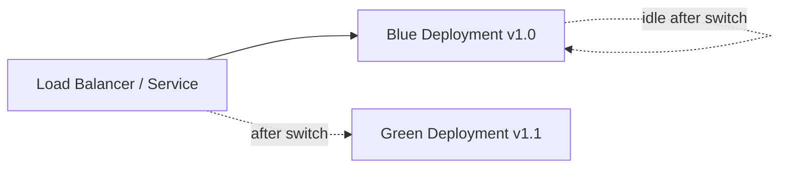

# How to Implement Blue-Green Deployments in Rancher

Author: [nawazdhandala](https://www.github.com/nawazdhandala)

Tags: Rancher, Kubernetes, Blue-Green, Deployments, CI/CD

Description: Implement zero-downtime blue-green deployments in Rancher-managed Kubernetes clusters using service switching and GitOps automation.

## Introduction

Blue-green deployment is a release strategy where you maintain two identical production environments (blue and green). At any point, one environment serves live traffic while the other is idle (or running the next release candidate). When a new version is ready, traffic is switched instantly from the current (blue) to the new (green) environment, providing zero-downtime deployments and instant rollback capability.

## Architecture



## Step 1: Create Blue and Green Deployments

```yaml
# blue-deployment.yaml
apiVersion: apps/v1
kind: Deployment
metadata:
  name: myapp-blue
  namespace: production
  labels:
    app: myapp
    slot: blue
    version: "1.0.0"
spec:
  replicas: 3
  selector:
    matchLabels:
      app: myapp
      slot: blue
  template:
    metadata:
      labels:
        app: myapp
        slot: blue
        version: "1.0.0"
    spec:
      containers:
        - name: myapp
          image: ghcr.io/my-org/myapp:1.0.0
          ports:
            - containerPort: 8080
          readinessProbe:
            httpGet:
              path: /healthz
              port: 8080
            initialDelaySeconds: 10
            periodSeconds: 5
---
# green-deployment.yaml
apiVersion: apps/v1
kind: Deployment
metadata:
  name: myapp-green
  namespace: production
  labels:
    app: myapp
    slot: green
    version: "1.1.0"
spec:
  replicas: 3
  selector:
    matchLabels:
      app: myapp
      slot: green
  template:
    metadata:
      labels:
        app: myapp
        slot: green
        version: "1.1.0"
    spec:
      containers:
        - name: myapp
          image: ghcr.io/my-org/myapp:1.1.0
          ports:
            - containerPort: 8080
          readinessProbe:
            httpGet:
              path: /healthz
              port: 8080
            initialDelaySeconds: 10
            periodSeconds: 5
```

## Step 2: Create the Active Service

The service points to one slot at a time via the `slot` label selector:

```yaml
# service.yaml
apiVersion: v1
kind: Service
metadata:
  name: myapp
  namespace: production
spec:
  selector:
    app: myapp
    slot: blue   # ← Change this to switch traffic
  ports:
    - port: 80
      targetPort: 8080
  type: ClusterIP
---
# ingress.yaml
apiVersion: networking.k8s.io/v1
kind: Ingress
metadata:
  name: myapp
  namespace: production
spec:
  ingressClassName: nginx
  rules:
    - host: myapp.example.com
      http:
        paths:
          - path: /
            pathType: Prefix
            backend:
              service:
                name: myapp
                port:
                  number: 80
```

## Step 3: The Traffic Switch Script

```bash
#!/usr/bin/env bash
# blue-green-switch.sh — Switch traffic between blue and green

NAMESPACE="production"
SERVICE="myapp"

# Determine current active slot
CURRENT_SLOT=$(kubectl get service "${SERVICE}" -n "${NAMESPACE}" \
  -o jsonpath='{.spec.selector.slot}')

if [ "${CURRENT_SLOT}" = "blue" ]; then
  TARGET_SLOT="green"
else
  TARGET_SLOT="blue"
fi

echo "Current slot: ${CURRENT_SLOT}"
echo "Switching to: ${TARGET_SLOT}"

# Verify the target slot is healthy before switching
READY_REPLICAS=$(kubectl get deployment "myapp-${TARGET_SLOT}" \
  -n "${NAMESPACE}" \
  -o jsonpath='{.status.readyReplicas}')

DESIRED_REPLICAS=$(kubectl get deployment "myapp-${TARGET_SLOT}" \
  -n "${NAMESPACE}" \
  -o jsonpath='{.spec.replicas}')

if [ "${READY_REPLICAS}" != "${DESIRED_REPLICAS}" ]; then
  echo "ERROR: ${TARGET_SLOT} slot is not fully ready (${READY_REPLICAS}/${DESIRED_REPLICAS})"
  exit 1
fi

# Perform the switch
kubectl patch service "${SERVICE}" \
  -n "${NAMESPACE}" \
  -p "{\"spec\":{\"selector\":{\"slot\":\"${TARGET_SLOT}\"}}}"

echo "✓ Traffic switched to ${TARGET_SLOT}"
echo "  Previous slot (${CURRENT_SLOT}) is now idle — available for rollback"
```

## Step 4: Integrate with a CI/CD Pipeline

```yaml
# .github/workflows/blue-green-deploy.yaml
name: Blue-Green Deploy

on:
  push:
    branches: [main]

jobs:
  deploy:
    runs-on: ubuntu-latest
    steps:
      - uses: actions/checkout@v4

      - name: Set up kubectl
        uses: azure/setup-kubectl@v3

      - name: Configure kubeconfig
        run: echo "${{ secrets.KUBECONFIG_B64 }}" | base64 -d > /tmp/kubeconfig

      - name: Determine inactive slot
        id: slot
        run: |
          CURRENT=$(kubectl get service myapp -n production \
            -o jsonpath='{.spec.selector.slot}' --kubeconfig /tmp/kubeconfig)
          if [ "$CURRENT" = "blue" ]; then
            echo "target=green" >> $GITHUB_OUTPUT
          else
            echo "target=blue" >> $GITHUB_OUTPUT
          fi

      - name: Deploy to inactive slot
        run: |
          kubectl set image deployment/myapp-${{ steps.slot.outputs.target }} \
            myapp=ghcr.io/${{ github.repository }}:${{ github.sha }} \
            -n production --kubeconfig /tmp/kubeconfig

          kubectl rollout status deployment/myapp-${{ steps.slot.outputs.target }} \
            -n production --timeout=5m --kubeconfig /tmp/kubeconfig

      - name: Run smoke tests
        run: |
          # Test the inactive slot directly via its service
          kubectl run smoke-test --rm -it \
            --image=curlimages/curl \
            --restart=Never \
            -n production \
            --kubeconfig /tmp/kubeconfig \
            -- curl -f http://myapp-${{ steps.slot.outputs.target }}:80/healthz

      - name: Switch traffic
        run: |
          kubectl patch service myapp \
            -n production \
            -p '{"spec":{"selector":{"slot":"${{ steps.slot.outputs.target }}"}}}' \
            --kubeconfig /tmp/kubeconfig
```

## Step 5: Rollback

```bash
# Instant rollback — just switch the selector back
kubectl patch service myapp \
  -n production \
  -p '{"spec":{"selector":{"slot":"blue"}}}'

# This takes effect immediately — no redeployment needed
```

## Conclusion

Blue-green deployments in Rancher-managed Kubernetes clusters provide zero-downtime releases and instant rollback by maintaining two deployment slots and switching the service selector. The simplicity of a `kubectl patch` for the traffic switch makes this pattern easy to automate in any CI/CD system. For more gradual traffic shifting, consider adding a canary phase before the full switch.
