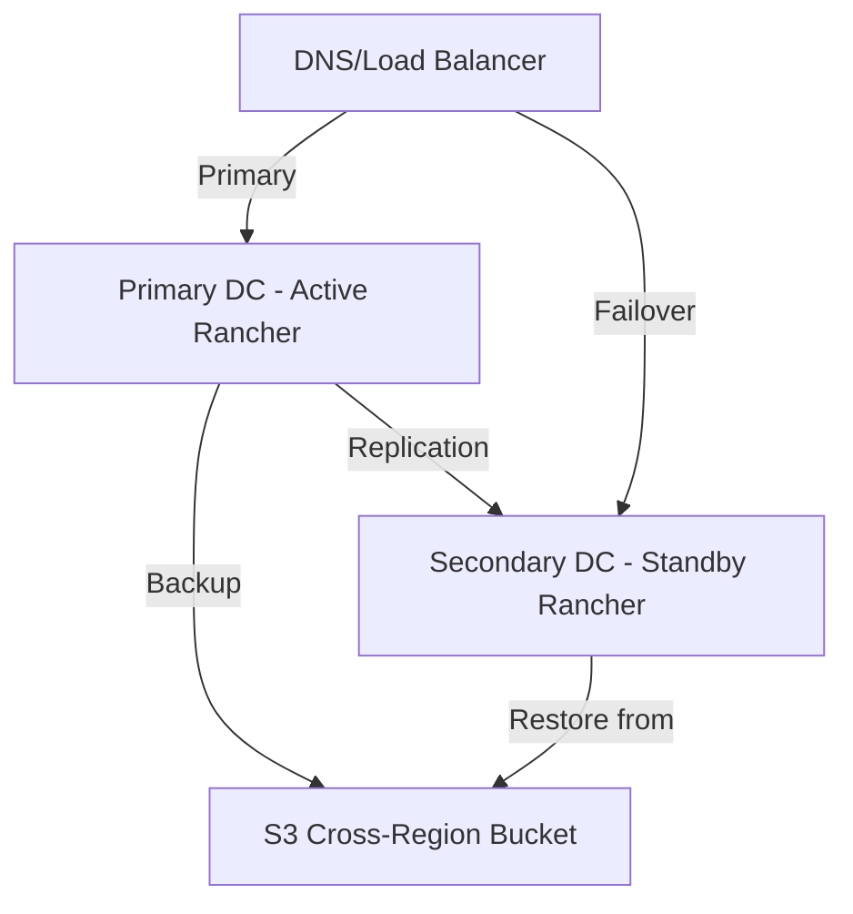

# How to Set Up Rancher DR Across Data Centers

Author: [nawazdhandala](https://www.github.com/nawazdhandala)

Tags: Rancher, Disaster-recovery, Multi-Datacenter, Kubernetes, High-Availability

Description: Step-by-step guide to configuring disaster recovery for Rancher across multiple data centers for geographic redundancy.

## Introduction

Running Rancher across multiple data centers provides geographic redundancy and protects against site-level failures. This guide covers the architecture and implementation details for setting up cross-datacenter DR.

## Architecture Overview



## Prerequisites

- Two data centers with network connectivity
- S3-compatible storage accessible from both DCs
- DNS provider with fast TTL support (60 seconds or less)
- Rancher v2.7+ installed on primary DC

## Step 1: Configure Primary DC Backups

Install the Rancher Backup Operator on your primary Rancher:

```bash
# Add the Rancher chart repository

helm repo add rancher-charts https://charts.rancher.io
helm repo update

# Install backup operator
helm install rancher-backup rancher-charts/rancher-backup \
  --namespace cattle-resources-system \
  --create-namespace \
  --version 4.0.0
```

Create a backup pointing to cross-region S3:

```yaml
# cross-region-backup.yaml
apiVersion: resources.cattle.io/v1
kind: Backup
metadata:
  name: cross-dc-backup
  namespace: cattle-resources-system
spec:
  storageLocation:
    s3:
      bucketName: rancher-dr-cross-region
      folder: rancher-backups
      region: us-west-2       # Secondary DC region
      endpoint: s3.amazonaws.com
      credentialSecretName: aws-s3-creds
      credentialSecretNamespace: cattle-resources-system
  schedule: "0 * * * *"        # Every hour
  retentionCount: 48            # Keep 48 hours of backups
  encryptionConfigSecretName: backup-encryption
```

## Step 2: Set Up Secondary DC Infrastructure

Prepare the secondary DC to host the standby Rancher:

```bash
# On secondary DC server - prepare infrastructure
# Install K3s or RKE2 for Rancher management cluster
curl -sfL https://get.rke2.io | INSTALL_RKE2_VERSION=v1.28.8+rke2r1 sh -

# Enable and start RKE2
systemctl enable rke2-server.service
systemctl start rke2-server.service

# Set up kubeconfig
mkdir -p ~/.kube
cp /etc/rancher/rke2/rke2.yaml ~/.kube/config
export KUBECONFIG=~/.kube/config
```

## Step 3: Install Rancher on Secondary DC (Standby Mode)

```bash
# Install cert-manager
helm repo add jetstack https://charts.jetstack.io
helm repo update
helm install cert-manager jetstack/cert-manager \
  --namespace cert-manager \
  --create-namespace \
  --set installCRDs=true

# Install Rancher in standby mode
helm repo add rancher-latest https://releases.rancher.com/server-charts/latest
helm install rancher rancher-latest/rancher \
  --namespace cattle-system \
  --create-namespace \
  --set hostname=rancher-standby.example.com \
  --set bootstrapPassword=your-secure-password \
  --set replicas=1  # Single replica for standby
```

## Step 4: Configure DNS Failover

```bash
# Example Route53 health check configuration (AWS CLI)
aws route53 create-health-check \
  --caller-reference rancher-primary-$(date +%s) \
  --health-check-config '{
    "IPAddress": "10.0.1.100",
    "Port": 443,
    "Type": "HTTPS",
    "ResourcePath": "/v3/ping",
    "FailureThreshold": 3,
    "RequestInterval": 30
  }'

# Create failover DNS record
cat > /tmp/dns-failover.json << 'DNSEOF'
{
  "Changes": [{
    "Action": "CREATE",
    "ResourceRecordSet": {
      "Name": "rancher.example.com",
      "Type": "A",
      "Failover": "PRIMARY",
      "TTL": 60,
      "ResourceRecords": [{"Value": "10.0.1.100"}],
      "HealthCheckId": "your-health-check-id"
    }
  }]
}
DNSEOF
```

## Step 5: Set Up Backup Replication Monitoring

```yaml
# backup-sync-checker.yaml
apiVersion: batch/v1
kind: CronJob
metadata:
  name: backup-sync-checker
  namespace: cattle-resources-system
spec:
  schedule: "*/15 * * * *"  # Check every 15 minutes
  jobTemplate:
    spec:
      template:
        spec:
          containers:
          - name: checker
            image: amazon/aws-cli:latest
            command:
            - /bin/sh
            - -c
            - |
              # Check if latest backup is recent (within 2 hours)
              LATEST=$(aws s3 ls s3://rancher-dr-cross-region/rancher-backups/ \
                --recursive | sort | tail -1 | awk '{print $1" "$2}')
              echo "Latest backup: $LATEST"
          restartPolicy: OnFailure
```

## Failover Procedure

When primary DC fails:

```bash
#!/bin/bash
# failover.sh - Execute during DR event

echo "=== Starting DR Failover ==="

# Step 1: Get latest backup from cross-region S3
LATEST_BACKUP=$(aws s3 ls s3://rancher-dr-cross-region/rancher-backups/ \
  --recursive | sort | tail -1 | awk '{print $4}')
echo "Using backup: $LATEST_BACKUP"

# Step 2: Create Restore resource on secondary Rancher
kubectl apply -f - << RESTOREEOF
apiVersion: resources.cattle.io/v1
kind: Restore
metadata:
  name: failover-restore
  namespace: cattle-resources-system
spec:
  backupFilename: ${LATEST_BACKUP}
  storageLocation:
    s3:
      bucketName: rancher-dr-cross-region
      folder: rancher-backups
      region: us-west-2
      credentialSecretName: aws-s3-creds
RESTOREEOF

# Step 3: Update DNS to point to secondary DC
echo "Update DNS records to secondary DC IP"
echo "Monitor restore progress:"
kubectl get restore failover-restore -w
```

## Conclusion

Cross-datacenter DR for Rancher requires careful coordination of backup replication, standby infrastructure, and DNS failover. By following this guide, you establish a robust DR capability that can recover your entire Rancher environment in a different geographic location when the primary site goes down.
