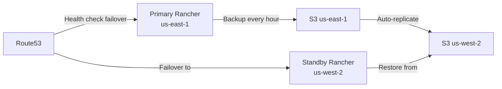

# How to Set Up Rancher DR with Cross-Region Replication

Author: [nawazdhandala](https://www.github.com/nawazdhandala)

Tags: Rancher, Disaster-recovery, Cross-Region, AWS, Kubernetes, Replication

Description: Configure disaster recovery for Rancher with automatic cross-region backup replication to protect against regional cloud failures.

## Introduction

Cloud regions can experience outages that affect multiple availability zones simultaneously. Cross-region DR ensures your Rancher environment can be restored even when an entire AWS or Azure region becomes unavailable.

## Architecture Overview



## Step 1: Set Up Cross-Region S3 Replication

```bash
# Create primary bucket in us-east-1

aws s3 mb s3://rancher-backups-primary --region us-east-1
aws s3api put-bucket-versioning \
  --bucket rancher-backups-primary \
  --versioning-configuration Status=Enabled

# Create replica bucket in us-west-2
aws s3 mb s3://rancher-backups-replica --region us-west-2
aws s3api put-bucket-versioning \
  --bucket rancher-backups-replica \
  --region us-west-2 \
  --versioning-configuration Status=Enabled

# Create replication IAM role
aws iam create-role \
  --role-name S3CrossRegionReplicationRole \
  --assume-role-policy-document '{
    "Version": "2012-10-17",
    "Statement": [{
      "Effect": "Allow",
      "Principal": {"Service": "s3.amazonaws.com"},
      "Action": "sts:AssumeRole"
    }]
  }'

# Attach replication policy
aws iam put-role-policy \
  --role-name S3CrossRegionReplicationRole \
  --policy-name ReplicationPolicy \
  --policy-document '{
    "Version": "2012-10-17",
    "Statement": [
      {
        "Effect": "Allow",
        "Action": ["s3:GetReplicationConfiguration", "s3:ListBucket"],
        "Resource": "arn:aws:s3:::rancher-backups-primary"
      },
      {
        "Effect": "Allow",
        "Action": ["s3:GetObjectVersionForReplication", "s3:GetObjectVersionAcl"],
        "Resource": "arn:aws:s3:::rancher-backups-primary/*"
      },
      {
        "Effect": "Allow",
        "Action": ["s3:ReplicateObject", "s3:ReplicateDelete"],
        "Resource": "arn:aws:s3:::rancher-backups-replica/*"
      }
    ]
  }'

# Enable replication
aws s3api put-bucket-replication \
  --bucket rancher-backups-primary \
  --replication-configuration '{
    "Role": "arn:aws:iam::ACCOUNT_ID:role/S3CrossRegionReplicationRole",
    "Rules": [{
      "ID": "rancher-cross-region",
      "Status": "Enabled",
      "Destination": {
        "Bucket": "arn:aws:s3:::rancher-backups-replica",
        "StorageClass": "STANDARD_IA"
      }
    }]
  }'
```

## Step 2: Configure Rancher Backup to Primary Region

```yaml
# primary-region-backup.yaml
apiVersion: resources.cattle.io/v1
kind: Backup
metadata:
  name: cross-region-backup
  namespace: cattle-resources-system
spec:
  storageLocation:
    s3:
      bucketName: rancher-backups-primary
      folder: production
      region: us-east-1
      endpoint: s3.amazonaws.com
      credentialSecretName: aws-s3-credentials
  schedule: "0 * * * *"    # Hourly backup
  retentionCount: 72        # 72 hours retention
  encryptionConfigSecretName: backup-encryption-key
```

## Step 3: Configure Route53 Health Check and Failover

```bash
# Create health check for primary Rancher
PRIMARY_HC_ID=$(aws route53 create-health-check \
  --caller-reference "rancher-primary-$(date +%s)" \
  --health-check-config '{
    "IPAddress": "PRIMARY_RANCHER_IP",
    "Port": 443,
    "Type": "HTTPS",
    "ResourcePath": "/v3/ping",
    "FailureThreshold": 3,
    "RequestInterval": 30,
    "FullyQualifiedDomainName": "rancher.example.com"
  }' --query 'HealthCheck.Id' --output text)

echo "Primary health check ID: $PRIMARY_HC_ID"

# Create primary DNS record with failover
aws route53 change-resource-record-sets \
  --hosted-zone-id YOUR_ZONE_ID \
  --change-batch '{
    "Changes": [
      {
        "Action": "CREATE",
        "ResourceRecordSet": {
          "Name": "rancher.example.com",
          "Type": "A",
          "SetIdentifier": "primary",
          "Failover": "PRIMARY",
          "TTL": 60,
          "ResourceRecords": [{"Value": "PRIMARY_IP"}],
          "HealthCheckId": "'$PRIMARY_HC_ID'"
        }
      },
      {
        "Action": "CREATE",
        "ResourceRecordSet": {
          "Name": "rancher.example.com",
          "Type": "A",
          "SetIdentifier": "secondary",
          "Failover": "SECONDARY",
          "TTL": 60,
          "ResourceRecords": [{"Value": "DR_REGION_IP"}]
        }
      }
    ]
  }'
```

## Step 4: Set Up DR Region Infrastructure

```bash
# In us-west-2 region - Set up EKS or RKE2 for DR Rancher
# Using AWS CLI to create infrastructure

# Create VPC for DR region
DR_VPC=$(aws ec2 create-vpc \
  --cidr-block 10.10.0.0/16 \
  --region us-west-2 \
  --tag-specifications 'ResourceType=vpc,Tags=[{Key=Name,Value=rancher-dr-vpc}]' \
  --query 'Vpc.VpcId' --output text)

echo "DR VPC: $DR_VPC"

# Install RKE2 on DR instance
# (Use EC2 user data or Terraform for automation)
cat > /tmp/dr-userdata.sh << 'USERDATA'
#!/bin/bash
# Install RKE2
curl -sfL https://get.rke2.io | INSTALL_RKE2_VERSION=v1.28.8+rke2r1 sh -
systemctl enable rke2-server && systemctl start rke2-server

# Install Helm
curl -fsSL https://raw.githubusercontent.com/helm/helm/main/scripts/get-helm-3 | bash

# Configure kubeconfig
mkdir -p /root/.kube
cp /etc/rancher/rke2/rke2.yaml /root/.kube/config

# Install cert-manager
helm repo add jetstack https://charts.jetstack.io && helm repo update
helm install cert-manager jetstack/cert-manager \
  --namespace cert-manager --create-namespace --set installCRDs=true
USERDATA
```

## Step 5: Verify Replication is Working

```bash
#!/bin/bash
# verify-cross-region-replication.sh

PRIMARY_BUCKET="rancher-backups-primary"
REPLICA_BUCKET="rancher-backups-replica"

echo "Checking replication status..."

# Get latest backup in primary
PRIMARY_LATEST=$(aws s3 ls s3://${PRIMARY_BUCKET}/production/ \
  --recursive --region us-east-1 | sort | tail -1 | awk '{print $4}')

echo "Primary latest: $PRIMARY_LATEST"

# Check if it exists in replica (after replication delay ~15 min)
aws s3 ls "s3://${REPLICA_BUCKET}/${PRIMARY_LATEST}" \
  --region us-west-2 && \
  echo "REPLICATED: Backup found in replica region" || \
  echo "NOT YET REPLICATED: Backup not in replica region"

# Check replication metrics
aws cloudwatch get-metric-statistics \
  --namespace AWS/S3 \
  --metric-name ReplicationLatency \
  --dimensions Name=SourceBucket,Value=${PRIMARY_BUCKET} \
  --start-time $(date -u -d '1 hour ago' '+%Y-%m-%dT%H:%M:%S') \
  --end-time $(date -u '+%Y-%m-%dT%H:%M:%S') \
  --period 300 \
  --statistics Average \
  --region us-east-1
```

## Step 6: DR Activation Playbook

```bash
#!/bin/bash
# activate-dr-region.sh

echo "=== ACTIVATING DR REGION ==="
echo "Time: $(date)"

# Install backup operator in DR region
helm install rancher-backup rancher-charts/rancher-backup \
  --namespace cattle-resources-system \
  --create-namespace

# Get latest backup from replica bucket
LATEST=$(aws s3 ls s3://rancher-backups-replica/production/ \
  --recursive --region us-west-2 | sort | tail -1 | awk '{print $4}')

echo "Restoring from: $LATEST"

# Create restore using replica bucket
kubectl apply -f - << RESTOREEOF
apiVersion: resources.cattle.io/v1
kind: Restore
metadata:
  name: dr-activation
  namespace: cattle-resources-system
spec:
  backupFilename: ${LATEST}
  prune: true
  storageLocation:
    s3:
      bucketName: rancher-backups-replica
      folder: production
      region: us-west-2
      credentialSecretName: aws-dr-creds
RESTOREEOF

# Install Rancher
helm install rancher rancher-latest/rancher \
  --namespace cattle-system \
  --create-namespace \
  --set hostname=rancher.example.com \
  --set bootstrapPassword=dr-bootstrap-pass \
  --set replicas=1

echo "DR activation in progress - monitor with: kubectl get restore -n cattle-resources-system -w"
```

## Conclusion

Cross-region replication provides the highest level of protection against regional cloud failures. By automatically replicating backups to a secondary region and maintaining a warm standby Rancher instance, you can achieve RTO targets under 2 hours even during a complete regional outage. Combine this with Route53 health check failover for automatic DNS cutover.
