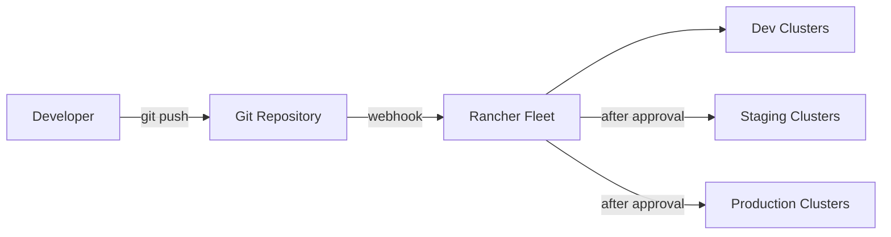

# How to Set Up Continuous Delivery with Rancher Fleet

Author: [nawazdhandala](https://www.github.com/nawazdhandala)

Tags: Rancher, Kubernetes, Fleet, GitOps, Continuous Delivery

Description: Build a production-ready continuous delivery pipeline using Rancher Fleet that automatically synchronizes applications from Git to hundreds of clusters.

## Introduction

Rancher Fleet is built for large-scale GitOps — it can manage thousands of clusters from a single Rancher instance. This guide goes beyond basic GitRepo setup and covers building a complete, production-grade continuous delivery pipeline: multi-environment promotion, secret management, drift detection, and observability.

## CD Pipeline Architecture



## Step 1: Structure Your Repository for Multi-Environment CD

```
my-app-gitops/
├── base/
│   ├── deployment.yaml
│   ├── service.yaml
│   └── kustomization.yaml
├── overlays/
│   ├── dev/
│   │   ├── fleet.yaml
│   │   ├── kustomization.yaml
│   │   └── patch-replicas.yaml    # 1 replica in dev
│   ├── staging/
│   │   ├── fleet.yaml
│   │   ├── kustomization.yaml
│   │   └── patch-replicas.yaml    # 2 replicas in staging
│   └── production/
│       ├── fleet.yaml
│       ├── kustomization.yaml
│       └── patch-replicas.yaml    # 5 replicas in production
└── fleet.yaml                      # Root config
```

## Step 2: Create Environment-Specific Fleet Configs

```yaml
# overlays/dev/fleet.yaml
defaultNamespace: dev
kustomize:
  dir: .
targets:
  - name: dev-clusters
    clusterSelector:
      matchLabels:
        environment: dev
```

```yaml
# overlays/staging/fleet.yaml
defaultNamespace: staging
kustomize:
  dir: .
targets:
  - name: staging-clusters
    clusterSelector:
      matchLabels:
        environment: staging
```

```yaml
# overlays/production/fleet.yaml
defaultNamespace: production
kustomize:
  dir: .
targets:
  - name: production-clusters
    clusterSelector:
      matchLabels:
        environment: production
```

## Step 3: Create GitRepo Resources per Environment

```yaml
# gitrepos/dev-gitrepo.yaml
apiVersion: fleet.cattle.io/v1alpha1
kind: GitRepo
metadata:
  name: myapp-dev
  namespace: fleet-default
spec:
  repo: https://github.com/my-org/my-app-gitops
  branch: develop           # Track develop branch for dev
  paths:
    - overlays/dev
  pollingInterval: 15s      # Fast sync for dev
  targets:
    - clusterSelector:
        matchLabels:
          environment: dev
---
apiVersion: fleet.cattle.io/v1alpha1
kind: GitRepo
metadata:
  name: myapp-staging
  namespace: fleet-default
spec:
  repo: https://github.com/my-org/my-app-gitops
  branch: main              # Track main branch for staging
  paths:
    - overlays/staging
  pollingInterval: 60s
  targets:
    - clusterSelector:
        matchLabels:
          environment: staging
---
apiVersion: fleet.cattle.io/v1alpha1
kind: GitRepo
metadata:
  name: myapp-production
  namespace: fleet-default
spec:
  repo: https://github.com/my-org/my-app-gitops
  branch: main
  paths:
    - overlays/production
  pollingInterval: 60s
  targets:
    - clusterSelector:
        matchLabels:
          environment: production
  # Pause auto-sync — require manual promotion to production
  paused: true
```

## Step 4: Automate Image Tag Updates (CD Pipeline)

```yaml
# .github/workflows/update-image-tag.yaml
name: Update Image Tag in GitOps Repo

on:
  workflow_call:
    inputs:
      image-tag:
        required: true
        type: string
      environment:
        required: true
        type: string

jobs:
  update-tag:
    runs-on: ubuntu-latest
    steps:
      - uses: actions/checkout@v4
        with:
          repository: my-org/my-app-gitops
          token: ${{ secrets.GITOPS_REPO_TOKEN }}

      - name: Update image tag
        run: |
          cd overlays/${{ inputs.environment }}
          # Update the image tag using kustomize
          kustomize edit set image \
            myapp=ghcr.io/my-org/myapp:${{ inputs.image-tag }}

      - name: Commit and push
        run: |
          git config user.email "cd-bot@example.com"
          git config user.name "CD Bot"
          git add .
          git commit -m "chore: update myapp to ${{ inputs.image-tag }} in ${{ inputs.environment }}"
          git push
```

## Step 5: Manual Promotion to Production

```bash
# When ready to promote to production, un-pause the GitRepo
kubectl patch gitrepo myapp-production \
  -n fleet-default \
  --type=merge \
  -p '{"spec":{"paused": false}}'

# Watch the deployment progress
kubectl get bundledeployment -A -w | grep production

# Pause again after sync completes (optional — to prevent accidental auto-sync)
kubectl patch gitrepo myapp-production \
  -n fleet-default \
  --type=merge \
  -p '{"spec":{"paused": true}}'
```

## Step 6: Manage Secrets with External Secrets Operator

```yaml
# Install External Secrets Operator alongside Fleet
helm repo add external-secrets https://charts.external-secrets.io
helm install external-secrets \
  external-secrets/external-secrets \
  --namespace external-secrets \
  --create-namespace

# In your GitOps repo, reference secrets from AWS Secrets Manager
apiVersion: external-secrets.io/v1beta1
kind: ExternalSecret
metadata:
  name: myapp-secrets
  namespace: production
spec:
  refreshInterval: 1h
  secretStoreRef:
    name: aws-secrets-manager
    kind: ClusterSecretStore
  target:
    name: myapp-secrets
  data:
    - secretKey: DATABASE_URL
      remoteRef:
        key: production/myapp/database-url
```

## Step 7: Monitor Fleet Sync Status

```bash
# Check overall Fleet health
kubectl get gitrepo -A
kubectl get bundle -A
kubectl get clustergroup -A

# Check which clusters are out of sync
kubectl get bundledeployment -A \
  -o jsonpath='{range .items[?(@.status.state!="Ready")]}{.metadata.namespace}{"\t"}{.metadata.name}{"\t"}{.status.state}{"\n"}{end}'

# View Fleet metrics in Rancher UI
# Continuous Delivery → Git Repos → select a repo → Clusters tab
```

## Conclusion

Rancher Fleet enables enterprise-scale continuous delivery with Git as the single source of truth for all cluster configuration. By combining multi-environment GitRepo resources, automated image tag updates, manual promotion gates, and External Secrets integration, you can build a secure, auditable CD pipeline that scales from a handful of clusters to thousands. Fleet's built-in drift detection ensures that manual changes to clusters are automatically corrected, maintaining configuration consistency across your entire fleet.
