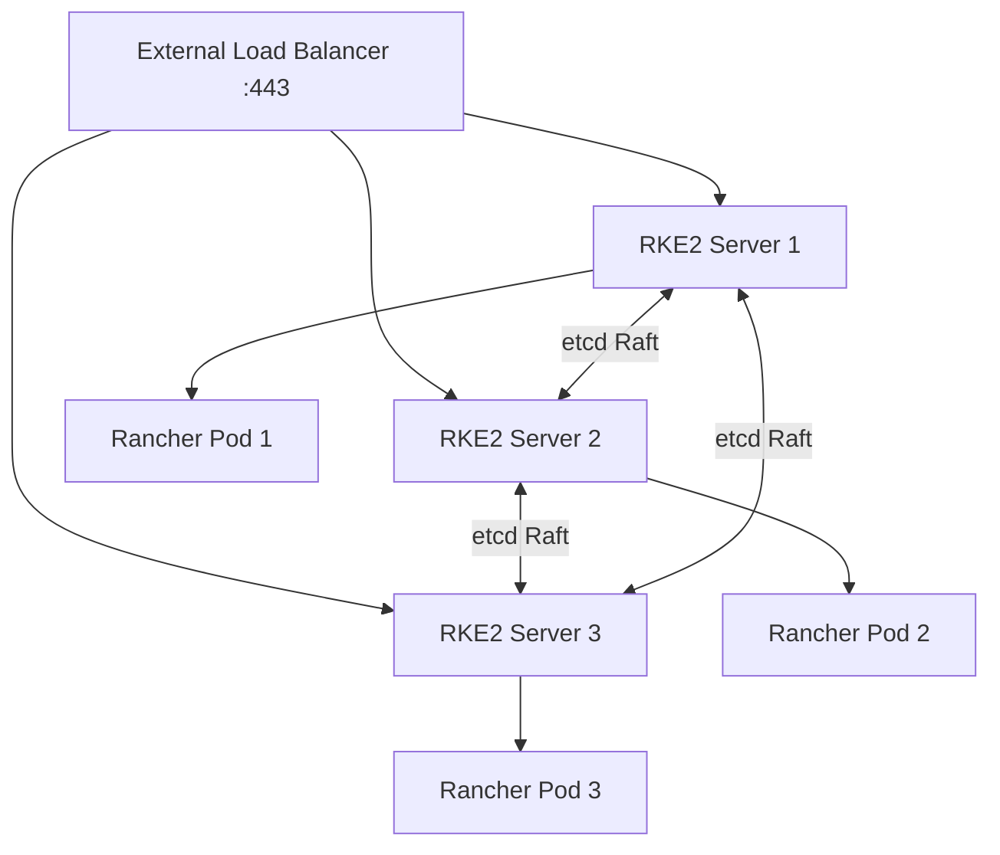

# How to Set Up Rancher HA on RKE2

Author: [nawazdhandala](https://www.github.com/nawazdhandala)

Tags: Rancher, RKE2, High Availability, Kubernetes, Load Balancer, Production

Description: Deploy Rancher in a high-availability configuration on an RKE2 cluster with three control plane nodes, etcd HA, and a load balancer frontend.

## Introduction

Running Rancher in HA on RKE2 is the recommended production configuration. RKE2 provides a hardened, FIPS-compliant Kubernetes distribution with built-in etcd HA. A three-node control plane ensures Rancher remains available if any single node fails.

## Architecture



## Prerequisites

- 3 Linux nodes (Ubuntu 22.04 or RHEL 8+)
- A load balancer or VIP pointing to all three nodes on port 443
- A DNS record pointing to the load balancer (`rancher.example.com`)

## Step 1: Install RKE2 on the First Server

```bash
# On server-1
curl -sfL https://get.rke2.io | sh -

# Configure the first server
cat > /etc/rancher/rke2/config.yaml << 'EOF'
tls-san:
  - rancher.example.com
  - 10.0.0.10    # Load balancer IP
  - 10.0.0.11    # Server 1 IP
  - 10.0.0.12    # Server 2 IP
  - 10.0.0.13    # Server 3 IP
node-taint:
  - "CriticalAddonsOnly=true:NoExecute"   # No workloads on control plane nodes
EOF

systemctl enable rke2-server.service
systemctl start rke2-server.service

# Get the cluster token for joining
cat /var/lib/rancher/rke2/server/node-token
```

## Step 2: Join Additional Server Nodes

```bash
# On server-2 and server-3
curl -sfL https://get.rke2.io | sh -

cat > /etc/rancher/rke2/config.yaml << 'EOF'
server: https://10.0.0.11:9345    # First server's internal IP
token: K108...    # Token from step 1
tls-san:
  - rancher.example.com
  - 10.0.0.10
node-taint:
  - "CriticalAddonsOnly=true:NoExecute"
EOF

systemctl enable rke2-server.service
systemctl start rke2-server.service
```

## Step 3: Configure kubectl

```bash
# On server-1, copy the kubeconfig
export KUBECONFIG=/etc/rancher/rke2/rke2.yaml

# Verify all nodes are Ready
kubectl get nodes
```

## Step 4: Install cert-manager

```bash
helm repo add jetstack https://charts.jetstack.io
helm install cert-manager jetstack/cert-manager \
  --namespace cert-manager --create-namespace \
  --set installCRDs=true
```

## Step 5: Install Rancher

```bash
helm repo add rancher-stable https://releases.rancher.com/server-charts/stable
helm install rancher rancher-stable/rancher \
  --namespace cattle-system \
  --create-namespace \
  --set hostname=rancher.example.com \
  --set replicas=3 \
  --set bootstrapPassword=changeme-on-first-login

# Wait for rollout
kubectl rollout status deployment/rancher -n cattle-system --timeout=10m
```

## Conclusion

Rancher HA on RKE2 provides a production-ready management platform. The three-node configuration tolerates any single node failure while maintaining quorum in the etcd cluster. Add worker nodes separately and taint the control plane nodes to ensure application workloads don't compete with Rancher's management components.
