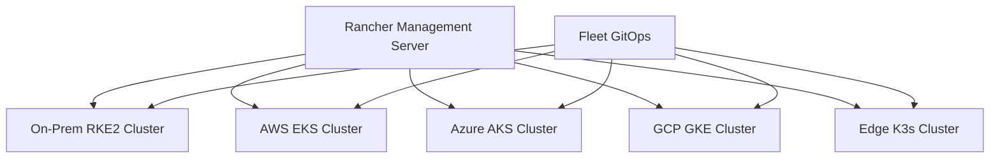

# How to Configure Rancher for Hybrid Cloud Management

Author: [nawazdhandala](https://www.github.com/nawazdhandala)

Tags: Rancher, Kubernetes, Hybrid Cloud, Multi-Cloud, Management

Description: Configure Rancher as a unified control plane for hybrid cloud Kubernetes management, spanning on-premises clusters, AWS, Azure, and Google Cloud.

## Introduction

Hybrid cloud environments combine on-premises infrastructure with one or more public clouds. Rancher serves as the unified control plane for managing all these clusters from a single interface, regardless of where they run. This guide covers the architecture, configuration, and operational best practices for a Rancher-managed hybrid cloud environment.

## Hybrid Cloud Architecture



## Step 1: Deploy Rancher in a Neutral Location

For true hybrid management, run Rancher in a location accessible from all environments:

```bash
# Option A: On-premises management cluster (recommended for data sovereignty)
# Install RKE2 HA on-premises and deploy Rancher there

# Option B: Dedicated cloud VPC
# Deploy Rancher on a cloud cluster accessible via VPN/private peering

# The Rancher server URL must be reachable from all downstream clusters
# Typical setup: expose via internal load balancer + VPN/WAN connectivity
```

## Step 2: Import Existing Clusters

```bash
# Import an existing K8s cluster (any provider)
# In Rancher UI: Cluster Management → Import Existing → Generic

# The import generates a kubectl command like:
kubectl apply -f https://rancher.example.com/v3/import/<token>.yaml

# Run this on each target cluster
# For AWS EKS:
aws eks update-kubeconfig --name my-eks-cluster --region us-east-1
kubectl apply -f https://rancher.example.com/v3/import/<token>.yaml

# For Azure AKS:
az aks get-credentials --resource-group my-rg --name my-aks
kubectl apply -f https://rancher.example.com/v3/import/<token>.yaml

# For GCP GKE:
gcloud container clusters get-credentials my-gke --zone us-central1-a
kubectl apply -f https://rancher.example.com/v3/import/<token>.yaml
```

## Step 3: Organize Clusters with Labels and Annotations

```bash
# Label clusters for organizational grouping
kubectl label cluster.management.cattle.io c-onprem \
  environment=production \
  cloud=on-premises \
  region=datacenter-east

kubectl label cluster.management.cattle.io c-aws-prod \
  environment=production \
  cloud=aws \
  region=us-east-1

kubectl label cluster.management.cattle.io c-gcp-dev \
  environment=development \
  cloud=gcp \
  region=us-central1
```

## Step 4: Configure Unified RBAC

```yaml
# rbac-hybrid-cloud.yaml
# Grant a team access to all production clusters
apiVersion: management.cattle.io/v3
kind: ClusterRoleTemplateBinding
metadata:
  name: platform-team-prod-access
  namespace: c-onprem
roleTemplateName: project-member
subjectName: platform-team
subjectKind: Group
---
apiVersion: management.cattle.io/v3
kind: ClusterRoleTemplateBinding
metadata:
  name: platform-team-aws-access
  namespace: c-aws-prod
roleTemplateName: project-member
subjectName: platform-team
subjectKind: Group
```

## Step 5: Deploy Applications Across Clouds with Fleet

```yaml
# gitops/fleet.yaml — Deploy an app to all production clusters
apiVersion: fleet.cattle.io/v1alpha1
kind: GitRepo
metadata:
  name: myapp-production
  namespace: fleet-default
spec:
  repo: https://github.com/example/myapp
  branch: main
  paths:
    - deploy/
  targets:
    # Deploy to ALL clusters labeled environment=production
    - clusterSelector:
        matchLabels:
          environment: production
```

## Step 6: Configure Centralized Monitoring

```bash
# Install Rancher Monitoring on the management cluster
helm install rancher-monitoring \
  rancher-charts/rancher-monitoring \
  -n cattle-monitoring-system \
  --create-namespace

# For downstream clusters, use Prometheus Federation
# Each cluster runs its own Prometheus that federates to the central one
# Configure via Rancher Monitoring app installed on each downstream cluster
```

```yaml
# prometheus-federation.yaml — Federate metrics to central Prometheus
# Add to the central Prometheus configuration
scrape_configs:
  - job_name: 'federate-aws-cluster'
    honor_labels: true
    metrics_path: '/federate'
    params:
      match[]:
        - '{job!=""}'
    static_configs:
      - targets:
          - 'prometheus.aws-cluster.svc:9090'
```

## Step 7: Implement Cross-Cloud Policy Enforcement

```yaml
# Enforce pod security standards across all clusters via Fleet
# gitops/security-policies/kustomization.yaml
apiVersion: kustomize.config.k8s.io/v1beta1
kind: Kustomization
resources:
  - pod-security-policy.yaml
  - network-policy-deny-all.yaml
  - resource-quota.yaml
```

```yaml
# gitops/fleet.yaml — Apply policies to all clusters
apiVersion: fleet.cattle.io/v1alpha1
kind: GitRepo
metadata:
  name: security-policies
  namespace: fleet-default
spec:
  repo: https://github.com/example/policies
  branch: main
  targets:
    - clusterSelector: {}   # Empty selector = all clusters
```

## Step 8: Configure Cost Visibility

```bash
# Use Rancher's built-in resource management to view usage per cluster
# Navigate to: Cluster Management → select cluster → Resources

# For cross-cloud cost allocation, export metrics to your cost management tool
# Example: push cluster resource usage to AWS Cost Explorer custom metrics
aws cloudwatch put-metric-data \
  --namespace "RancherHybridCloud" \
  --metric-data \
    "MetricName=PodCount,Dimensions=[{Name=Cluster,Value=on-prem}],Value=$(kubectl get pods -A --no-headers | wc -l),Unit=Count"
```

## Conclusion

Rancher as a hybrid cloud management platform provides unified visibility and control over Kubernetes clusters wherever they run. By combining cluster import, centralized RBAC, Fleet-based GitOps, federated monitoring, and policy enforcement, you can manage an on-premises-to-multi-cloud Kubernetes estate from a single pane of glass. The key to success is ensuring reliable connectivity between the Rancher management server and all downstream clusters.
