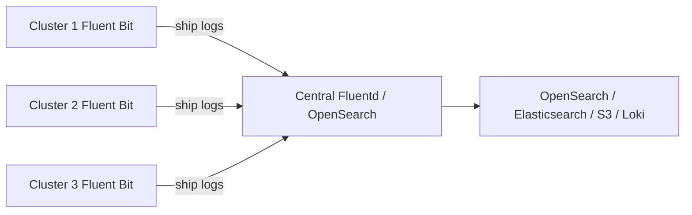

# How to Set Up Multi-Cluster Logging in Rancher

Author: [nawazdhandala](https://www.github.com/nawazdhandala)

Tags: Rancher, Kubernetes, Logging, Multi-Cluster, Observability

Description: Configure centralized multi-cluster logging in Rancher using Rancher Logging (Fluentd/Fluentbit) to aggregate logs from all clusters to a central log storage system.

## Introduction

Multi-cluster logging centralizes logs from all your Kubernetes clusters into a single searchable location, enabling cross-cluster correlation, auditing, and alerting. Rancher Logging (based on the Banzai Cloud Logging Operator with Fluentd and Fluent Bit) provides a Kubernetes-native approach to configuring log pipelines across all clusters managed by Rancher.

## Architecture



## Step 1: Install Rancher Logging on Each Cluster

```bash
# Add Rancher charts repo
helm repo add rancher-charts https://charts.rancher.io
helm repo update

# Install Rancher Logging on a downstream cluster
helm install rancher-logging rancher-charts/rancher-logging \
  -n cattle-logging-system \
  --create-namespace

# Install via Rancher UI: Cluster → Apps → Charts → Logging
```

## Step 2: Create a ClusterFlow and ClusterOutput for OpenSearch

```yaml
# opensearch-output.yaml — defines where to ship logs
apiVersion: logging.banzaicloud.io/v1beta1
kind: ClusterOutput
metadata:
  name: opensearch-output
  namespace: cattle-logging-system
spec:
  opensearch:
    host: opensearch.logging.svc.cluster.local
    port: 9200
    scheme: https
    ssl_verify: true
    user: admin
    password:
      valueFrom:
        secretKeyRef:
          name: opensearch-credentials
          key: password
    index_name: "k8s-logs-${record['kubernetes']['cluster_name']}"
    template_name: rancher-logs
    template_file: /fluentd/etc/opensearch-template.json
    type_name: _doc
    # Buffer configuration for reliability
    buffer:
      chunk_limit_size: 8M
      total_limit_size: 512M
      overflow_action: drop_oldest_chunk
      retry_max_interval: 30s
```

```yaml
# cluster-flow.yaml — defines what logs to collect and how to process them
apiVersion: logging.banzaicloud.io/v1beta1
kind: ClusterFlow
metadata:
  name: all-logs
  namespace: cattle-logging-system
spec:
  # Collect logs from all namespaces (except system noise)
  match:
    - select:
        namespaces: []    # Empty = all namespaces
    - exclude:
        namespaces:
          - kube-system
        labels:
          app: fluent-bit  # Exclude log forwarder own logs
  filters:
    # Add cluster name tag to every log record
    - record_transformer:
        records:
          - cluster_name: my-cluster-name
            environment: production
    # Parse JSON logs from structured applications
    - parser:
        parse:
          type: json
        key_name: log
        reserve_data: true
        remove_key_name_field: false
  globalOutputRefs:
    - opensearch-output
```

## Step 3: Ship to Multiple Outputs

```yaml
# multi-output-flow.yaml — ship to both OpenSearch and S3 for archive
apiVersion: logging.banzaicloud.io/v1beta1
kind: ClusterFlow
metadata:
  name: all-logs-multi-output
  namespace: cattle-logging-system
spec:
  match:
    - select: {}
  filters:
    - record_transformer:
        records:
          - cluster_name: my-cluster
  globalOutputRefs:
    - opensearch-output    # Live search
    - s3-archive-output    # Long-term archive
---
apiVersion: logging.banzaicloud.io/v1beta1
kind: ClusterOutput
metadata:
  name: s3-archive-output
  namespace: cattle-logging-system
spec:
  s3:
    aws_key_id:
      valueFrom:
        secretKeyRef:
          name: aws-s3-credentials
          key: access_key_id
    aws_sec_key:
      valueFrom:
        secretKeyRef:
          name: aws-s3-credentials
          key: secret_access_key
    s3_bucket: my-log-archive-bucket
    s3_region: us-east-1
    path: "k8s-logs/${record['kubernetes']['cluster_name']}/%Y/%m/%d/"
    s3_object_key_format: "%{path}%{time_slice}_%{index}.%{file_extension}"
    time_slice_format: "%H%M"
    store_as: gzip
```

## Step 4: Configure Per-Namespace Flows

```yaml
# application-flow.yaml — collect only application logs in the production namespace
apiVersion: logging.banzaicloud.io/v1beta1
kind: Flow
metadata:
  name: production-app-logs
  namespace: production
spec:
  match:
    - select:
        labels:
          app: myapp   # Only collect logs from myapp pods
  filters:
    - parser:
        parse:
          type: json
        key_name: log
        reserve_data: true
    - tag_normaliser:
        format: "${namespace}.${pod_name}.${container_name}"
  localOutputRefs:
    - app-specific-output
```

## Step 5: Apply Logging Config via Fleet (GitOps)

```yaml
# gitops/logging/fleet.yaml
apiVersion: fleet.cattle.io/v1alpha1
kind: GitRepo
metadata:
  name: cluster-logging
  namespace: fleet-default
spec:
  repo: https://github.com/my-org/cluster-config
  branch: main
  paths:
    - logging/
  targets:
    - clusterSelector: {}   # Apply to all clusters
```

```
logging/
├── cluster-output-opensearch.yaml    # Shared output config
├── cluster-flow-production.yaml      # Production log flow
├── cluster-flow-audit.yaml           # Audit log flow
└── kustomization.yaml
```

## Step 6: Set Up Log Alerting

```yaml
# OpenSearch alerting monitor (OpenSearch Alerting plugin)
{
  "name": "High Error Rate Alert",
  "type": "monitor",
  "monitor_type": "query_level_monitor",
  "inputs": [{
    "search": {
      "indices": ["k8s-logs-*"],
      "query": {
        "query": {
          "bool": {
            "filter": [
              {"range": {"@timestamp": {"from": "now-5m", "to": "now"}}},
              {"term": {"level": "ERROR"}}
            ]
          }
        },
        "aggs": {"error_count": {"value_count": {"field": "_id"}}}
      }
    }
  }],
  "triggers": [{
    "query_level_trigger": {
      "name": "ErrorCount > 100",
      "condition": {
        "script": {"source": "ctx.results[0].aggregations.error_count.value > 100"}
      },
      "actions": [{
        "name": "Slack Alert",
        "destination_id": "<slack-destination-id>",
        "message_template": {"source": "Cluster {{ctx.monitor.tags.cluster_name}} has high error rate"}
      }]
    }
  }]
}
```

## Conclusion

Multi-cluster logging with Rancher Logging provides a consistent, Kubernetes-native approach to centralizing logs from all clusters in your fleet. By deploying ClusterFlows and ClusterOutputs through Fleet's GitOps pipeline, every cluster automatically ships its logs to central storage with appropriate cluster metadata tags, enabling cross-cluster log correlation and long-term archival for compliance requirements.
