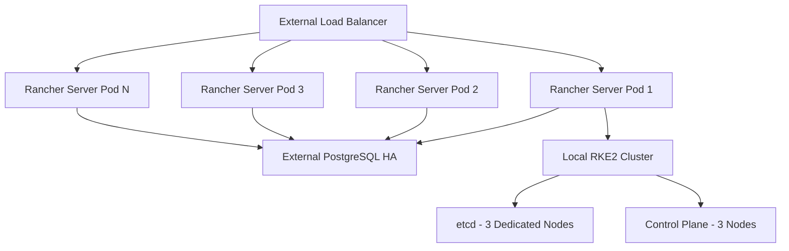

# How to Configure Rancher Server for 1000+ Clusters - Server

Author: [nawazdhandala](https://www.github.com/nawazdhandala)

Tags: Rancher, Enterprise Scale, 1000 Clusters, Performance, Architecture, has

Description: Architecture and configuration guide for running Rancher Server at 1000+ cluster scale with external databases, horizontal scaling, and optimized agent configurations.

## Introduction

Running Rancher at 1000+ cluster scale requires treating the Rancher Server itself as a production service with external dependencies, horizontal scaling, and careful capacity planning. This is the domain of Rancher Prime, SUSE's enterprise offering, though many optimizations apply to the open-source version too.

## Architecture Overview



## Step 1: External PostgreSQL Cluster

At 1000+ clusters, the embedded database cannot handle the load:

```yaml
# rancher-values.yaml

extraEnv:
  - name: CATTLE_DB_CATTLE_MYSQL_HOST
    value: "postgres-ha.databases.svc.cluster.local"
  - name: CATTLE_DB_CATTLE_MYSQL_PORT
    value: "5432"
  - name: CATTLE_DB_CATTLE_MYSQL_USER
    valueFrom:
      secretKeyRef:
        name: rancher-db
        key: username
  - name: CATTLE_DB_CATTLE_MYSQL_PASSWORD
    valueFrom:
      secretKeyRef:
        name: rancher-db
        key: password
  - name: CATTLE_DB_CATTLE_MYSQL_NAME
    value: "rancher"

# PostgreSQL should have:
# - At least 16 CPU, 32GB RAM
# - PgBouncer connection pooling (max 500 connections from Rancher)
# - Streaming replication with at least 1 standby
```

## Step 2: Scale Rancher Server Pods

```yaml
# rancher-values.yaml
replicas: 10    # 10 Rancher server replicas

resources:
  requests:
    cpu: "4"
    memory: "8Gi"
  limits:
    cpu: "8"
    memory: "16Gi"

# Configure HPA for dynamic scaling
autoscaling:
  enabled: true
  minReplicas: 5
  maxReplicas: 20
  targetCPUUtilizationPercentage: 60
  targetMemoryUtilizationPercentage: 70
```

## Step 3: Tune Local Cluster etcd for Large State

```yaml
# RKE2 etcd configuration for Rancher's local cluster
etcd-arg:
  - "quota-backend-bytes=17179869184"    # 16GB quota
  - "auto-compaction-retention=2"         # Compact every 2 hours
  - "max-request-bytes=10485760"
  - "heartbeat-interval=500"
  - "election-timeout=5000"
  - "snapshot-count=5000"               # Lower snapshot frequency
```

## Step 4: Dedicated etcd Infrastructure

For the local cluster:
- 3 dedicated etcd nodes (no other workloads)
- NVMe SSD storage
- 10 Gbps network between etcd nodes
- Separate availability zones

## Step 5: Optimize Cattle Agent Connections

With 1000+ clusters, the Rancher server manages thousands of WebSocket connections:

```yaml
extraEnv:
  - name: CATTLE_WEBSOCKET_PING_INTERVAL
    value: "60"      # Ping every 60s (default 10s)
  - name: CATTLE_AGENT_CLEANUP_INTERVAL
    value: "300"     # Clean disconnected agents every 5m
  - name: CATTLE_MAX_WEBSOCKET_SIZE
    value: "2097152" # 2MB max message size
```

## Step 6: Rancher Prime for Supported Scale

Rancher Prime includes:
- SUSE-supported SLAs for 1000+ cluster deployments
- Access to the Rancher engineering team for architecture reviews
- Enhanced monitoring and diagnostics tooling
- Priority access to patches and security updates

## Conclusion

Running Rancher at 1000+ cluster scale is an enterprise undertaking that requires careful infrastructure planning, external database dependencies, and horizontal scaling of the Rancher Server itself. The combination of external PostgreSQL, 10+ Rancher Server replicas, dedicated etcd nodes, and tuned agent connection settings enables stable operation at this scale.
