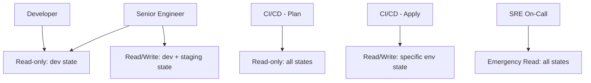

# How to Set Up RBAC for OpenTofu State Access

Author: [nawazdhandala](https://www.github.com/nawazdhandala)

Tags: OpenTofu, RBAC, State Access, IAM, S3, Security, Infrastructure as Code

Description: Learn how to implement role-based access control for OpenTofu state files using S3 bucket policies, IAM roles, and path-based permissions to prevent unauthorized state access.

---

OpenTofu state files contain sensitive data — resource IDs, IP addresses, and sometimes secrets. Role-based access control ensures developers can only access the state for their environment and team, while CI/CD pipelines have scoped permissions appropriate for their function.

## RBAC Model for State Access



## S3 State Bucket with Path-Based Permissions

```hcl
# iam_roles.tf

# Read-only access to all states (for plans and auditing)
resource "aws_iam_policy" "state_read_only" {
  name = "tofu-state-read-only"

  policy = jsonencode({
    Version = "2012-10-17"
    Statement = [
      {
        Effect   = "Allow"
        Action   = ["s3:GetObject", "s3:ListBucket"]
        Resource = [
          aws_s3_bucket.state.arn,
          "${aws_s3_bucket.state.arn}/*"
        ]
      },
      {
        # Read lock table (needed for plan)
        Effect   = "Allow"
        Action   = ["dynamodb:GetItem"]
        Resource = aws_dynamodb_table.state_lock.arn
      }
    ]
  })
}

# Environment-scoped write access
resource "aws_iam_policy" "state_write_dev" {
  name = "tofu-state-write-dev"

  policy = jsonencode({
    Version = "2012-10-17"
    Statement = [
      {
        Effect = "Allow"
        Action = ["s3:GetObject", "s3:PutObject", "s3:DeleteObject"]
        Resource = "${aws_s3_bucket.state.arn}/environments/dev/*"
      },
      {
        Effect   = "Allow"
        Action   = ["s3:ListBucket"]
        Resource = aws_s3_bucket.state.arn
        Condition = {
          StringLike = {
            "s3:prefix" = ["environments/dev/*"]
          }
        }
      },
      {
        Effect   = "Allow"
        Action   = ["dynamodb:GetItem", "dynamodb:PutItem", "dynamodb:DeleteItem"]
        Resource = aws_dynamodb_table.state_lock.arn
      }
    ]
  })
}

resource "aws_iam_policy" "state_write_production" {
  name = "tofu-state-write-production"

  policy = jsonencode({
    Version = "2012-10-17"
    Statement = [
      {
        Effect = "Allow"
        Action = ["s3:GetObject", "s3:PutObject", "s3:DeleteObject"]
        Resource = "${aws_s3_bucket.state.arn}/environments/production/*"
      },
      {
        # Require MFA for production state writes
        Effect = "Deny"
        Action = ["s3:PutObject", "s3:DeleteObject"]
        Resource = "${aws_s3_bucket.state.arn}/environments/production/*"
        Condition = {
          BoolIfExists = {
            "aws:MultiFactorAuthPresent" = "false"
          }
        }
      },
      {
        Effect   = "Allow"
        Action   = ["s3:ListBucket"]
        Resource = aws_s3_bucket.state.arn
      },
      {
        Effect   = "Allow"
        Action   = ["dynamodb:GetItem", "dynamodb:PutItem", "dynamodb:DeleteItem"]
        Resource = aws_dynamodb_table.state_lock.arn
      }
    ]
  })
}
```

## IAM Roles per Function

```hcl
locals {
  roles = {
    "ci-plan" = {
      policies    = [aws_iam_policy.state_read_only.arn]
      description = "CI plan role — read-only state access"
    }
    "ci-apply-dev" = {
      policies    = [aws_iam_policy.state_write_dev.arn]
      description = "CI apply to dev — read/write dev state"
    }
    "ci-apply-production" = {
      policies    = [aws_iam_policy.state_write_production.arn]
      description = "CI apply to production — read/write production state"
    }
  }
}

resource "aws_iam_role" "tofu" {
  for_each    = local.roles
  name        = "tofu-${each.key}"
  description = each.value.description

  assume_role_policy = jsonencode({
    Version = "2012-10-17"
    Statement = [{
      Effect    = "Allow"
      Principal = { Service = "ec2.amazonaws.com" }
      Action    = "sts:AssumeRole"
    }]
  })
}

resource "aws_iam_role_policy_attachment" "tofu" {
  for_each   = local.roles
  role       = aws_iam_role.tofu[each.key].name
  policy_arn = each.value.policies[0]
}
```

## Team Group Assignments

```hcl
resource "aws_iam_group" "dev_team" {
  name = "infrastructure-dev-team"
}

resource "aws_iam_group_policy_attachment" "dev_team" {
  group      = aws_iam_group.dev_team.name
  policy_arn = aws_iam_policy.state_write_dev.arn
}

resource "aws_iam_group" "senior_engineers" {
  name = "infrastructure-senior"
}

resource "aws_iam_group_policy_attachment" "senior_staging" {
  group      = aws_iam_group.senior_engineers.name
  policy_arn = aws_iam_policy.state_write_staging.arn
}
```

## Best Practices

- Require MFA for production state writes using IAM condition keys — even for service accounts that have MFA capable credentials.
- Use path-based permissions (S3 prefix conditions) rather than separate buckets per environment — it's easier to manage with fewer resources.
- Give CI/CD plan roles read-only state access — only apply roles should have write access.
- Audit state access with S3 server access logging and CloudTrail — you need to know who accessed state and when.
- Never grant developers direct access to production state — use CI/CD pipelines as the only path to production applies.
