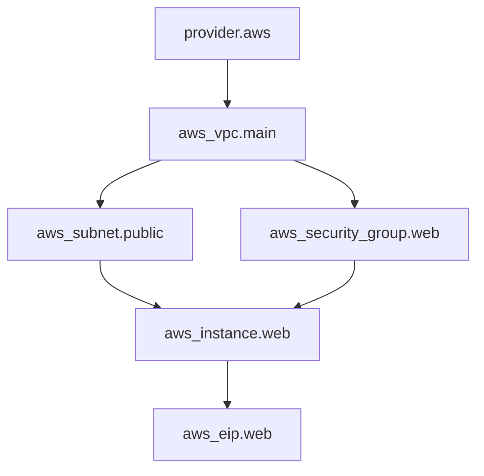
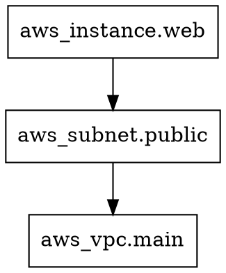

# How to Read Resource Dependency Graphs in OpenTofu

Author: [nawazdhandala](https://www.github.com/nawazdhandala)

Tags: OpenTofu, Dependency Graphs, Infrastructure as Code, Debugging, HCL

Description: Understand how to interpret OpenTofu dependency graphs to trace resource ordering, identify bottlenecks, and reason about apply behavior.

OpenTofu generates a dependency graph internally for every operation. Learning to read this graph helps you predict apply order, diagnose failures, and optimize configurations for parallel execution.

## Anatomy of a Dependency Graph

A dependency graph in OpenTofu is a Directed Acyclic Graph (DAG). Each node represents a resource, data source, variable, or provider. Each directed edge means "this node must be created before the node it points to."



In this graph:
- `provider.aws` initializes first.
- `aws_vpc.main` is created next.
- `aws_subnet.public` and `aws_security_group.web` can be created **in parallel** — they both depend only on the VPC.
- `aws_instance.web` waits for both the subnet and security group.
- `aws_eip.web` is created last, after the instance.

## Reading the DOT Output

The `tofu graph` command produces DOT-format output:

```bash
tofu graph -type=plan
```



Each `->` arrow means "left node depends on right node." In other words, the right node must exist before the left node is created.

## Identifying Resource Creation Order

Trace the path from root nodes (no incoming edges) to leaf nodes (no outgoing edges):

1. **Root nodes** (no dependencies): providers, data sources, and standalone variables.
2. **Middle nodes**: resources with both dependents and dependencies.
3. **Leaf nodes** (nothing depends on them): usually outputs or the final resources in the chain.

When `tofu apply` runs:
- All root nodes are processed first.
- Any node whose dependencies are satisfied is immediately eligible for concurrent processing.
- Leaf nodes are processed last.

## Detecting Critical Paths

The critical path is the longest chain of sequential dependencies — it determines the minimum total apply time:

```hcl
# Example: this chain creates a sequential bottleneck
resource "aws_vpc" "main" { ... }
resource "aws_subnet" "a" { vpc_id = aws_vpc.main.id }
resource "aws_subnet" "b" { vpc_id = aws_subnet.a.id }  # Unnecessary! Should depend on VPC
resource "aws_instance" "web" { subnet_id = aws_subnet.b.id }
```

In the graph, this appears as a straight chain with no parallel branches. Fix it by removing the unnecessary `aws_subnet.a` dependency from `aws_subnet.b`.

## Graph Nodes by Type

Different node shapes and labels indicate different resource types:

| Label Pattern | Meaning |
|---|---|
| `[root] aws_*.name` | Managed resource |
| `[root] data.aws_*.name` | Data source |
| `[root] var.name` | Input variable |
| `[root] local.name` | Local value |
| `[root] output.name` | Output value |
| `[root] provider["registry..."]` | Provider configuration |
| `[root] module.name` | Child module root |

## Practical Debugging: Tracing Why a Resource Was Not Created

If a resource fails or is skipped, follow its edges upward in the graph to find the failing dependency:

```bash
# Generate the graph and search for dependencies of a specific resource
tofu graph | grep "aws_db_instance.main"
```

Look at all nodes pointing to `aws_db_instance.main` — one of those is the resource that failed or is missing.

## Conclusion

Reading OpenTofu dependency graphs gives you a mental model of apply execution order. By understanding root nodes, parallel branches, and critical paths, you can predict behavior, diagnose failures faster, and write more efficient configurations.
