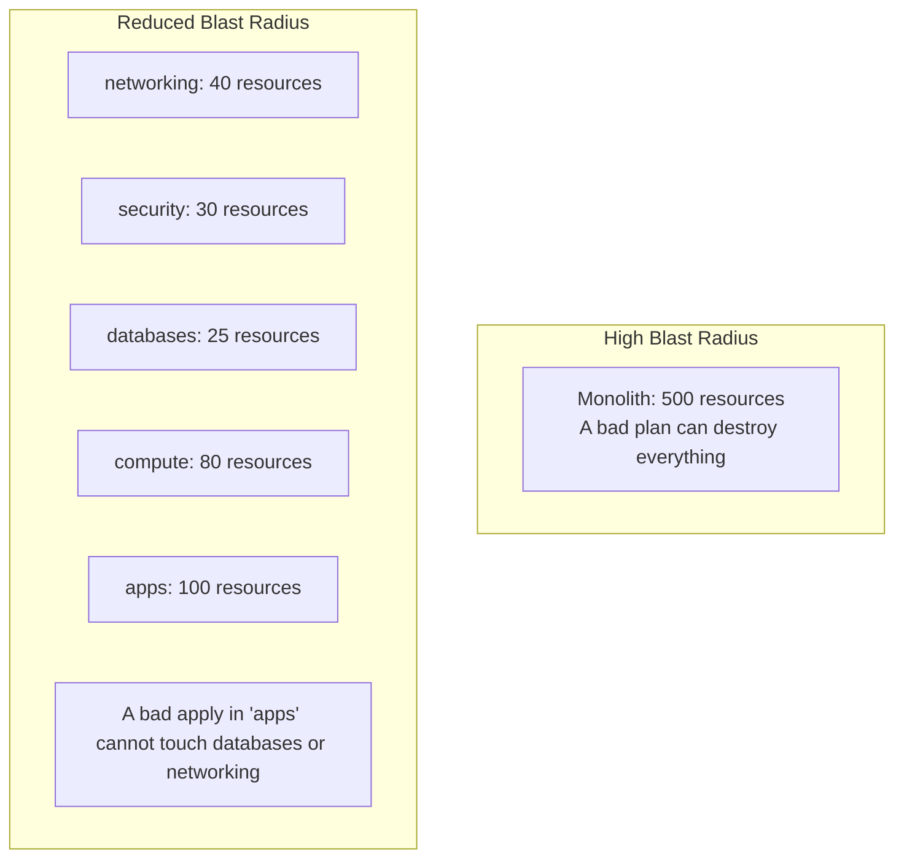

# How to Reduce Blast Radius Through State Segmentation in OpenTofu

Author: [nawazdhandala](https://www.github.com/nawazdhandala)

Tags: OpenTofu, Blast Radius, State Segmentation, Risk Management, Infrastructure as Code, Best Practices

Description: Learn how to segment OpenTofu state files along domain and lifecycle boundaries to limit the impact of a failed apply to a small, recoverable subset of infrastructure.

## Introduction

"Blast radius" is the scope of damage if an OpenTofu apply goes wrong. A monolithic state managing 500 resources has a blast radius of the entire system. State segmentation limits this to the 20-50 resources in a single focused configuration, making both failures and rollbacks manageable.

## The Blast Radius Problem



## Segmentation Principles

**By lifecycle rate**:
- Foundation (VPC, subnets): changes quarterly
- Platform (IAM, security groups): changes monthly
- Data (RDS, caches): changes monthly
- Compute (EKS, ASGs): changes weekly
- Applications (ECS services, Lambda): changes daily

**By ownership**:
- Platform team: networking, security, shared services
- Data team: databases, data pipelines
- App teams: application-specific resources

**By risk profile**:
- Stateful resources (databases, storage): separate state with `prevent_destroy`
- Stateless resources (compute): can be freely replaced

## Implementation: Directory Structure

```
infrastructure/
├── foundation/         → VPC, subnets, routing (run rarely)
│   ├── main.tf
│   └── backend.tf      → key: "foundation/tofu.tfstate"
├── platform/           → IAM, security groups, KMS (platform team)
│   ├── main.tf
│   └── backend.tf      → key: "platform/tofu.tfstate"
├── data/               → RDS, ElastiCache (data team)
│   ├── main.tf
│   └── backend.tf      → key: "data/tofu.tfstate"
└── applications/       → ECS, Lambda (app teams — daily changes)
    ├── main.tf
    └── backend.tf      → key: "applications/tofu.tfstate"
```

## Protecting High-Risk Segments

```hcl
# data/main.tf — protect stateful resources from accidental destruction
resource "aws_db_instance" "main" {
  identifier        = "prod-postgres"
  instance_class    = "db.r5.large"
  allocated_storage = 500

  lifecycle {
    prevent_destroy = true   # Fail with an error if anyone tries to destroy
    ignore_changes  = [snapshot_identifier]  # Don't manage snapshots via OpenTofu
  }
}
```

## CI/CD: Separate Pipelines per Segment

```yaml
# .github/workflows/opentofu.yml
jobs:
  plan-applications:
    # Runs on every PR — daily change rate
    paths:
      - "infrastructure/applications/**"

  plan-data:
    # Runs only on PRs touching data config
    # Requires additional approvals from data team
    paths:
      - "infrastructure/data/**"
    environment: data-platform   # Requires extra approval step

  plan-foundation:
    # Runs only on PRs touching foundation
    # Requires network architect review
    paths:
      - "infrastructure/foundation/**"
    environment: foundation       # Requires architecture team approval
```

## Conclusion

State segmentation is the most effective way to reduce blast radius in OpenTofu. Segment by lifecycle rate, ownership, and risk profile. Protect stateful segments with `prevent_destroy` and require additional approvals for high-impact segments. The goal is that a junior engineer's daily deploy can never accidentally destroy a production database — not because of human vigilance but because the database is in a completely separate state file.
